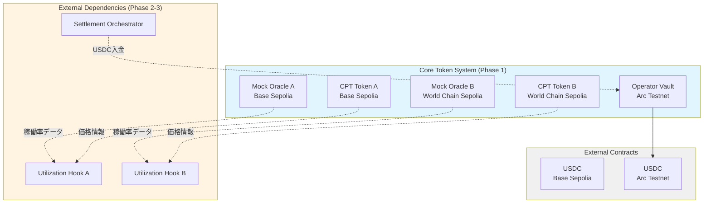

# Design Document: Core Token System

## Overview

**Purpose**: Core Token System は、Zombie L2 Clearinghouse の基盤となるトークンインフラを提供します。計算リソースをERC20トークン（CPT）として発行し、裁定収益を受け取るOperator Vaultを実装します。

**Users**:
- **L2運営者**: CPTを発行し、Vaultから収益を引き出す
- **システム（自動実行）**: Mock Oracleから稼働率データを取得
- **他の仕様**: CPT価格市場（uniswap-v4-integration）、決済処理（settlement-layer）が依存

**Impact**:
トークン化された計算リソースと収益管理の基盤を提供し、Zombie L2 Clearinghouse の全機能を支える中核レイヤーとなります。

### Goals

- CPT（Compute Token）トークン化による計算リソースの資産化
- Operator Vault による USDC 収益の安全な管理
- Mock Oracle による稼働率シグナル供給（デモ・テスト用）
- 他の仕様が依存可能な堅牢なコントラクト基盤
- マルチチェーンデプロイ（Base Sepolia, World Chain Sepolia, Arc）の自動化

### Non-Goals

- Uniswap v4 Pool 初期化（uniswap-v4-integration 仕様）
- 動的手数料制御ロジック（uniswap-v4-integration 仕様）
- 価格監視・裁定実行（offchain-arbitrage-engine 仕様）
- Arc + Circle 決済統合（settlement-layer 仕様）
- CPT Token のアップグレード機能（Proxy Pattern不使用）

---

## Architecture

### Existing Architecture Analysis

本仕様は既存の Foundry プロジェクトへの新規コントラクト追加（Extension）です。

**現状**:
- Foundry 環境構築済み（forge-std 導入済み）
- サンプルコントラクト（Counter.sol）が存在（削除予定）
- TypeScript スクリプト（arc-transfer.ts, settle-to-vault.ts）が存在（Circle W3S API統合）

**統合方針**:
- `contract/src/` に新規コントラクト（CPTToken.sol, MockOracle.sol, OperatorVault.sol）を配置
- `contract/script/` に新規デプロイスクリプト（DeployCore.s.sol）を配置
- `contract/test/` に新規テスト（CPTToken.t.sol, MockOracle.t.sol, OperatorVault.t.sol, Integration.t.sol）を配置
- 既存の環境変数パターン（.env）を活用

### Architecture Pattern & Boundary Map

**選択パターン**: Domain-Separated Contracts（ドメイン分離型コントラクト）

**Domain/Feature Boundaries**:
- **Token Domain**: CPT Token Contract（ERC20標準実装）
- **Oracle Domain**: Mock Oracle（稼働率シグナル供給）
- **Vault Domain**: Operator Vault（USDC収益管理）

**Dependency Direction**:
- CPT Token → 独立（他コンポーネントへの依存なし）
- Mock Oracle → 独立（他コンポーネントへの依存なし）
- Operator Vault → USDC Token（ERC20インターフェース）
- Settlement Layer → Operator Vault: USDC入金（他仕様）
- Utilization Hook → Mock Oracle: 稼働率データ取得（他仕様）



**Key Decisions**:
- **Domain Separation**: 各コントラクトが明確な責任を持つ（Single Responsibility Principle）
- **Independent Deployment**: 各コントラクトを独立してデプロイ可能
- **OpenZeppelin Integration**: 標準ライブラリを活用してセキュリティとメンテナンス性を向上

**Steering Compliance**:
- 機能ドメイン優先の組織化（ステアリング `structure.md`）
- Solidity 0.8.x以上、OpenZeppelin活用（ステアリング `tech.md`）
- ハッカソンスコープでの簡略化（Mock Oracle、Proxy Pattern不使用）

---

### Technology Stack

| Layer | Choice / Version | Role in Feature | Notes |
|-------|------------------|-----------------|-------|
| **Smart Contracts** | Solidity 0.8.26 | CPT Token, Mock Oracle, Operator Vault | ERC20標準、Ownable、ReentrancyGuard |
| **Standard Library** | OpenZeppelin Contracts v5.x | ERC20, Ownable, ReentrancyGuard | 監査済み、セキュリティベストプラクティス準拠 |
| **Blockchain** | Base Sepolia (L2-A), World Chain Sepolia (L2-B), Arc Testnet (Vault) | CPT発行・稼働率供給・USDC管理 | Testnet環境でデプロイ |
| **Deployment** | Foundry (forge, forge script) | コントラクトデプロイ・テスト | スクリプト自動化、既存 `contract/` ディレクトリ活用 |
| **Testing** | Foundry test (forge test, forge coverage) | コントラクト単体・統合テスト | テストカバレッジ測定 |
| **External Tokens** | USDC (Base Sepolia: 0x036CbD53842c5426634e7929541eC2318f3dCF7E, Arc: 0x3600000000000000000000000000000000000000) | Operator Vault が USDC を管理 | Testnet USDC、6 decimals |

**Technology Alignment**:
- **OpenZeppelin v5.x**: Solidity 0.8.20+ 対応、標準的な ERC20/Ownable/ReentrancyGuard 実装
- **Foundry**: ステアリング `tech.md` で指定された標準デプロイツール
- **Multi-Chain Support**: 環境変数ベースのチェーン切り替えにより、3チェーン対応を実現

**USDC Testnet Addresses**:
- **Base Sepolia**: `0x036CbD53842c5426634e7929541eC2318f3dCF7E`（[BaseScan](https://sepolia.basescan.org/token/0x036cbd53842c5426634e7929541ec2318f3dcf7e)）
- **Arc Testnet**: `0x3600000000000000000000000000000000000000`（[Arc Docs](https://docs.arc.network/arc/references/contract-addresses)、ERC-20インターフェース、6 decimals）
- **World Chain Sepolia**: CCTP経由でEthereum Sepoliaからブリッジ（[World Chain Docs](https://docs.world.org/world-chain/quick-start/info)）

---

## Requirements Traceability

| Requirement | Summary | Components | Interfaces | Flows |
|-------------|---------|------------|------------|-------|
| 1.1-1.7 | CPT Token 発行・管理 | CPT Token Contract | IComputeToken, mint, transfer | CPT発行フロー |
| 2.1-2.6 | Mock Oracle 稼働率シグナル | Mock Oracle | IMockOracle, getUtilization, setUtilization | 稼働率供給フロー |
| 3.1-3.7 | Operator Vault USDC管理 | Operator Vault | IOperatorVault, depositUSDC, withdraw, balanceOf | USDC入出金フロー |
| 4.1-4.6 | デプロイ・初期化 | DeployCore Script | Foundry Script, JSON出力 | マルチチェーンデプロイ |
| 5.1-5.4 | エラーハンドリング・ログ | All Contracts | Custom Errors, Events | revert, emit |
| 6.1-6.6 | テスト・品質保証 | Test Suite | Foundry Test, Coverage | 単体テスト、統合テスト |
| 7.1-7.6 | セキュリティ・権限管理 | All Contracts | Ownable, ReentrancyGuard | onlyOwner, nonReentrant |

---

## Components and Interfaces

### Component Summary

| Component | Domain/Layer | Intent | Req Coverage | Key Dependencies (P0/P1) | Contracts |
|-----------|--------------|--------|--------------|--------------------------|-----------|
| CPT Token Contract | Onchain/Token | ERC20計算トークン発行・転送 | 1.1-1.7 | OpenZeppelin ERC20, Ownable (P0) | Service |
| Mock Oracle | Onchain/Oracle | 稼働率シグナル供給 | 2.1-2.6 | - | Service |
| Operator Vault | Onchain/Vault | USDC収益管理 | 3.1-3.7 | USDC Token (P0), OpenZeppelin Ownable, ReentrancyGuard (P0) | Service, Event |
| DeployCore Script | Deployment/Foundry | マルチチェーンデプロイ | 4.1-4.6 | Foundry Script (P0) | Script |

---

### Token Domain

#### CPT Token Contract

| Field | Detail |
|-------|--------|
| Intent | 計算リソースをERC20トークンとして発行・転送する |
| Requirements | 1.1-1.7 |

**Responsibilities & Constraints**
- ERC20標準インターフェースの完全実装（transfer, balanceOf, totalSupply等）
- 運営者アドレスのみが発行可能（mint権限）
- Base Sepolia と World Chain Sepolia に独立してデプロイ
- NatSpec コメントによるドキュメント化

**Dependencies**
- Outbound: OpenZeppelin ERC20, Ownable — 標準実装 (P0)

**Contracts**: Service [x]

##### Service Interface

```solidity
// SPDX-License-Identifier: MIT
pragma solidity ^0.8.26;

import "@openzeppelin/contracts/token/ERC20/ERC20.sol";
import "@openzeppelin/contracts/access/Ownable.sol";

/// @title IComputeToken
/// @notice CPT (Compute Token) インターフェース
interface IComputeToken is IERC20 {
    /// @notice CPTを発行し、運営者アドレスに転送する
    /// @param amount 発行数量
    function mint(uint256 amount) external;

    /// @notice 発行権限を持つアドレスを返す
    /// @return owner アドレス
    function owner() external view returns (address);
}

/// @title ComputeToken
/// @notice Compute Token (CPT) - 計算リソースをトークン化したERC20
/// @dev OpenZeppelin ERC20 + Ownable を継承
contract ComputeToken is ERC20, Ownable {
    /// @notice コンストラクタ
    /// @param name トークン名
    /// @param symbol トークンシンボル
    constructor(string memory name, string memory symbol, address initialOwner)
        ERC20(name, symbol)
        Ownable(initialOwner)
    {}

    /// @notice CPTを発行し、運営者アドレスに転送する
    /// @param amount 発行数量
    /// @dev onlyOwner modifier により、ownerのみ実行可能
    function mint(uint256 amount) external onlyOwner {
        _mint(msg.sender, amount);
    }
}
```

- **Preconditions**: mint呼び出しはownerのみ
- **Postconditions**: 指定数量のCPTが発行され、ownerアドレスに転送される
- **Invariants**: totalSupply >= 0, owner権限は変更可能（transferOwnership）

**Implementation Notes**
- **Integration**: OpenZeppelin ERC20 + Ownable を継承、標準的な ERC20 実装
- **Validation**: onlyOwner modifier で mint 権限制御
- **Risks**: 発行上限なし（ハッカソンスコープでは問題なし）、将来的にはcapを設定可能

---

### Oracle Domain

#### Mock Oracle

| Field | Detail |
|-------|--------|
| Intent | L2稼働率をモック実装で供給する（Utilization Hook 用） |
| Requirements | 2.1-2.6 |

**Responsibilities & Constraints**
- getUtilization 関数を実装（0-100%の範囲）
- デモ用の setUtilization 関数を実装
- 異常データ（< 0 または > 100）を拒否
- Base Sepolia と World Chain Sepolia に独立してデプロイ

**Dependencies**
- Outbound: なし（独立）

**Contracts**: Service [x]

##### Service Interface

```solidity
// SPDX-License-Identifier: MIT
pragma solidity ^0.8.26;

/// @title IMockOracle
/// @notice Mock Oracle インターフェース
interface IMockOracle {
    /// @notice 現在の稼働率を返す
    /// @return utilization 稼働率（0-100%）
    function getUtilization() external view returns (uint256 utilization);

    /// @notice 稼働率を設定する（デモ用）
    /// @param utilization 稼働率（0-100%）
    function setUtilization(uint256 utilization) external;
}

/// @title MockOracle
/// @notice L2稼働率をモック実装で供給するOracle
/// @dev デモ・テスト用の簡易実装
contract MockOracle is IMockOracle {
    /// @notice 現在の稼働率（0-100%）
    uint256 private _utilization = 50; // デフォルト50%

    /// @notice 稼働率が変更されたときに発行されるイベント
    /// @param utilization 新しい稼働率
    event UtilizationUpdated(uint256 utilization);

    /// @notice 現在の稼働率を返す
    /// @return 稼働率（0-100%）
    function getUtilization() external view returns (uint256) {
        return _utilization;
    }

    /// @notice 稼働率を設定する（デモ用）
    /// @param utilization 稼働率（0-100%）
    /// @dev 範囲外の値は拒否される
    function setUtilization(uint256 utilization) external {
        require(utilization <= 100, "MockOracle: utilization out of range");
        _utilization = utilization;
        emit UtilizationUpdated(utilization);
    }
}
```

- **Preconditions**: setUtilization で 0 <= utilization <= 100
- **Postconditions**: 設定された稼働率が getUtilization で返される
- **Invariants**: 0 <= _utilization <= 100

**Implementation Notes**
- **Integration**: 独立したコントラクト、Utilization Hook から参照される
- **Validation**: 範囲外の稼働率を拒否（require文）
- **Risks**: なし（シンプルなモック実装）

---

### Vault Domain

#### Operator Vault

| Field | Detail |
|-------|--------|
| Intent | 裁定収益（USDC）を受け取り、運営者が引き出し可能にする |
| Requirements | 3.1-3.7 |

**Responsibilities & Constraints**
- USDC 残高管理（IERC20インターフェース）
- 運営者のみが引き出し可能（Ownable）
- ReentrancyGuard によるセキュリティ保護
- Arc Testnet にデプロイ

**Dependencies**
- Inbound: Settlement Orchestrator — USDC 入金 (P0)
- Outbound: USDC Token — 残高確認・転送 (P0)
- External: OpenZeppelin Ownable, ReentrancyGuard (P0)

**Contracts**: Service [x], Event [x]

##### Service Interface

```solidity
// SPDX-License-Identifier: MIT
pragma solidity ^0.8.26;

import "@openzeppelin/contracts/access/Ownable.sol";
import "@openzeppelin/contracts/utils/ReentrancyGuard.sol";
import "@openzeppelin/contracts/token/ERC20/IERC20.sol";

/// @title IOperatorVault
/// @notice Operator Vault インターフェース
interface IOperatorVault {
    /// @notice USDCを入金する
    /// @param amount 入金数量
    function depositUSDC(uint256 amount) external;

    /// @notice USDCを引き出す（運営者のみ）
    /// @param amount 引き出し数量
    function withdraw(uint256 amount) external;

    /// @notice USDC残高を返す
    /// @return balance USDC残高
    function balanceOf() external view returns (uint256 balance);

    /// @notice USDC入金イベント
    /// @param depositor 入金者アドレス
    /// @param amount 入金数量
    /// @param timestamp タイムスタンプ
    event Deposit(address indexed depositor, uint256 amount, uint256 timestamp);

    /// @notice USDC引き出しイベント
    /// @param operator 運営者アドレス
    /// @param amount 引き出し数量
    /// @param timestamp タイムスタンプ
    event Withdraw(address indexed operator, uint256 amount, uint256 timestamp);
}

/// @title OperatorVault
/// @notice L2運営者のUSDC収益を管理するVault
/// @dev OpenZeppelin Ownable + ReentrancyGuard を継承
contract OperatorVault is IOperatorVault, Ownable, ReentrancyGuard {
    /// @notice USDCトークンコントラクト
    IERC20 public immutable usdc;

    /// @notice コンストラクタ
    /// @param _usdc USDCトークンアドレス
    /// @param initialOwner 初期所有者アドレス
    constructor(address _usdc, address initialOwner) Ownable(initialOwner) {
        require(_usdc != address(0), "OperatorVault: usdc is zero address");
        usdc = IERC20(_usdc);
    }

    /// @notice USDCを入金する
    /// @param amount 入金数量
    /// @dev 呼び出し元が事前に approve している必要がある
    function depositUSDC(uint256 amount) external nonReentrant {
        require(amount > 0, "OperatorVault: amount is zero");
        require(usdc.transferFrom(msg.sender, address(this), amount), "OperatorVault: transfer failed");
        emit Deposit(msg.sender, amount, block.timestamp);
    }

    /// @notice USDCを引き出す（運営者のみ）
    /// @param amount 引き出し数量
    /// @dev onlyOwner modifier により、ownerのみ実行可能
    function withdraw(uint256 amount) external onlyOwner nonReentrant {
        uint256 balance = usdc.balanceOf(address(this));
        require(balance >= amount, "OperatorVault: insufficient balance");
        require(usdc.transfer(msg.sender, amount), "OperatorVault: transfer failed");
        emit Withdraw(msg.sender, amount, block.timestamp);
    }

    /// @notice USDC残高を返す
    /// @return USDC残高
    function balanceOf() external view returns (uint256) {
        return usdc.balanceOf(address(this));
    }
}
```

- **Preconditions**:
  - depositUSDC: 呼び出し元が事前に approve している、amount > 0
  - withdraw: owner のみ、balance >= amount
- **Postconditions**:
  - depositUSDC: USDC が Vault に転送される、Deposit イベント発行
  - withdraw: USDC が owner アドレスに転送される、Withdraw イベント発行
- **Invariants**: balanceOf >= 0

**Implementation Notes**
- **Integration**: OpenZeppelin Ownable + ReentrancyGuard, USDC ERC20 インターフェース
- **Validation**:
  - amount > 0 チェック
  - balance >= amount チェック
  - transferFrom/transfer の戻り値チェック
- **Risks**: なし（シンプルな Vault、標準的なセキュリティパターン）

---

### Deployment

#### DeployCore Script

| Field | Detail |
|-------|--------|
| Intent | 3チェーン（Base Sepolia, World Chain Sepolia, Arc）へのマルチチェーンデプロイ |
| Requirements | 4.1-4.6 |

**Responsibilities & Constraints**
- 環境変数ベースのチェーン切り替え
- CPT Token, Mock Oracle, Operator Vault の順次デプロイ
- デプロイ結果をコンソール出力（JSON形式も対応）
- デプロイ失敗時のエラー処理

**Dependencies**
- Outbound: Foundry Script, CPT Token, Mock Oracle, Operator Vault (P0)

**Contracts**: Script [x]

##### Script Interface

```solidity
// SPDX-License-Identifier: MIT
pragma solidity ^0.8.26;

import {Script, console} from "forge-std/Script.sol";
import {ComputeToken} from "../src/ComputeToken.sol";
import {MockOracle} from "../src/MockOracle.sol";
import {OperatorVault} from "../src/OperatorVault.sol";

/// @title DeployCore
/// @notice Core Token System のデプロイスクリプト
/// @dev 環境変数でチェーンとUSDCアドレスを指定
contract DeployCore is Script {
    function run() external {
        // 環境変数読み込み
        uint256 deployerPrivateKey = vm.envUint("DEPLOYER_PRIVATE_KEY");
        address deployer = vm.addr(deployerPrivateKey);

        // チェーン判定（RPC URLから推測、または環境変数で指定）
        string memory chainName = vm.envString("CHAIN_NAME"); // "base-sepolia", "world-chain-sepolia", "arc"

        vm.startBroadcast(deployerPrivateKey);

        if (keccak256(bytes(chainName)) == keccak256(bytes("base-sepolia")) ||
            keccak256(bytes(chainName)) == keccak256(bytes("world-chain-sepolia"))) {
            // CPT Token デプロイ（L2-A, L2-B）
            ComputeToken cpt = new ComputeToken("Compute Token", "CPT", deployer);
            console.log("CPT Token deployed at:", address(cpt));

            // Mock Oracle デプロイ（L2-A, L2-B）
            MockOracle oracle = new MockOracle();
            console.log("Mock Oracle deployed at:", address(oracle));

        } else if (keccak256(bytes(chainName)) == keccak256(bytes("arc"))) {
            // Operator Vault デプロイ（Arc）
            address usdcAddress = vm.envAddress("USDC_ADDRESS");
            OperatorVault vault = new OperatorVault(usdcAddress, deployer);
            console.log("Operator Vault deployed at:", address(vault));
        }

        vm.stopBroadcast();
    }
}
```

**Implementation Notes**
- **Integration**: Foundry Script を使用、環境変数で柔軟なデプロイ
- **Validation**:
  - CHAIN_NAME で Base Sepolia, World Chain Sepolia, Arc を切り替え
  - USDC_ADDRESS は Arc デプロイ時のみ必要
- **Usage**:
  ```bash
  # Base Sepolia
  CHAIN_NAME=base-sepolia forge script script/DeployCore.s.sol --rpc-url $BASE_SEPOLIA_RPC_URL --broadcast

  # World Chain Sepolia
  CHAIN_NAME=world-chain-sepolia forge script script/DeployCore.s.sol --rpc-url $WORLDCOIN_SEPOLIA_RPC_URL --broadcast

  # Arc Testnet
  CHAIN_NAME=arc USDC_ADDRESS=0x3600000000000000000000000000000000000000 forge script script/DeployCore.s.sol --rpc-url $ARC_RPC_URL --broadcast
  ```

---

## Data Models

### Domain Model

**主要エンティティ**:

1. **CPT Token** (Value Object)
   - 属性: name, symbol, decimals (18), totalSupply
   - 制約: ERC20標準準拠、運営者のみ発行可能
   - ライフサイクル: mint → transfer → burn（未実装）

2. **Operator Vault** (Entity)
   - 属性: usdc (IERC20), owner (address), balance (uint256)
   - 制約: balance >= 0, owner のみ引き出し可能
   - ライフサイクル: デプロイ → 入金 → 引き出し

3. **Mock Oracle** (Value Object)
   - 属性: utilization (0-100%)
   - 制約: 範囲内の値のみ
   - ライフサイクル: デプロイ → 稼働率設定 → 稼働率取得

**Domain Events**:
- `Transfer(from, to, amount)` - CPT Token 転送（ERC20標準）
- `Deposit(depositor, amount, timestamp)` - USDC 入金
- `Withdraw(operator, amount, timestamp)` - USDC 引き出し
- `UtilizationUpdated(utilization)` - 稼働率更新

**Invariants**:
- CPT Token: totalSupply >= 0, balanceOf[address] >= 0
- Operator Vault: balance >= 0
- Mock Oracle: 0 <= utilization <= 100

---

### Logical Data Model

**主要構造**:

1. **CPT Token (ERC20)**
   - balances: mapping(address => uint256)
   - allowances: mapping(address => mapping(address => uint256))
   - totalSupply: uint256
   - name: string
   - symbol: string
   - decimals: uint8 (18)
   - owner: address

2. **Operator Vault**
   - usdc: IERC20 (immutable)
   - owner: address

3. **Mock Oracle**
   - _utilization: uint256 (private)

**Consistency Boundaries**:
- **CPT Token**: ERC20 標準により残高整合性を保証（transfer時にbalance更新）
- **Operator Vault**: 単一コントラクトで USDC 残高を管理（IERC20.balanceOf で確認）
- **Mock Oracle**: 単一変数で状態管理（setUtilization で更新）

---

### Physical Data Model

**Onchain (Ethereum L2 / Arc)**:

1. **CPT Token Contract (Solidity)**
   - Storage Layout:
     - Slot 0-4: ERC20 標準変数（balances, allowances, totalSupply, name, symbol）
     - Slot 5: Ownable owner
   - Indexes: なし（ERC20標準で十分）

2. **Operator Vault Contract (Solidity)**
   - Storage Layout:
     - Slot 0: usdc (immutable, コンストラクタで設定）
     - Slot 1: Ownable owner
     - Slot 2: ReentrancyGuard status
   - Indexes: なし

3. **Mock Oracle Contract (Solidity)**
   - Storage Layout:
     - Slot 0: _utilization (uint256)
   - Indexes: なし

---

## Error Handling

### Error Strategy

**エラーカテゴリ**:

1. **User Errors (4xx equivalent)**
   - 例: 残高不足、権限なし、範囲外データ
   - 対応: `revert` with custom error または `require` with message
   - メッセージ: 明確なエラー理由を提供

2. **System Errors (5xx equivalent)**
   - 例: コントラクトデプロイ失敗、RPC接続失敗
   - 対応: Foundry Script でエラー出力、処理中断

### Error Categories and Responses

**Onchain Errors**:

| Error Type | Condition | Response | User Message |
|------------|-----------|----------|--------------|
| `InsufficientBalance` | balance < amount | revert | "OperatorVault: insufficient balance" |
| `Unauthorized` | msg.sender != owner | revert | "Ownable: caller is not the owner" |
| `UtilizationOutOfRange` | utilization > 100 | revert | "MockOracle: utilization out of range" |
| `TransferFailed` | IERC20.transfer returns false | revert | "OperatorVault: transfer failed" |
| `ZeroAddress` | address == 0x0 | revert | "OperatorVault: usdc is zero address" |
| `ZeroAmount` | amount == 0 | revert | "OperatorVault: amount is zero" |

**Custom Errors (Solidity 0.8+)**:
```solidity
// 将来的にガスコスト削減のためにCustom Errorに移行可能
error InsufficientBalance(uint256 balance, uint256 amount);
error Unauthorized(address caller);
error UtilizationOutOfRange(uint256 utilization);
```

---

## Testing Strategy

### Unit Tests

1. **CPT Token Contract** (`test/CPTToken.t.sol`)
   - mint 権限テスト（onlyOwner）
   - ERC20 標準機能テスト（transfer, balanceOf, totalSupply, approve, transferFrom）
   - 発行上限なしの確認
   - transferOwnership テスト

2. **Mock Oracle** (`test/MockOracle.t.sol`)
   - getUtilization テスト（デフォルト50%）
   - setUtilization テスト（0-100%範囲）
   - 範囲外データ拒否テスト（101%, type(uint256).max）
   - UtilizationUpdated イベント発行確認

3. **Operator Vault** (`test/OperatorVault.t.sol`)
   - depositUSDC テスト（approve + depositUSDC）
   - withdraw テスト（onlyOwner, balance確認）
   - balanceOf テスト（残高確認）
   - ReentrancyGuard テスト（depositUSDC, withdraw の再入攻撃防止）
   - Deposit / Withdraw イベント発行確認
   - ゼロアドレス・ゼロamount バリデーション

### Integration Tests

1. **Multi-Contract Integration** (`test/Integration.t.sol`)
   - CPT Token + Operator Vault: CPT を Vault に預ける（将来拡張）
   - Mock Oracle + CPT Token: 稼働率に基づく CPT 発行シミュレーション
   - Settlement Orchestrator → Operator Vault: USDC 入金フロー（他仕様との統合テスト）

### Coverage Target

- **Minimum Coverage**: 80%
- **Critical Paths**: mint, depositUSDC, withdraw は 100% カバレッジ
- **Coverage Report**: `forge coverage` で確認

---

## Security Considerations

### Authentication & Authorization

- **CPT Token**: mint 権限は owner のみ（Ownable modifier）
- **Operator Vault**: withdraw 権限は owner のみ（Ownable modifier）
- **transferOwnership**: owner の移譲が可能（セキュリティ上注意が必要）

### Data Protection

- **秘密鍵・APIキー**: 環境変数で管理（.env ファイル、.gitignore に追加）
- **ハードコード禁止**: コードに秘密情報を含まない
- **RPC URL**: 環境変数で管理（BASE_SEPOLIA_RPC_URL, WORLDCOIN_SEPOLIA_RPC_URL, ARC_RPC_URL）

### Smart Contract Security

- **Reentrancy Guard**: OpenZeppelin ReentrancyGuard 使用（Operator Vault の depositUSDC, withdraw）
- **Input Validation**: すべてのパブリック関数で引数検証（require文）
- **Access Control**: onlyOwner modifier で権限制御（CPT Token mint, Operator Vault withdraw）
- **Overflow Protection**: Solidity 0.8.x でオーバーフロー保護が自動化
- **Zero Address Check**: コンストラクタで USDC アドレスが 0x0 でないことを確認

### Known Risks & Mitigations

| Risk | Mitigation |
|------|-----------|
| Owner Private Key Compromise | Multi-sig Wallet 導入（将来拡張）、transferOwnership の慎重な使用 |
| USDC Token Contract Malicious | 公式 USDC アドレスを使用、デプロイ前に確認 |
| Arc USDC Decimal Mismatch | ERC-20 インターフェース (6 decimals) を使用、ドキュメント化 |

---

## Performance & Scalability

### Target Metrics

- **CPT Token**: mint/transfer は標準的な ERC20 性能（< 100ms on testnet）
- **Operator Vault**: 入出金は 1ブロック以内に確定（Ethereum L2 / Arc）
- **Mock Oracle**: getUtilization/setUtilization は < 50ms（view/pure 関数）

### Scaling Approach

- **ハッカソンスコープ**: 2チェーン（Base Sepolia, World Chain Sepolia）+ Arc
- **将来拡張**: 追加L2への拡張が容易な設計（コントラクトは独立、環境変数で管理）
- **Gas Optimization**: OpenZeppelin の最適化済み実装を使用

---

## Deployment Strategy

**デプロイフェーズ**:

### Phase 1: OpenZeppelin 導入
```bash
cd contract
forge install OpenZeppelin/openzeppelin-contracts
```

### Phase 2: Base Sepolia デプロイ
```bash
CHAIN_NAME=base-sepolia \
forge script script/DeployCore.s.sol \
  --rpc-url $BASE_SEPOLIA_RPC_URL \
  --broadcast \
  --verify
```

**Expected Output**:
- CPT Token Address: `0x...`
- Mock Oracle Address: `0x...`

### Phase 3: World Chain Sepolia デプロイ
```bash
CHAIN_NAME=world-chain-sepolia \
forge script script/DeployCore.s.sol \
  --rpc-url $WORLDCOIN_SEPOLIA_RPC_URL \
  --broadcast \
  --verify
```

**Expected Output**:
- CPT Token Address: `0x...`
- Mock Oracle Address: `0x...`

### Phase 4: Arc Testnet デプロイ
```bash
CHAIN_NAME=arc \
USDC_ADDRESS=0x3600000000000000000000000000000000000000 \
forge script script/DeployCore.s.sol \
  --rpc-url $ARC_RPC_URL \
  --broadcast \
  --verify
```

**Expected Output**:
- Operator Vault Address: `0x...`

### Phase 5: アドレス記録
デプロイ結果を `contract/deployed-addresses.json` に記録:
```json
{
  "base-sepolia": {
    "cpt-token": "0x...",
    "mock-oracle": "0x..."
  },
  "world-chain-sepolia": {
    "cpt-token": "0x...",
    "mock-oracle": "0x..."
  },
  "arc": {
    "operator-vault": "0x..."
  }
}
```

**Rollback Triggers**:
- コントラクトデプロイ失敗 → 再デプロイ
- アドレス記録失敗 → 手動記録

**Validation Checkpoints**:
- 各フェーズ完了時にコントラクトアドレス確認
- テストネットでの動作確認（mint, setUtilization, depositUSDC, withdraw）

---

## Dependencies on Other Specifications

- **uniswap-v4-integration**: Mock Oracle が提供する稼働率データを使用（Utilization Hook）
- **settlement-layer**: Operator Vault が USDC を受け取る（Settlement Orchestrator）
- **dashboard-demo**: CPT Token と Operator Vault の状態を表示

---

## Success Criteria

本仕様が完了とみなされる条件：

1. ✅ CPT Token が Base Sepolia と World Chain Sepolia にデプロイされ、mint/transfer が動作する
2. ✅ Mock Oracle が Base Sepolia と World Chain Sepolia にデプロイされ、稼働率データを返す
3. ✅ Operator Vault が Arc Testnet にデプロイされ、USDC の入出金が動作する
4. ✅ すべてのテストがパスする（単体テスト・統合テスト、カバレッジ >= 80%）
5. ✅ デプロイスクリプトが自動化され、コントラクトアドレスが記録される
6. ✅ OpenZeppelin Contracts が導入され、セキュリティベストプラクティスが適用される
