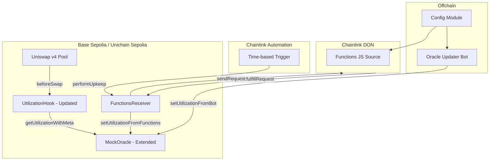
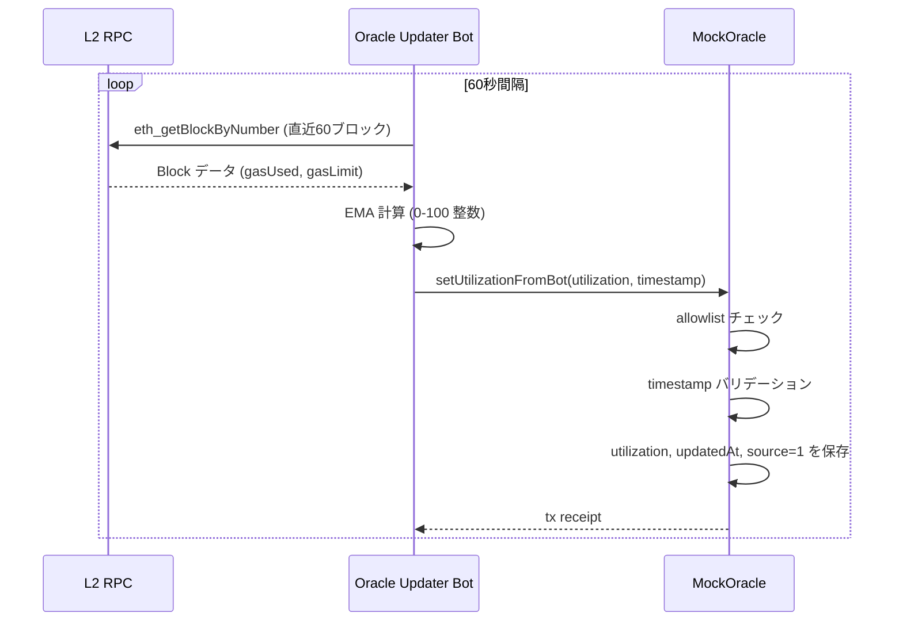
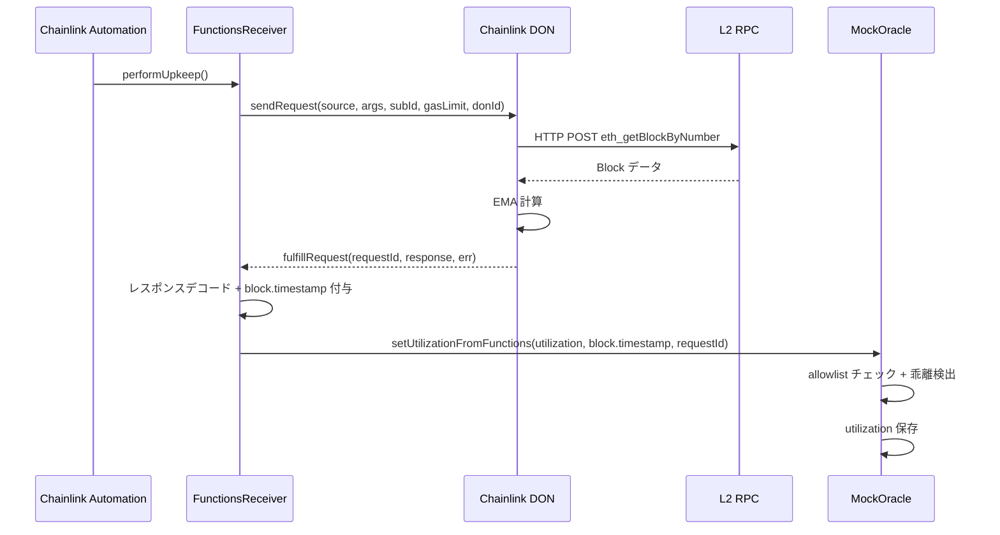
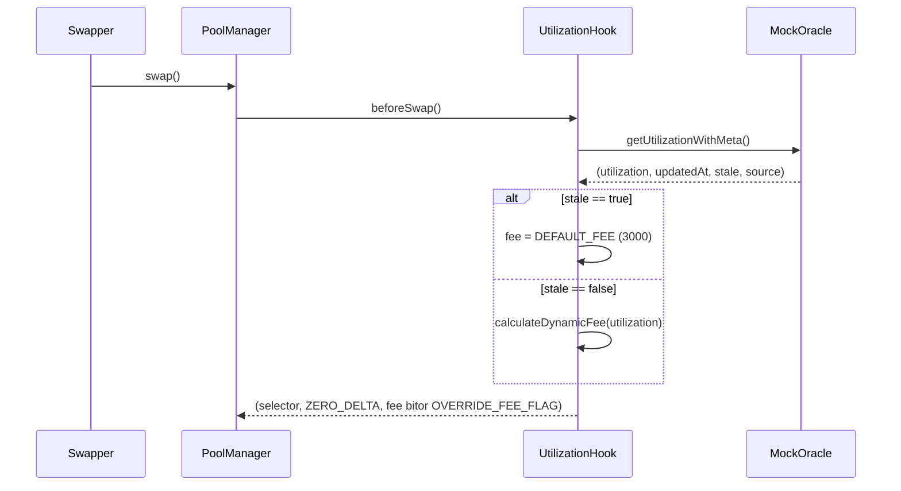
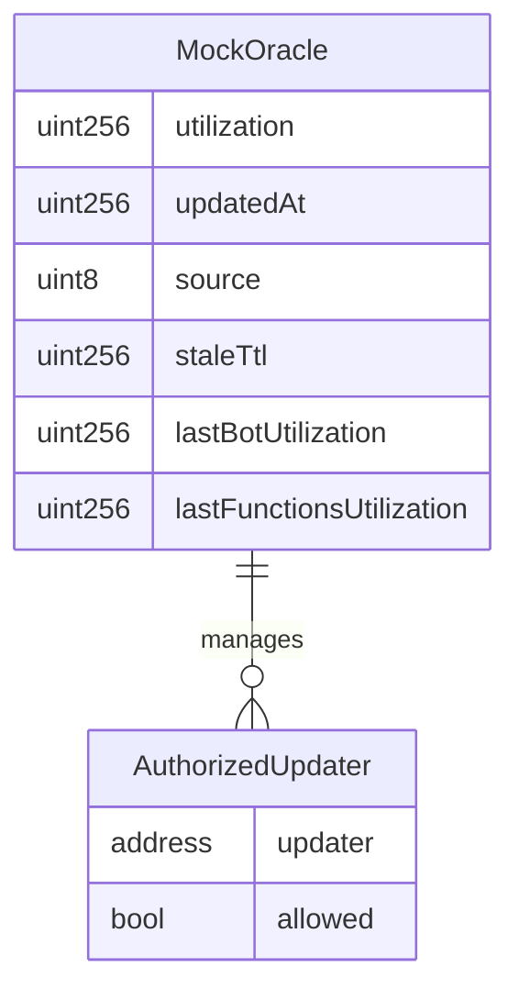

# Technical Design: l2-utilization-oracle

## Overview

**Purpose**: MockOracle.sol を Block Fullness EMA に基づくプロダクションオラクルに拡張し、高頻度 bot 更新と Chainlink Functions 検証のハイブリッド方式で L2 稼働率を提供する。UtilizationHook は stale 検出により安全な手数料決定を行う。

**Users**: Uniswap v4 Hook（自動参照）、システム運用者（bot/Functions 管理）、コントラクト管理者（allowlist/TTL 設定）。

**Impact**: 既存の MockOracle を拡張（後方互換維持）。UtilizationHook は新インターフェースで再デプロイ。オフチェーン bot と Chainlink Functions コンポーネントを新規追加。

### Goals
- L2 稼働率を EMA で正規化し、メタデータ付きでオンチェーン提供する
- bot + Functions のハイブリッド更新で信頼性と検証性を両立する
- stale 検出により障害時に安全側（DEFAULT_FEE）へフォールバックする
- allowlist によるアクセス制御で不正更新を防止する

### Non-Goals
- オンチェーンでの EMA 計算（オフチェーンで算出し結果のみ書き込む）
- Unichain Sepolia での Chainlink Functions 統合（未サポートのため bot のみ）
- Oracle のプロキシ化やアップグレーダビリティ（ハッカソンスコープ外）
- 複数 L2 の稼働率集約（各チェーンに独立した Oracle をデプロイ）

## Architecture

### Existing Architecture Analysis

現在の構成:
- `MockOracle.sol`: `IMockOracle` を実装。`_utilization` 状態変数のみ。認可・メタデータ・TTL なし
- `UtilizationHook.sol`: `oracle.getUtilization()` を呼び、3 段階 fee を返す。`IMockOracle` を immutable 保持
- テスト: MockOracle 4 件、Hook 40+ 件、統合 6 件。境界値テスト重視
- デプロイ: Foundry スクリプト + `deployed-addresses.json` でアドレス管理

維持すべきパターン:
- `IMockOracle` の既存シグネチャ（`getUtilization()`, `setUtilization(uint256)`）
- CREATE2 + HookMiner によるアドレスマイニング
- 環境変数ベースのデプロイ設定
- `deployed-addresses.json` によるアドレス管理

### Architecture Pattern & Boundary Map



**Architecture Integration**:
- **Selected pattern**: ハイブリッドアプローチ — 既存 Oracle 拡張 + FunctionsReceiver 分離 + オフチェーン新規作成
- **Domain boundaries**: Oracle（データ保存・鮮度管理・アクセス制御）、FunctionsReceiver（Chainlink 通信）、Bot（データ取得・EMA 計算）、Hook（手数料決定）
- **Existing patterns preserved**: IMockOracle 互換、CREATE2 デプロイ、Foundry テスト
- **New components rationale**: FunctionsReceiver は Chainlink 固有ロジックを分離し Oracle のテスタビリティを維持。Bot は EMA 計算の複雑性をオフチェーンに隔離
- **Steering compliance**: Solidity 0.8.26 / Foundry / OpenZeppelin 準拠。段階デリバリーでハッカソンのタイムボックスに適合

### Technology Stack

| Layer | Choice / Version | Role in Feature | Notes |
|-------|------------------|-----------------|-------|
| Smart Contracts | Solidity 0.8.26 / Foundry | Oracle, Hook, FunctionsReceiver | 既存スタック維持 |
| Chainlink | @chainlink/contracts (FunctionsClient v1.0.0) | Functions 応答受信 | `forge install smartcontractkit/chainlink-evm` |
| OpenZeppelin | Ownable | アクセス制御の基盤 | 既存依存に含まれる |
| Off-chain Bot | TypeScript / viem | EMA 計算・Oracle 更新 | 既存 scripts/ パターンに準拠 |
| Functions Source | JavaScript | DON 上での Block Fullness 再計算 | 4KB / 10秒制約内 |
| Automation | Chainlink Automation | Functions 定期トリガー | Base Sepolia のみ |

## System Flows

### フロー 1: Bot 更新フロー



### フロー 2: Chainlink Functions 検証フロー



### フロー 3: Swap 時の手数料決定フロー



## Requirements Traceability

| Requirement | Summary | Components | Interfaces | Flows |
|-------------|---------|------------|------------|-------|
| 1.1 | utilization を 0-100 で保存 | MockOracle | `_utilization`, `_updatedAt`, `_source` | Bot更新, Functions検証 |
| 1.2 | 100超過で revert | MockOracle | `_updateUtilization()` 内部 | — |
| 1.3 | updatedAt 同時記録 | MockOracle | `_updateUtilization()` | — |
| 1.4 | source フィールド識別 | MockOracle | `SOURCE_BOT=1`, `SOURCE_FUNCTIONS=2` | — |
| 1.5 | getUtilizationWithMeta() | MockOracle | `IMockOracle` 拡張 | Swap手数料決定 |
| 2.1 | setUtilizationFromBot() | MockOracle | `IMockOracle` 拡張 | Bot更新 |
| 2.2 | setUtilizationFromFunctions() | MockOracle | `IMockOracle` 拡張 | Functions検証 |
| 2.3 | 乖離時 Functions 優先 | MockOracle | `_updateUtilization()` 内部 | — |
| 2.4 | 独立した更新受付 | MockOracle | 2つの更新関数 | — |
| 3.1 | setAuthorizedUpdater() | MockOracle | `Ownable` + allowlist | — |
| 3.2 | 非認可アドレスの revert | MockOracle | `onlyAuthorized` modifier | — |
| 3.3 | UpdaterAuthorizationChanged | MockOracle | Event | — |
| 3.4 | 管理者ロール制限 | MockOracle | `onlyOwner` | — |
| 3.5 | setUtilization 互換維持 | MockOracle | 既存関数 + allowlist | — |
| 4.1 | updatedAt と staleTtl 保持 | MockOracle | State variables | — |
| 4.2 | TTL超過で stale=true | MockOracle | `_isStale()` 内部 | Swap手数料決定 |
| 4.3 | setStaleTtl() + TtlUpdated | MockOracle | `onlyOwner` | — |
| 4.4 | 初期状態 stale=true | MockOracle | `_updatedAt = 0` | — |
| 4.5 | 更新時 stale リセット | MockOracle | `_updateUtilization()` | — |
| 5.1 | Hook が getUtilizationWithMeta 使用 | UtilizationHook | `IMockOracle` 拡張 | Swap手数料決定 |
| 5.2 | stale 時 DEFAULT_FEE 強制 | UtilizationHook | `beforeSwap()` | Swap手数料決定 |
| 5.3 | 非stale 時に動的手数料 | UtilizationHook | `calculateDynamicFee()` | Swap手数料決定 |
| 5.4 | deterministic 手数料 | UtilizationHook | pure 関数 | — |
| 6.1 | ブロックデータ取得 | Oracle Updater Bot | viem RPC client | Bot更新 |
| 6.2 | EMA 計算 | Oracle Updater Bot | `calculateEMA()` | Bot更新 |
| 6.3 | 60秒間隔更新 | Oracle Updater Bot | setInterval loop | Bot更新 |
| 6.4 | RPC フォールバック | Oracle Updater Bot | Config: primaryRpc, fallbackRpc | Bot更新 |
| 6.5 | 設定ファイル読み込み | Oracle Updater Bot, Config Module | `OracleConfig` type | — |
| 7.1 | Functions で EMA 再計算 | FunctionsReceiver, Functions JS Source | HTTP + EMA 計算 | Functions検証 |
| 7.2 | 15分間隔実行 | Chainlink Automation | CRON trigger | Functions検証 |
| 7.3 | fulfillRequest で記録 | FunctionsReceiver | `fulfillRequest()` override | Functions検証 |
| 7.4 | デプロイ自動化 | Deploy Script | Foundry script | — |
| 7.5 | Functions 失敗時の継続 | MockOracle | bot 更新独立動作 | — |
| 8.1 | UtilizationUpdated イベント | MockOracle | Event (utilization, source, updatedAt) | — |
| 8.2 | UpdaterAuthorizationChanged | MockOracle | Event (updater, allowed) | — |
| 8.3 | TtlUpdated イベント | MockOracle | Event (ttlSeconds) | — |
| 8.4 | source 区別 | MockOracle | `uint8 source` in event | — |
| 9.1 | 全停止時 DEFAULT_FEE | UtilizationHook + MockOracle | stale 判定 | Swap手数料決定 |
| 9.2 | 未来 timestamp revert | MockOracle | `_validateTimestamp()` | — |
| 9.3 | 古すぎる timestamp revert | MockOracle | `_validateTimestamp()` | — |
| 9.4 | Functions 不能時 bot 継続 | MockOracle | 独立更新パス | — |
| 9.5 | 初期状態 stale + DEFAULT_FEE | MockOracle + UtilizationHook | `_updatedAt = 0` | — |
| 10.1 | setUtilization シグネチャ維持 | MockOracle | `IMockOracle` | — |
| 10.2 | setUtilization に allowlist | MockOracle | 内部統合 | — |
| 10.3 | getUtilization 維持 | MockOracle | `IMockOracle` | — |
| 10.4 | IMockOracle 互換 | MockOracle | Interface | — |
| 11.1 | 設定一元管理 | Config Module | `OracleConfig` type | — |
| 11.2 | Chainlink 設定保持 | Config Module | router, subscriptionId | — |
| 11.3 | チェーンごと設定 | Config Module | `ChainConfig` type | — |
| 11.4 | 環境変数優先 | Config Module | `process.env` override | — |

## Components and Interfaces

| Component | Domain/Layer | Intent | Req Coverage | Key Dependencies | Contracts |
|-----------|--------------|--------|--------------|------------------|-----------|
| MockOracle (拡張) | On-chain / Data | 稼働率データの保存・鮮度管理・アクセス制御 | 1, 2, 3, 4, 8, 9, 10 | OpenZeppelin Ownable (P0) | Service, Event, State |
| UtilizationHook (更新) | On-chain / Hook | stale 対応の動的手数料決定 | 5, 9 | MockOracle (P0), PoolManager (P0) | Service |
| FunctionsReceiver | On-chain / Integration | Chainlink Functions 応答受信・Oracle 更新 | 7 | FunctionsClient (P0), MockOracle (P0), Automation (P1) | Service, Event |
| Oracle Updater Bot | Off-chain / Service | EMA 計算・Oracle 高頻度更新 | 6 | viem (P0), Config (P0) | Batch |
| Functions JS Source | Off-chain / Chainlink | DON 上での Block Fullness 再計算 | 7 | Chainlink DON (P0) | — |
| Config Module | Off-chain / Config | チェーンごとの設定一元管理 | 11 | — | — |

### On-chain Layer

#### MockOracle (拡張)

| Field | Detail |
|-------|--------|
| Intent | L2 稼働率データの保存・鮮度管理・allowlist アクセス制御を一元提供 |
| Requirements | 1.1-1.5, 2.1-2.4, 3.1-3.5, 4.1-4.5, 8.1-8.4, 9.2-9.5, 10.1-10.4 |

**Responsibilities & Constraints**
- 稼働率（0-100 整数）、更新タイムスタンプ、ソース識別子の保存
- TTL ベースの stale 判定（計算のみ、ストレージに stale フラグは持たない）
- allowlist による書き込み権限管理（Ownable ベース）
- bot 値と Functions 値の乖離検出・優先適用
- 後方互換: `getUtilization()` と `setUtilization(uint256)` を維持

**Dependencies**
- External: OpenZeppelin `Ownable` — アクセス制御基盤 (P0)

**Contracts**: Service [x] / Event [x] / State [x]

##### Service Interface

```solidity
interface IMockOracle {
    // === 既存（後方互換） ===
    function getUtilization() external view returns (uint256 utilization);
    function setUtilization(uint256 utilization) external;

    // === 新規追加 ===
    function getUtilizationWithMeta()
        external
        view
        returns (uint256 utilization, uint256 updatedAt, bool stale, uint8 source);

    function setUtilizationFromBot(uint256 utilization, uint256 timestamp) external;

    /// @dev timestamp は fulfillRequest 実行時の block.timestamp を使用すること。
    ///      JavaScript ソースからは utilization 値のみを返し、timestamp は Solidity 側で付与する。
    function setUtilizationFromFunctions(
        uint256 utilization,
        uint256 timestamp,
        bytes32 requestId
    ) external;

    function setStaleTtl(uint256 ttlSeconds) external;

    function setAuthorizedUpdater(address updater, bool allowed) external;
}
```

- Preconditions:
  - `setUtilizationFromBot` / `setUtilizationFromFunctions`: 呼び出し元が allowlist に登録済み、utilization ≤ 100、timestamp が有効範囲内
  - `setStaleTtl` / `setAuthorizedUpdater`: 呼び出し元が owner
- Postconditions:
  - 更新後に `UtilizationUpdated` イベントが発行される
  - `_updatedAt` が更新され stale 判定が false になる
- Invariants:
  - `_utilization` は常に 0 ≤ x ≤ 100
  - `_updatedAt = 0` の場合、stale は常に true

##### Event Contract

```solidity
event UtilizationUpdated(uint256 utilization, uint8 source, uint256 updatedAt);
event UpdaterAuthorizationChanged(address indexed updater, bool allowed);
event TtlUpdated(uint256 ttlSeconds);
```

- Published events: 上記 3 種
- Ordering: トランザクション内で即座に発行
- source 値: `1` = bot, `2` = Functions

##### State Management

```solidity
// Core state
uint256 private _utilization;        // 0-100
uint256 private _updatedAt;          // block.timestamp at last update
uint8 private _source;              // 1=bot, 2=functions
uint256 private _staleTtl;          // default: 1200 (20 minutes)

// Divergence tracking
uint256 private _lastBotUtilization;
uint256 private _lastFunctionsUtilization;

// Access control
mapping(address => bool) private _authorizedUpdaters;

// Constants
uint8 constant SOURCE_BOT = 1;
uint8 constant SOURCE_FUNCTIONS = 2;
uint256 constant DEFAULT_STALE_TTL = 1200;
uint256 constant MAX_TIMESTAMP_FUTURE_DRIFT = 60;   // 1 min future tolerance
uint256 constant MAX_TIMESTAMP_AGE = 3600;           // 1 hour max age
uint256 constant DIVERGENCE_THRESHOLD = 15;          // 15 points
```

- Persistence: すべて EVM storage
- Consistency: 単一トランザクションでアトミック更新
- stale 判定: `block.timestamp - _updatedAt > _staleTtl` で動的計算（ストレージに保存しない）

**Implementation Notes**
- 乖離検出: `setUtilizationFromFunctions` 呼び出し時に以下のルールで判定する:
  1. `_lastBotUtilization == 0`（bot 未更新）の場合 → 乖離チェックをスキップし、Functions 値をそのまま採用
  2. `abs(_lastBotUtilization - functionsValue) > DIVERGENCE_THRESHOLD` の場合 → Functions 値を `_utilization` に書き込み（乖離補正）
  3. 上記以外 → Functions 値を `_lastFunctionsUtilization` に記録するが、`_utilization` は最新の更新値を維持
  4. 乖離補正後、bot の次回更新では通常モードに復帰する（クールダウンや抑制は行わない）
- `setUtilization(uint256)` は内部で `_updateUtilization(utilization, block.timestamp, SOURCE_BOT)` を呼び、allowlist チェックを適用
- 初期状態: `_updatedAt = 0` により `_isStale()` は true を返す

---

#### UtilizationHook (更新)

| Field | Detail |
|-------|--------|
| Intent | オラクルの stale 判定を活用し、安全な動的手数料を決定する |
| Requirements | 5.1-5.4, 9.1, 9.5 |

**Responsibilities & Constraints**
- `getUtilizationWithMeta()` からメタデータ付きで稼働率を取得
- stale 時は `DEFAULT_FEE` を強制適用（安全側フォールバック）
- 非stale 時は既存の `calculateDynamicFee()` で動的手数料を計算
- 既存のfee定数・閾値定数は変更なし

**Dependencies**
- Inbound: PoolManager — beforeSwap コールバック (P0)
- Outbound: MockOracle — `getUtilizationWithMeta()` (P0)

**Contracts**: Service [x]

##### Service Interface

```solidity
// beforeSwap の変更箇所のみ記載
function beforeSwap(
    address,
    PoolKey calldata key,
    IPoolManager.SwapParams calldata,
    bytes calldata
) external virtual returns (bytes4, BeforeSwapDelta, uint24) {
    // 1. msg.sender == poolManager チェック
    // 2. oracle.getUtilizationWithMeta() を呼び出し
    // 3. stale == true → fee = DEFAULT_FEE
    //    stale == false → fee = calculateDynamicFee(utilization)
    // 4. FeeOverridden イベント発行
    // 5. (selector, ZERO_DELTA, fee | OVERRIDE_FEE_FLAG) を返す
}
```

- Preconditions: `msg.sender == address(poolManager)`
- Postconditions: FeeOverridden イベントが発行される
- Invariants: `calculateDynamicFee` は pure 関数であり deterministic

**Implementation Notes**
- `IMockOracle` の型を新インターフェースに変更。Hook の再デプロイが必要
- `calculateDynamicFee()` は変更なし（既存ロジック維持）
- stale 判定の追加のみが実質的な変更

---

#### FunctionsReceiver

| Field | Detail |
|-------|--------|
| Intent | Chainlink Functions の応答を受信し Oracle に検証値を書き込む |
| Requirements | 7.1-7.5 |

**Responsibilities & Constraints**
- `FunctionsClient` を継承し、Chainlink Router と通信
- `AutomationCompatibleInterface` を実装し、15分間隔の定期実行をサポート
- `fulfillRequest` で応答をデコードし `oracle.setUtilizationFromFunctions()` を呼び出す
- Base Sepolia のみにデプロイ（Unichain Sepolia は Chainlink Functions 未サポート）

**Dependencies**
- External: Chainlink FunctionsClient — Functions 応答受信 (P0)
- External: Chainlink AutomationCompatibleInterface — 定期トリガー (P1)
- Outbound: MockOracle — `setUtilizationFromFunctions()` (P0)

**Contracts**: Service [x] / Event [x]

##### Service Interface

```solidity
contract FunctionsReceiver is FunctionsClient, AutomationCompatibleInterface, ConfirmedOwner {
    IMockOracle public immutable oracle;
    bytes32 public donId;
    uint64 public subscriptionId;
    uint32 public callbackGasLimit;
    string public source;          // JavaScript ソースコード
    string[] public args;          // RPC URL 等の引数
    uint256 public minUpkeepInterval;  // default: 600 (10 minutes) — クールダウン
    uint256 public lastUpkeepTimestamp; // 前回 performUpkeep 実行時刻

    bytes32 public s_lastRequestId;
    bytes public s_lastResponse;
    bytes public s_lastError;

    // Automation interface
    function checkUpkeep(bytes calldata) external view returns (bool upkeepNeeded, bytes memory);
    /// @dev クールダウン: block.timestamp - lastUpkeepTimestamp >= minUpkeepInterval を検証。
    ///      外部からの不正呼び出しによる LINK サブスクリプション枯渇を防止する。
    function performUpkeep(bytes calldata) external;

    // FunctionsClient override
    function fulfillRequest(bytes32 requestId, bytes memory response, bytes memory err) internal override;

    // Admin
    function setSource(string memory newSource) external onlyOwner;
    function setArgs(string[] memory newArgs) external onlyOwner;
    function setSubscriptionId(uint64 newSubId) external onlyOwner;
    function setMinUpkeepInterval(uint256 interval) external onlyOwner;
}
```

- Preconditions: `performUpkeep` は Automation forwarder からのみ呼び出し可能
- Postconditions: `fulfillRequest` 成功時に Oracle が更新される
- Invariants: Functions 失敗時でも Oracle の既存値は維持される

##### Event Contract

```solidity
event FunctionsRequestSent(bytes32 indexed requestId);
event FunctionsResponseReceived(bytes32 indexed requestId, uint256 utilization);
event FunctionsError(bytes32 indexed requestId, bytes error);
```

**Implementation Notes**
- `fulfillRequest` 内で `err` が空でない場合は `FunctionsError` を発行し、Oracle 更新はスキップ
- `fulfillRequest` 内で Oracle に渡す `timestamp` は `block.timestamp`（コールバック実行時刻）を使用する。JavaScript ソースからは utilization 値（uint256）のみをエンコードして返し、timestamp は Solidity 側で付与する
- `checkUpkeep` は `block.timestamp - lastUpkeepTimestamp >= minUpkeepInterval` を満たす場合に `true` を返す（クールダウン機構）
- `performUpkeep` は実行前にクールダウンを検証し、通過した場合のみ `lastUpkeepTimestamp` を更新して Functions リクエストを送信する。これにより外部からの不正な高頻度呼び出しによる LINK 枯渇を防止する
- Oracle の authorized updater として登録が必要（デプロイ後にオーナーが `setAuthorizedUpdater` を呼ぶ）

---

### Off-chain Layer

#### Oracle Updater Bot

| Field | Detail |
|-------|--------|
| Intent | L2 ブロックデータから EMA を計算し Oracle を高頻度更新 |
| Requirements | 6.1-6.5 |

**Responsibilities & Constraints**
- 対象 L2 の最新ブロック群（60 ブロック）から gasUsed/gasLimit を取得
- EMA（α = 2/61）で稼働率を計算し 0-100 整数に変換
- 設定間隔（60秒）で `setUtilizationFromBot()` を送信
- RPC 障害時に副系エンドポイントへフォールバック

**Dependencies**
- External: viem — RPC 通信・トランザクション送信 (P0)
- External: Config Module — 設定読み込み (P0)
- Outbound: MockOracle — `setUtilizationFromBot()` (P0)

**Contracts**: Batch [x]

##### Batch / Job Contract

```typescript
interface OracleUpdaterBot {
  start(): Promise<void>;
  stop(): void;
}

// EMA 計算
function calculateEMA(
  blocks: Array<{ gasUsed: bigint; gasLimit: bigint }>,
  alpha: number
): number;  // 0-100 integer

// 単一更新サイクル
async function updateOracle(
  client: WalletClient,
  oracleAddress: Address,
  rpcUrl: string,
  fallbackRpcUrl: string,
  emaWindow: number
): Promise<TransactionReceipt>;
```

- Trigger: `setInterval` で 60 秒間隔
- Input: RPC からブロックデータ取得
- Output: `setUtilizationFromBot` トランザクション
- Idempotency: 同一 utilization 値でも更新（updatedAt の更新で stale 防止）

**Implementation Notes**
- `scripts/oracle-updater.ts` として配置（既存 scripts/ パターン準拠）
- EMA 計算: `α = 2 / (N + 1)` where `N = emaWindow`（デフォルト 60）
- 各ブロックの `gasUsed / gasLimit` 比率に対して EMA を適用し、最終値を `* 100` で整数化
- エラー時はログ出力して次サイクルを待つ（クラッシュしない）

---

#### Functions JavaScript Source

| Field | Detail |
|-------|--------|
| Intent | Chainlink DON 上で独立に Block Fullness を再計算 |
| Requirements | 7.1 |

**Implementation Notes**
- `Functions.makeHttpRequest()` で RPC に `eth_getBlockByNumber` を POST
- bot と同一の EMA 計算式を適用
- `Functions.encodeUint256(utilization)` で結果を返す
- 4KB / 10 秒制約内に収まるよう最小限のコード
- RPC URL は `args[0]` で受け取り（ソースコードにハードコードしない）
- 配置: `scripts/arbitrage/functions/source.js`

---

#### Config Module

| Field | Detail |
|-------|--------|
| Intent | チェーンごとのオラクル設定を一元管理 |
| Requirements | 11.1-11.4 |

**Contracts**: — (設定型定義のみ)

```typescript
interface ChainOracleConfig {
  chainId: number;
  chainName: string;
  oracleAddress: Address;
  primaryRpc: string;
  fallbackRpc: string;
  emaWindow: number;             // default: 60
  botUpdateInterval: number;      // default: 60000 (ms)
  functionsEnabled: boolean;      // Base Sepolia: true, Unichain: false
  functionsVerifyInterval: number; // default: 900000 (ms, 15min)
  divergenceThreshold: number;    // default: 15
  staleTtl: number;              // default: 1200 (seconds)
}

interface ChainlinkConfig {
  routerAddress: Address;
  subscriptionId: bigint;
  donId: string;
  callbackGasLimit: number;
}

interface OracleConfig {
  chains: Record<string, ChainOracleConfig>;
  chainlink: Record<string, ChainlinkConfig>;  // chain name → config
  deployerPrivateKey: string;  // from env
}
```

**Implementation Notes**
- 配置: `scripts/arbitrage/config.ts` に統合（既存パターン準拠）
- 環境変数 (`process.env`) が設定されている場合はファイル値を上書き
- チェーンごとに `functionsEnabled` フラグで Chainlink Functions の有効/無効を制御

## Data Models

### Domain Model



- **Aggregate Root**: MockOracle コントラクト
- **Entities**: 稼働率データ（utilization, updatedAt, source）
- **Value Objects**: AuthorizedUpdater（allowlist エントリ）
- **Invariants**: utilization ∈ [0, 100]、updatedAt = 0 → stale = true

### Logical Data Model

**Oracle State**:
- `_utilization`: 直近の正規化稼働率（EMA 適用済み）
- `_updatedAt`: 最終更新の block.timestamp
- `_source`: 最終更新ソース（1=bot, 2=functions）
- `_staleTtl`: stale 判定の TTL 秒数
- `_lastBotUtilization`: bot からの最終値（乖離比較用）
- `_lastFunctionsUtilization`: Functions からの最終値（乖離比較用）

**Stale 判定ロジック**:
```
isStale = (_updatedAt == 0) || (block.timestamp - _updatedAt > _staleTtl)
```

**乖離検出ロジック**:
```
divergence = abs(_lastBotUtilization - functionsUtilization)
if divergence > DIVERGENCE_THRESHOLD:
    use functionsUtilization as canonical
```

## Error Handling

### Error Strategy

| エラー種別 | 発生箇所 | 対応 |
|-----------|---------|------|
| utilization > 100 | Oracle | revert `MockOracle: utilization out of range` |
| 未認可アドレス | Oracle | revert `MockOracle: unauthorized updater` |
| 未来 timestamp | Oracle | revert `MockOracle: timestamp in future` |
| 古すぎる timestamp | Oracle | revert `MockOracle: timestamp too old` |
| stale データ | Hook | DEFAULT_FEE (3000) を適用。revert しない |
| RPC 接続失敗 | Bot | fallback RPC に切り替え。両方失敗時はログ出力しスキップ |
| Functions 実行失敗 | FunctionsReceiver | FunctionsError イベント発行。Oracle 既存値を維持 |
| Automation 未到達 | FunctionsReceiver | TTL で stale 化 → DEFAULT_FEE。システムは安全に継続 |

### Monitoring
- Oracle の `UtilizationUpdated` イベントで更新頻度と source 分布を監視
- Bot はコンソールログで各サイクルの成功/失敗を出力
- FunctionsReceiver の `FunctionsError` イベントで Chainlink 障害を検知

## Testing Strategy

### Unit Tests (Solidity — forge test)

| テスト | 対象 | 要件 |
|--------|------|------|
| allowlist 外からの更新拒否 | MockOracle | 3.2 |
| utilization > 100 の revert | MockOracle | 1.2 |
| TTL 超過で stale = true | MockOracle | 4.2 |
| 初期状態で stale = true | MockOracle | 4.4, 9.5 |
| source 別イベント発行 | MockOracle | 8.1, 8.4 |
| 未来 timestamp の revert | MockOracle | 9.2 |
| 古すぎる timestamp の revert | MockOracle | 9.3 |
| setUtilization 後方互換 + allowlist | MockOracle | 10.1, 10.2 |
| 乖離閾値超過で Functions 優先 | MockOracle | 2.3 |
| setStaleTtl + TtlUpdated | MockOracle | 4.3, 8.3 |
| setAuthorizedUpdater + イベント | MockOracle | 3.1, 3.3 |
| stale 時 DEFAULT_FEE 返却 | UtilizationHook | 5.2, 9.1 |
| 非stale 時の動的手数料 | UtilizationHook | 5.3 |

### Integration Tests (Solidity — forge test)

| テスト | 対象 | 要件 |
|--------|------|------|
| bot 更新 → Hook fee 反映 | MockOracle + Hook | 2.1, 5.1 |
| Functions 更新 → 補正反映 | MockOracle + Hook | 2.2, 7.3 |
| 更新停止 → stale → DEFAULT_FEE | MockOracle + Hook | 9.1 |
| FunctionsReceiver → Oracle 更新 | FunctionsReceiver + Oracle | 7.3 |

### Off-chain Tests

| テスト | 対象 | 要件 |
|--------|------|------|
| EMA 計算の正確性 | Bot calculateEMA | 6.2 |
| RPC フォールバック | Bot updateOracle | 6.4 |
| 設定読み込み・環境変数上書き | Config Module | 11.1-11.4 |

## Security Considerations

- **allowlist 管理**: `setAuthorizedUpdater` は `onlyOwner` で保護。deployer が owner となる
- **timestamp 操作防止**: `MAX_TIMESTAMP_FUTURE_DRIFT` (60秒) と `MAX_TIMESTAMP_AGE` (1時間) でバリデーション。マイナーによる timestamp 操作の影響を制限
- **stale フェイルセーフ**: 全更新ソース停止時は DEFAULT_FEE (3000 = 0.3%) を適用。低手数料による LP 損失を防止
- **reentrancy**: Oracle の更新関数は外部コントラクトへの呼び出しを行わないため、reentrancy リスクは低い
- **Chainlink Functions セキュリティ**: RPC URL を `args` で渡し、ソースコードにハードコードしない

## Performance & Scalability

- **ガス効率**: stale 判定は `_updatedAt` と `block.timestamp` の比較のみ（ストレージ読み取り 1 回追加）
- **bot 更新頻度**: 60 秒間隔。ガス代はネットワークに依存するが、テストネットでは無料
- **Functions 実行コスト**: 15 分間隔。LINK トークンで支払い。テストネットの faucet から取得可能
- **Hook パフォーマンス**: `getUtilizationWithMeta()` は view 関数（ガス不要）。既存の `getUtilization()` と同等のパフォーマンス

## Migration Strategy

### Phase 1: オンチェーン基盤（必須）
1. `IMockOracle` インターフェース拡張
2. `MockOracle.sol` 拡張実装
3. `UtilizationHook.sol` 更新
4. テスト追加
5. Oracle 再デプロイ → `deployed-addresses.json` 更新
6. Hook 再デプロイ（CREATE2 再マイニング）→ Pool 再作成

### Phase 2: Bot 更新（必須）
1. `scripts/arbitrage/config.ts` 設定ファイル作成
2. `scripts/oracle-updater.ts` 実装
3. bot 起動・動作確認

### Phase 3: Chainlink Functions（Base Sepolia のみ）
1. Chainlink 依存追加（`forge install smartcontractkit/chainlink-evm`）
2. `FunctionsReceiver.sol` 実装
3. `scripts/arbitrage/functions/source.js` 作成
4. Chainlink Functions Subscription 作成・funding
5. FunctionsReceiver デプロイ → Oracle の authorized updater に登録
6. Chainlink Automation upkeep 作成（CRON: `0 */15 * * * *`）
