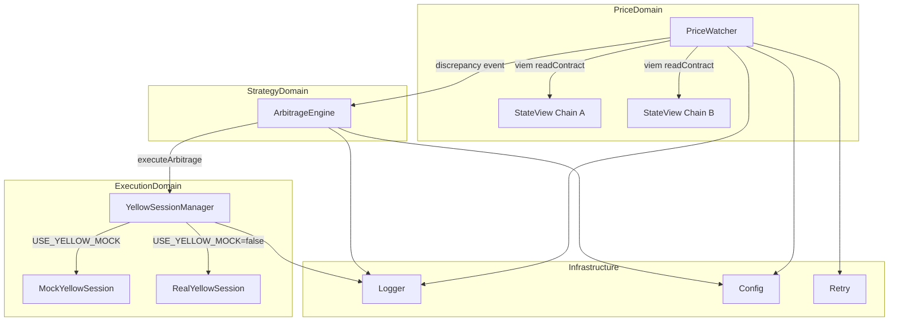
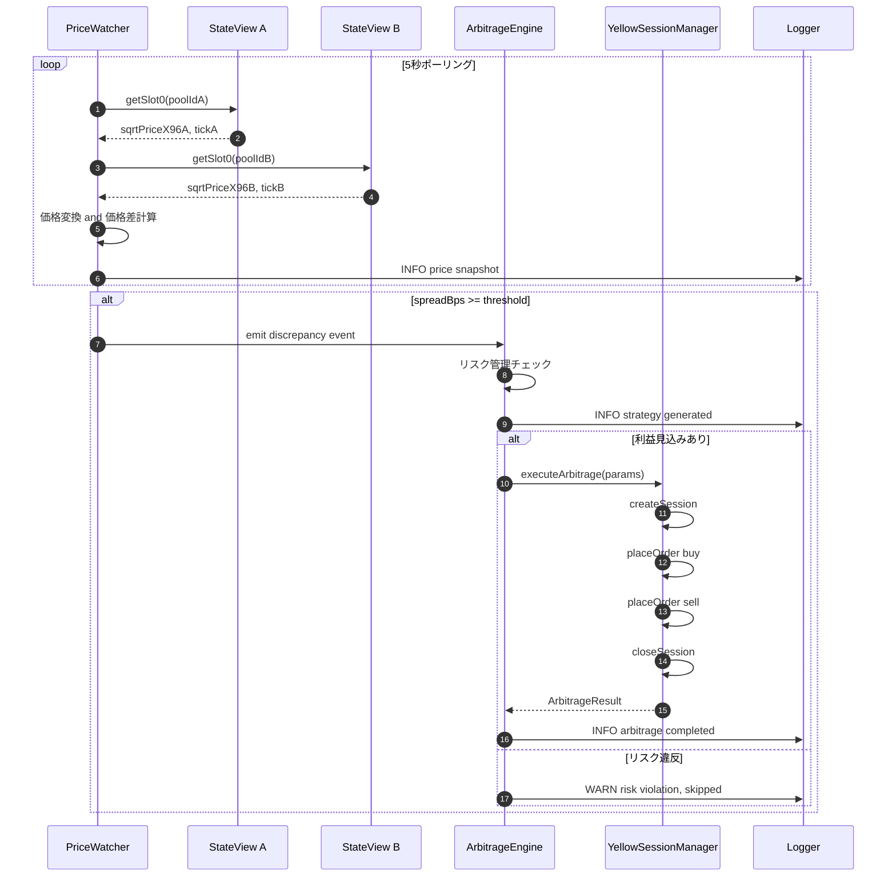
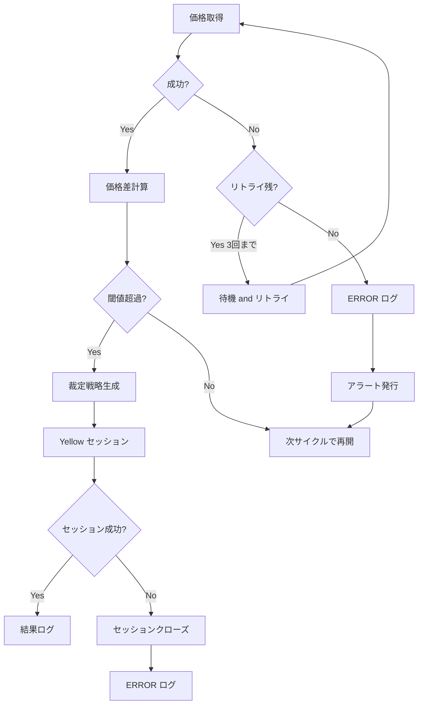
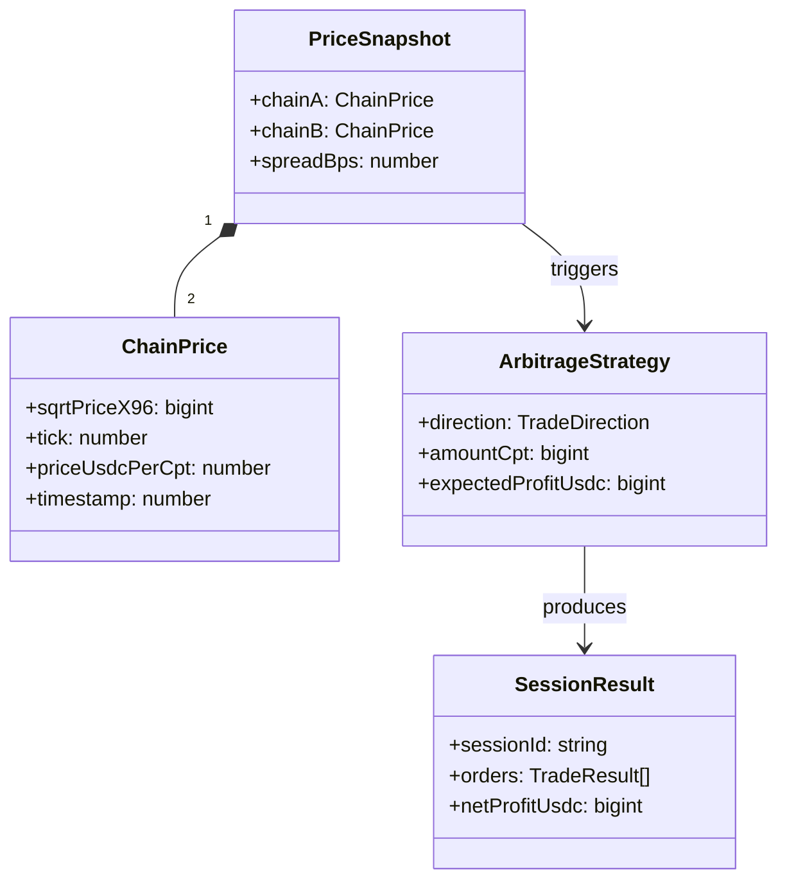

# Design Document: Offchain Arbitrage Engine

## Overview

**Purpose**: Offchain Arbitrage Engine は、複数 L2 チェーン上の CPT/USDC プール価格を監視し、裁定機会を検知して、Yellow SDK によるガスレス高速裁定を自動実行するオフチェーンシステムである。

**Users**:
- **システム（自動実行）**: 価格監視 → 裁定戦略生成 → Yellow セッション実行の自動パイプライン
- **開発者**: Yellow SDK 統合またはモック実装の選択、設定管理

**Impact**: ガスレスかつ高速な裁定実行により、L2 間の CPT 価格差を効率的に取引し、Operator Vault への USDC 収益を最大化する。ハッカソンデモにおいて、Uniswap v4 → Yellow Network → Arc 決済の統合フローを可視化する。

### Goals

- 5秒間隔の価格監視で L2 間の CPT/USDC 価格差を検知する
- 裁定戦略を自動生成し、Yellow セッション内でガスレス売買を実行する
- `IYellowSession` インターフェースによる Mock/Real の DI 切り替えを提供する
- 構造化ログ（JSON）とリトライロジックによる運用可観測性を確保する

### Non-Goals

- CPT Token 発行・管理（core-token-system 仕様）
- Uniswap v4 Pool 初期化・流動性管理（uniswap-v4-integration 仕様）
- Arc + Circle USDC 決済統合（settlement-layer 仕様）
- Dashboard UI（dashboard-demo 仕様）

---

## Architecture

### Architecture Pattern & Boundary Map

**Selected pattern**: Event-driven Pipeline（EventEmitter ベース）
- PriceWatcher → ArbitrageEngine → YellowSessionManager を EventEmitter で疎結合に接続
- 各コンポーネントは独立してテスト可能

**Domain boundaries**:
- `Price Domain`: チェーン価格取得・比較（viem + StateView）
- `Strategy Domain`: 裁定分析・リスク管理（純粋ロジック）
- `Execution Domain`: Yellow セッション管理（SDK / Mock）
- `Infrastructure`: ロガー・リトライ・設定管理

**Existing patterns preserved**: クラスベースサービス、kebab-case ファイル名、`{success, error?}` 結果パターン

**New components rationale**: 裁定エンジンは既存 Arc 決済スクリプトとは独立した責務群であり、リアルタイム処理のため専用設計が必要

**Steering compliance**: TypeScript strict mode、ES Modules、tsx ランタイム



### Technology Stack

| Layer | Choice / Version | Role | Notes |
|-------|------------------|------|-------|
| Runtime | Node.js 20+ / tsx | TypeScript 実行 | 既存パターン踏襲 |
| Language | TypeScript 5.x (strict) | 型安全性 | tsconfig strict: true |
| Chain Interaction | viem ^2.x | Uniswap v4 Pool 価格読み取り | StateView.getSlot0() |
| Yellow SDK | @erc7824/nitrolite | ガスレスセッション | モックフォールバック付き |
| Test Framework | Vitest ^2.x | 単体/統合テスト | @vitest/coverage-v8 |
| WebSocket | ws ^8.x | Yellow ClearNode 接続 | Node.js 用（Real 実装時） |
| Modules | ES Modules | import/export | `"type": "module"` |

---

## System Flows

### メインフロー: 価格監視 → 裁定実行



### エラーフロー: リトライ and フォールバック



---

## Requirements Traceability

| Requirement | Summary | Components | Interfaces | Flows |
|-------------|---------|------------|------------|-------|
| 1.1 | Base Sepolia CPT-A/USDC 価格取得 | PriceWatcher | IPriceWatcher.start() | メインフロー 1-2 |
| 1.2 | L2-B CPT-B/USDC 価格取得 | PriceWatcher | IPriceWatcher.start() | メインフロー 3-4 |
| 1.3 | 価格差閾値検知 → イベント発行 | PriceWatcher | onDiscrepancy callback | メインフロー alt |
| 1.4 | リトライロジック（3回） | PriceWatcher, Retry | withRetry() | エラーフロー |
| 1.5 | エラーログ・アラート | PriceWatcher, Logger | Logger.error() | エラーフロー |
| 1.6 | viem 使用 | PriceWatcher | viem PublicClient | メインフロー 1-4 |
| 1.7 | TypeScript strict mode | 全コンポーネント | — | — |
| 1.8 | 5秒ポーリング | PriceWatcher | Config.pollIntervalMs | メインフロー loop |
| 2.1 | 裁定機会分析 | ArbitrageEngine | IArbitrageEngine.analyze() | メインフロー 8 |
| 2.2 | Yellow セッション開始指示 | ArbitrageEngine | IArbitrageEngine.execute() | メインフロー 10 |
| 2.3 | リスク管理ルール | ArbitrageEngine | RiskConfig | メインフロー alt else |
| 2.4 | 売買方向決定 | ArbitrageEngine | TradeDirection | メインフロー 8 |
| 2.5 | 取引数量計算 | ArbitrageEngine | ArbitrageStrategy | メインフロー 8 |
| 2.6 | 裁定戦略ログ | ArbitrageEngine, Logger | Logger.info() | メインフロー 9 |
| 2.7 | TypeScript strict mode | 全コンポーネント | — | — |
| 3.1 | Yellow セッション開始 | YellowSessionManager | IYellowSession.createSession() | メインフロー 11 |
| 3.2 | セッション ID 取得 | YellowSessionManager | SessionInfo | メインフロー 11 |
| 3.3 | オフチェーンマッチング | YellowSessionManager | IYellowSession.placeOrder() | メインフロー 12-13 |
| 3.4 | 反復売買 | YellowSessionManager | IYellowSession.placeOrder() | メインフロー 12-13 |
| 3.5 | セッション終了・結果返却 | YellowSessionManager | IYellowSession.closeSession() | メインフロー 14-15 |
| 3.6 | エラー時クローズ | YellowSessionManager | IYellowSession.closeSession() | エラーフロー |
| 3.7 | Yellow SDK (Nitrolite) 使用 | RealYellowSession | @erc7824/nitrolite | — |
| 3.8 | ガスレストランザクション | YellowSessionManager | IYellowSession | — |
| 3.9 | モックフォールバック | MockYellowSession | IYellowSession | — |
| 3.10 | USE_YELLOW_MOCK 切り替え | YellowSessionManager, Config | Config.useYellowMock | — |
| 4.1-4.6 | Yellow SDK 調査・統合 | RealYellowSession | — | research.md に記録 |
| 5.1-5.7 | テストスイート | テストファイル群 | Vitest | — |
| 6.1-6.6 | エラーハンドリング・ログ | Logger, Retry | ILogger, withRetry | エラーフロー |

---

## Components and Interfaces

### コンポーネント概要

| Component | Domain/Layer | Intent | Req Coverage | Key Dependencies | Contracts |
|-----------|-------------|--------|--------------|------------------|-----------|
| PriceWatcher | Price | 複数チェーンの CPT/USDC 価格を監視し価格差を検知 | 1.1-1.8 | viem (P0), Config (P0), Logger (P1) | Service, Event |
| ArbitrageEngine | Strategy | 価格差を分析し裁定戦略を生成・実行指示 | 2.1-2.7 | PriceWatcher (P0), YellowSessionManager (P0) | Service |
| YellowSessionManager | Execution | Yellow セッションの作成・売買・終了を管理 | 3.1-3.10 | IYellowSession (P0), Config (P0) | Service |
| MockYellowSession | Execution/Mock | Yellow SDK のモック実装 | 3.9 | — | Service |
| RealYellowSession | Execution/Real | Yellow SDK (Nitrolite) 実統合 | 3.7, 4.1-4.6 | @erc7824/nitrolite (P0), ws (P0) | Service |
| Logger | Infrastructure | 構造化 JSON ログ出力 | 6.1-6.6 | — | Service |
| Retry | Infrastructure | リトライロジック | 1.4, 6.4 | — | Service |
| Config | Infrastructure | 環境変数・チェーン設定管理 | 1.8, 3.10 | deployed-addresses.json (P0) | State |
| Orchestrator | Entry Point | 全コンポーネントの初期化・接続・ライフサイクル管理 | 全体 | 全コンポーネント (P0) | — |

---

### Infrastructure Layer

#### Logger

| Field | Detail |
|-------|--------|
| Intent | 構造化 JSON ログをログレベル付きで出力する |
| Requirements | 6.1, 6.2, 6.3, 6.5, 6.6 |

**Responsibilities & Constraints**
- 4段階のログレベル（DEBUG, INFO, WARN, ERROR）をサポート
- JSON 形式でタイムスタンプ・コンポーネント名・コンテキストを出力
- ERROR レベルでアラート（stderr 出力）を発行

**Dependencies**
- External: なし（Node.js 標準の console を利用）

**Contracts**: Service [x]

##### Service Interface

```typescript
type LogLevel = 'DEBUG' | 'INFO' | 'WARN' | 'ERROR';

interface LogEntry {
  timestamp: string;
  level: LogLevel;
  component: string;
  message: string;
  context?: Record<string, unknown>;
}

interface ILogger {
  debug(component: string, message: string, context?: Record<string, unknown>): void;
  info(component: string, message: string, context?: Record<string, unknown>): void;
  warn(component: string, message: string, context?: Record<string, unknown>): void;
  error(component: string, message: string, context?: Record<string, unknown>): void;
  setLevel(level: LogLevel): void;
}
```

- Preconditions: なし
- Postconditions: ログエントリが stdout（または stderr for ERROR）に JSON 形式で出力される
- Invariants: タイムスタンプは ISO 8601 形式

---

#### Retry

| Field | Detail |
|-------|--------|
| Intent | 外部 API 呼び出しのリトライロジックを提供する |
| Requirements | 1.4, 6.4 |

**Responsibilities & Constraints**
- 最大リトライ回数と待機時間を設定可能
- 指数バックオフ対応
- 全リトライ失敗時に最後のエラーを throw

**Contracts**: Service [x]

##### Service Interface

```typescript
interface RetryOptions {
  maxRetries: number;
  baseDelayMs: number;
  maxDelayMs: number;
  backoffMultiplier: number;
}

declare function withRetry<T>(
  fn: () => Promise<T>,
  options: RetryOptions,
  logger?: ILogger,
  component?: string
): Promise<T>;
```

- Preconditions: `maxRetries >= 1`, `baseDelayMs > 0`
- Postconditions: 成功時は結果を返す。全失敗時は最後のエラーを throw
- Invariants: リトライ間隔は `min(baseDelay * multiplier^attempt, maxDelay)`

---

#### Config

| Field | Detail |
|-------|--------|
| Intent | 環境変数とデプロイ済みアドレスからシステム設定を読み込む |
| Requirements | 1.8, 3.10 |

**Responsibilities & Constraints**
- 環境変数の読み込みとバリデーション
- `deployed-addresses.json`, `usdc-addresses.json`, `uniswap-v4-addresses.json` の読み込み
- デフォルト値の提供

**Contracts**: State [x]

##### State Management

```typescript
interface ChainConfig {
  name: string;
  chainId: number;
  rpcUrl: string;
  cptAddress: `0x${string}`;
  usdcAddress: `0x${string}`;
  poolManagerAddress: `0x${string}`;
  stateViewAddress: `0x${string}`;
  hookAddress: `0x${string}`;
  oracleAddress: `0x${string}`;
  poolId: `0x${string}`;
  cptDecimals: number;
  usdcDecimals: number;
}

interface ArbitrageConfig {
  chainA: ChainConfig;
  chainB: ChainConfig;
  pollIntervalMs: number;
  thresholdBps: number;
  maxTradeAmountUSDC: bigint;
  minProfitUSDC: bigint;
  useYellowMock: boolean;
  logLevel: LogLevel;
}

declare function loadConfig(): ArbitrageConfig;
```

**環境変数一覧**:

| 変数名 | 必須 | デフォルト | 説明 |
|--------|------|----------|------|
| `CHAIN_A_RPC_URL` | Yes | — | L2-A (Base Sepolia) RPC URL |
| `CHAIN_B_RPC_URL` | Yes | — | L2-B (Unichain Sepolia) RPC URL |
| `USE_YELLOW_MOCK` | No | `true` | Yellow SDK モック切り替え |
| `POLL_INTERVAL_MS` | No | `5000` | ポーリング間隔 (ms) |
| `THRESHOLD_BPS` | No | `50` | 裁定閾値 (basis points) |
| `MAX_TRADE_AMOUNT_USDC` | No | `100000000` | 最大取引額 (USDC, 6 decimals) |
| `MIN_PROFIT_USDC` | No | `1000000` | 最小利益 (USDC, 6 decimals) |
| `LOG_LEVEL` | No | `INFO` | ログレベル |
| `YELLOW_PRIVATE_KEY` | Conditional | — | Yellow SDK 認証用秘密鍵（Real 時必須） |
| `YELLOW_CLEARNODE_URL` | No | `wss://clearnet.yellow.com/ws` | ClearNode WebSocket URL |

- Persistence: 読み取り専用（起動時に一度読み込み）
- Consistency: 不変。再起動で再読み込み

---

### Price Domain

#### PriceWatcher

| Field | Detail |
|-------|--------|
| Intent | 複数 L2 チェーンの CPT/USDC Pool 価格を定期的に取得し、価格差を検知する |
| Requirements | 1.1, 1.2, 1.3, 1.4, 1.5, 1.6, 1.8 |

**Responsibilities & Constraints**
- viem PublicClient で各チェーンの StateView コントラクトから `getSlot0(poolId)` を呼び出す
- sqrtPriceX96 を人間可読価格に変換し、価格差（basis points）を計算する
- 価格差が閾値を超えた場合にコールバックを発火する
- 5秒間隔のポーリングループを管理（start/stop）

**Dependencies**
- Inbound: Orchestrator — ライフサイクル管理 (P0)
- Outbound: ArbitrageEngine — discrepancy コールバック (P0)
- External: viem — チェーン RPC 読み取り (P0)
- External: StateView contract — getSlot0 view 関数 (P0)

**Contracts**: Service [x] / Event [x]

##### Service Interface

```typescript
interface PriceSnapshot {
  chainA: {
    sqrtPriceX96: bigint;
    tick: number;
    priceUsdcPerCpt: number;
    timestamp: number;
  };
  chainB: {
    sqrtPriceX96: bigint;
    tick: number;
    priceUsdcPerCpt: number;
    timestamp: number;
  };
  spreadBps: number;
}

interface PriceDiscrepancy {
  snapshot: PriceSnapshot;
  direction: 'A_CHEAPER' | 'B_CHEAPER';
  timestamp: number;
}

type DiscrepancyCallback = (discrepancy: PriceDiscrepancy) => void;

interface IPriceWatcher {
  start(): void;
  stop(): void;
  onDiscrepancy(callback: DiscrepancyCallback): void;
  getLatestSnapshot(): PriceSnapshot | null;
}
```

- Preconditions: Config が有効な RPC URL とアドレスを含む
- Postconditions: start() 呼び出し後、pollIntervalMs 間隔でポーリングが実行される
- Invariants: spreadBps は `|priceA - priceB| / avg(priceA, priceB) * 10000` で計算

##### Event Contract

- Published events: `discrepancy` — 価格差が thresholdBps を超えた時に発火
- Subscribed events: なし
- Ordering: 最新の PriceSnapshot のみを保持。古いスナップショットは破棄

##### 価格変換ロジック（設計仕様）

StateView.getSlot0() が返す `sqrtPriceX96` から USDC/CPT 価格への変換:

```
price_token1_per_token0 = (sqrtPriceX96 / 2^96)^2

# token decimals 調整
# token0 が CPT(18) で token1 が USDC(6) の場合:
priceUsdcPerCpt = price_token1_per_token0 * 10^(18 - 6)
                = price_token1_per_token0 * 10^12

# token0 が USDC(6) で token1 が CPT(18) の場合:
priceUsdcPerCpt = 1 / (price_token1_per_token0 * 10^(6 - 18))
```

トークン順序は `address(CPT) < address(USDC)` の比較で決定される。チェーンごとに異なるため Config で管理する。

**Implementation Notes**
- Integration: StateView ABI は最小限（getSlot0 のみ）を `abi/state-view.ts` に定義
- Validation: RPC レスポンスの sqrtPriceX96 が 0 の場合はエラーとして扱う
- Risks: RPC タイムアウト → withRetry(3回) で緩和

---

### Strategy Domain

#### ArbitrageEngine

| Field | Detail |
|-------|--------|
| Intent | 価格差を分析し、リスク管理ルールに基づいて裁定戦略を生成・実行する |
| Requirements | 2.1, 2.2, 2.3, 2.4, 2.5, 2.6 |

**Responsibilities & Constraints**
- PriceDiscrepancy イベントを受信し、裁定可能性を分析する
- 売買方向（CPT-A を買って CPT-B を売る、またはその逆）を決定する
- 取引数量をリスク管理ルール内で計算する
- YellowSessionManager に裁定実行を指示する

**Dependencies**
- Inbound: PriceWatcher — discrepancy イベント (P0)
- Outbound: YellowSessionManager — 裁定実行指示 (P0)
- Outbound: Logger — 戦略・結果ログ (P1)

**Contracts**: Service [x]

##### Service Interface

```typescript
type TradeDirection = 'BUY_A_SELL_B' | 'BUY_B_SELL_A';

interface ArbitrageStrategy {
  direction: TradeDirection;
  buyChain: 'A' | 'B';
  sellChain: 'A' | 'B';
  amountCpt: bigint;
  expectedProfitUsdc: bigint;
  spreadBps: number;
  timestamp: number;
}

interface ArbitrageResult {
  success: boolean;
  strategy: ArbitrageStrategy;
  sessionId: string;
  actualProfitUsdc: bigint;
  ordersExecuted: number;
  error?: string;
}

interface RiskConfig {
  maxTradeAmountUsdc: bigint;
  minProfitUsdc: bigint;
  maxConcurrentSessions: number;
  cooldownMs: number;
}

interface IArbitrageEngine {
  handleDiscrepancy(discrepancy: PriceDiscrepancy): Promise<ArbitrageResult | null>;
  getActiveSessionCount(): number;
}
```

- Preconditions: PriceDiscrepancy.spreadBps >= Config.thresholdBps（PriceWatcher が保証）
- Postconditions: 裁定実行後に ArbitrageResult が返される。リスク違反時は null を返す
- Invariants: 同時実行セッション数は maxConcurrentSessions 以下

**Implementation Notes**
- Integration: PriceWatcher.onDiscrepancy() コールバックで接続
- Validation: maxTradeAmountUsdc を超える取引は拒否。minProfitUsdc 未満の見込み利益は拒否
- Risks: リスク管理ルールが厳しすぎると裁定機会を逃す → しきい値を調整可能に

---

### Execution Domain

#### YellowSessionManager

| Field | Detail |
|-------|--------|
| Intent | IYellowSession を通じて Yellow セッションのライフサイクルを管理し、裁定取引を実行する |
| Requirements | 3.1, 3.2, 3.3, 3.4, 3.5, 3.6, 3.9, 3.10 |

**Responsibilities & Constraints**
- Config.useYellowMock に基づいて Mock/Real の IYellowSession 実装を選択する
- セッション作成 → 売買注文 → セッション終了の一連のフローを管理する
- エラー発生時はセッションをクローズし、エラーログを記録する

**Dependencies**
- Inbound: ArbitrageEngine — 裁定実行指示 (P0)
- Outbound: IYellowSession — セッション操作 (P0)
- Outbound: Logger — セッションログ (P1)
- External: Config — useYellowMock フラグ (P0)

**Contracts**: Service [x]

##### Service Interface

```typescript
interface SessionInfo {
  sessionId: string;
  createdAt: number;
  status: 'ACTIVE' | 'CLOSED' | 'ERROR';
}

interface TradeOrder {
  type: 'BUY' | 'SELL';
  token: 'CPT_A' | 'CPT_B';
  amountCpt: bigint;
  priceUsdc: number;
}

interface TradeResult {
  orderId: string;
  executedAmountCpt: bigint;
  executedPriceUsdc: number;
  timestamp: number;
}

interface SessionResult {
  sessionId: string;
  orders: TradeResult[];
  netProfitUsdc: bigint;
  duration: number;
}

interface IYellowSession {
  createSession(strategy: ArbitrageStrategy): Promise<SessionInfo>;
  placeOrder(sessionId: string, order: TradeOrder): Promise<TradeResult>;
  closeSession(sessionId: string): Promise<SessionResult>;
  isUsingMock(): boolean;
}

interface IYellowSessionManager {
  executeArbitrage(strategy: ArbitrageStrategy): Promise<SessionResult>;
}
```

- Preconditions: ArbitrageStrategy が有効な方向・数量を含む
- Postconditions: セッション終了後に SessionResult（net profit/loss 含む）を返す
- Invariants: セッションは必ずクローズされる（正常終了・エラー問わず）

---

#### MockYellowSession

| Field | Detail |
|-------|--------|
| Intent | Yellow SDK のモック実装としてステートフルなセッションシミュレーションを提供する |
| Requirements | 3.9 |

**Responsibilities & Constraints**
- IYellowSession インターフェースを実装する
- セッション内の注文を追跡し、シミュレートされた損益を計算する
- ランダム要素を含むが、一貫したデモ結果を生成する

**Contracts**: Service [x]

##### Service Interface

`IYellowSession` を実装。追加の外部依存なし。

**Implementation Notes**
- Integration: `USE_YELLOW_MOCK=true`（デフォルト）で使用
- Validation: セッション ID の存在チェック、注文パラメータのバリデーション
- Risks: モック利益計算がリアルなシナリオを反映しない可能性 → spread に基づく利益計算で緩和

---

#### RealYellowSession

| Field | Detail |
|-------|--------|
| Intent | Yellow SDK (Nitrolite) を使用して実際のガスレスセッションを実行する |
| Requirements | 3.7, 4.1-4.6 |

**Responsibilities & Constraints**
- @erc7824/nitrolite SDK を使用して ClearNode に WebSocket 接続する
- EIP-712 認証フローを実行する
- Application Session を作成し、off-chain 取引を実行する
- セッション終了時に最終 allocation を確定する

**Dependencies**
- External: @erc7824/nitrolite — SDK (P0)
- External: ws — WebSocket 接続 (P0)
- External: Yellow ClearNode — `wss://clearnet.yellow.com/ws` (P0)

**Contracts**: Service [x]

##### Service Interface

`IYellowSession` を実装。

**Yellow SDK 統合フロー** (詳細は `research.md` を参照):
1. WebSocket 接続 (`wss://clearnet.yellow.com/ws`)
2. `createAuthRequestMessage()` で認証リクエスト送信
3. auth_challenge 受信 → `createEIP712AuthMessageSigner()` で署名
4. `createAuthVerifyMessage()` で認証完了 → JWT 取得
5. `createAppSessionMessage()` でセッション作成
6. off-chain 操作
7. `createCloseAppSessionMessage()` でセッション終了

**Implementation Notes**
- Integration: `USE_YELLOW_MOCK=false` かつ `YELLOW_PRIVATE_KEY` 設定時のみ有効
- Validation: WebSocket 接続状態チェック、認証状態チェック
- Risks: ClearNode 接続不安定 → 再接続ロジック + 指数バックオフ。認証失敗 → MockYellowSession へフォールバック

---

### Entry Point

#### Orchestrator (index.ts)

| Field | Detail |
|-------|--------|
| Intent | 全コンポーネントの初期化・接続・ライフサイクルを管理する |
| Requirements | 全体 |

**Responsibilities & Constraints**
- Config を読み込み、各コンポーネントをインスタンス化する
- PriceWatcher.onDiscrepancy → ArbitrageEngine.handleDiscrepancy を接続する
- Graceful shutdown（SIGINT/SIGTERM）でリソースをクリーンアップする

**Implementation Notes**
- Integration: `pnpm arbitrage` で実行（package.json に scripts 追加）
- Risks: 未処理の Promise rejection → process.on('unhandledRejection') でキャッチ

---

## Data Models

### Domain Model



**Entities**: PriceSnapshot（値オブジェクト）、ArbitrageStrategy（値オブジェクト）、SessionResult（値オブジェクト）

**Business Rules**:
- spreadBps = |priceA - priceB| / avg(priceA, priceB) * 10000
- 裁定方向: priceA > priceB → BUY_B_SELL_A（安い方を買って高い方を売る）
- 利益計算: expectedProfitUsdc = amountCpt * |priceA - priceB| (USDC 換算)

### Data Contracts & Integration

**ログ出力スキーマ**（dashboard-demo 仕様との連携用）:

```typescript
// 構造化ログの JSON 形式
interface ArbitrageLogEntry extends LogEntry {
  context: {
    priceA?: number;
    priceB?: number;
    spreadBps?: number;
    direction?: TradeDirection;
    sessionId?: string;
    profitUsdc?: string;
    ordersCount?: number;
  };
}
```

---

## Error Handling

### Error Strategy

本システムのエラーは以下の3カテゴリに分類される。回復可能なエラーはリトライ後に次サイクルで自動再開する。

### Error Categories and Responses

**RPC Errors (外部チェーン通信)**:
- タイムアウト → withRetry(3回, 指数バックオフ) → 全失敗時は ERROR ログ + 次サイクルで再開
- レート制限 → WARN ログ + 待機時間延長 → 次サイクルで再開
- 不正レスポンス → ERROR ログ + スキップ

**Yellow Session Errors (セッション実行)**:
- セッション作成失敗 → ERROR ログ + 裁定スキップ
- 注文実行失敗 → セッションクローズ + ERROR ログ
- セッション終了失敗 → WARN ログ + 強制クローズ試行
- WebSocket 切断 → 再接続 + 指数バックオフ

**Business Logic Errors (裁定判断)**:
- リスク違反 → WARN ログ + 裁定スキップ（正常動作）
- 数量計算エラー → ERROR ログ + 裁定スキップ

### Monitoring

- 全ログは JSON 構造化形式で stdout に出力
- ERROR レベルのログは stderr にも出力（アラート相当）
- 各サイクルの実行結果（成功/スキップ/エラー）を INFO でログ

---

## Testing Strategy

### Unit Tests

1. **PriceWatcher**: sqrtPriceX96 → 価格変換の正確性、spreadBps 計算、ポーリング制御（start/stop）
2. **ArbitrageEngine**: 売買方向決定ロジック、数量計算、リスク管理ルール判定
3. **MockYellowSession**: セッション作成・注文・終了フロー、損益計算
4. **Logger**: JSON 出力形式、ログレベルフィルタリング
5. **Retry**: リトライ回数、バックオフ間隔、最終エラー伝播

### Integration Tests

1. **PriceWatcher → ArbitrageEngine**: 価格差検知からの戦略生成フロー（viem モック使用）
2. **ArbitrageEngine → YellowSessionManager**: 戦略生成からのセッション実行（MockYellowSession）
3. **End-to-End (モック)**: Orchestrator 経由の全フロー（全外部依存をモック化）

### Test Infrastructure

- **Framework**: Vitest ^2.x
- **モック**: viem の PublicClient をモック化（`vi.mock('viem')`）
- **カバレッジ**: `@vitest/coverage-v8` で計測
- **実行**: `pnpm test:arbitrage` で実行

---

## Performance & Scalability

- **ポーリング遅延**: 5秒間隔（設定可能）。RPC レスポンスは通常 < 1秒
- **裁定実行遅延**: Mock < 10ms、Real Yellow Session < 500ms（ターゲット）
- **スケーラビリティ**: 2チェーンペアに対応。Config 拡張で追加ペア対応可能（ただし本仕様スコープ外）
- **メモリ**: 最新の PriceSnapshot のみ保持。セッション完了後にメモリ解放

---

## ディレクトリ構造

```
scripts/
├── arbitrage/
│   ├── index.ts                # Orchestrator エントリーポイント
│   ├── price-watcher.ts        # PriceWatcher
│   ├── arbitrage-engine.ts     # ArbitrageEngine
│   ├── yellow-session-manager.ts # YellowSessionManager
│   ├── types.ts                # 共有型定義（全インターフェース）
│   ├── config.ts               # Config
│   ├── abi/
│   │   └── state-view.ts       # StateView ABI 定義
│   └── mock/
│       └── mock-yellow-session.ts # MockYellowSession
├── lib/
│   ├── logger.ts               # Logger
│   └── retry.ts                # Retry
├── __tests__/
│   ├── price-watcher.test.ts
│   ├── arbitrage-engine.test.ts
│   ├── yellow-session.test.ts
│   ├── logger.test.ts
│   └── integration.test.ts
├── arc-transfer.ts             # 既存（変更なし）
└── settle-to-vault.ts          # 既存（変更なし）
```
