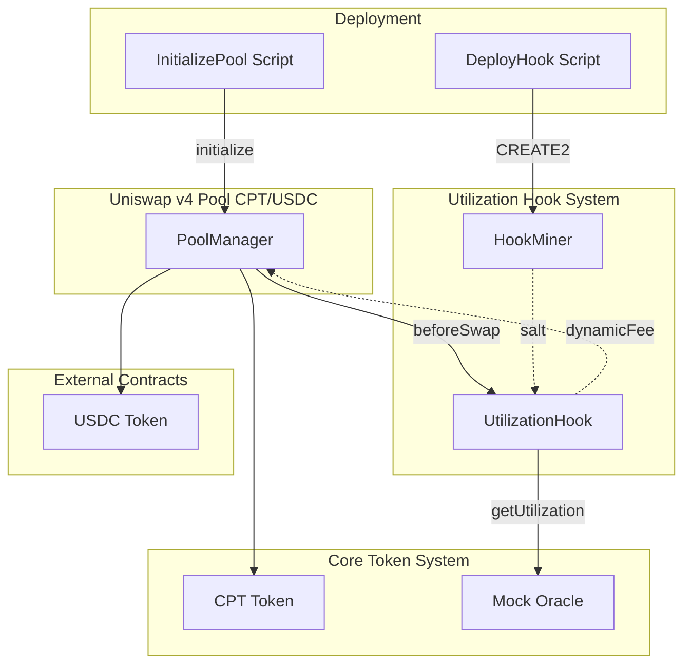
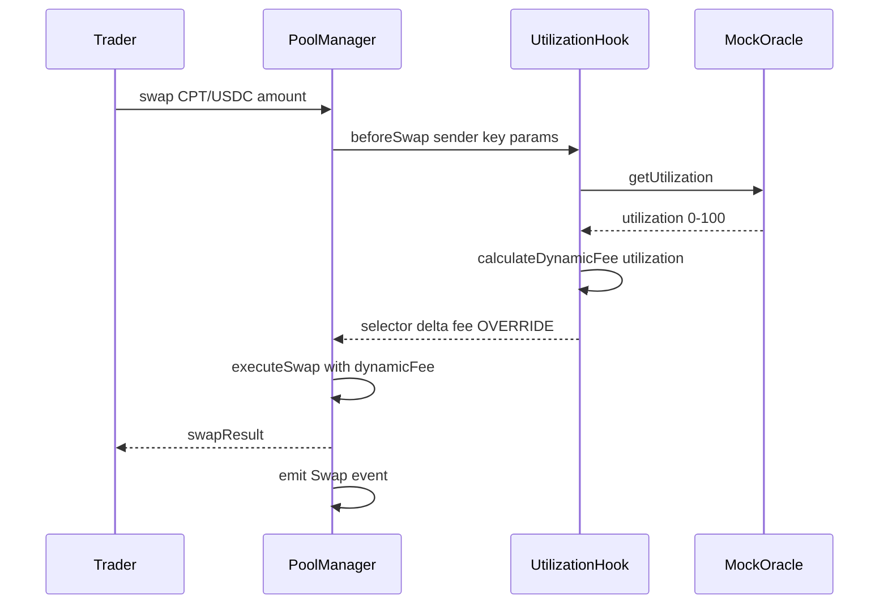
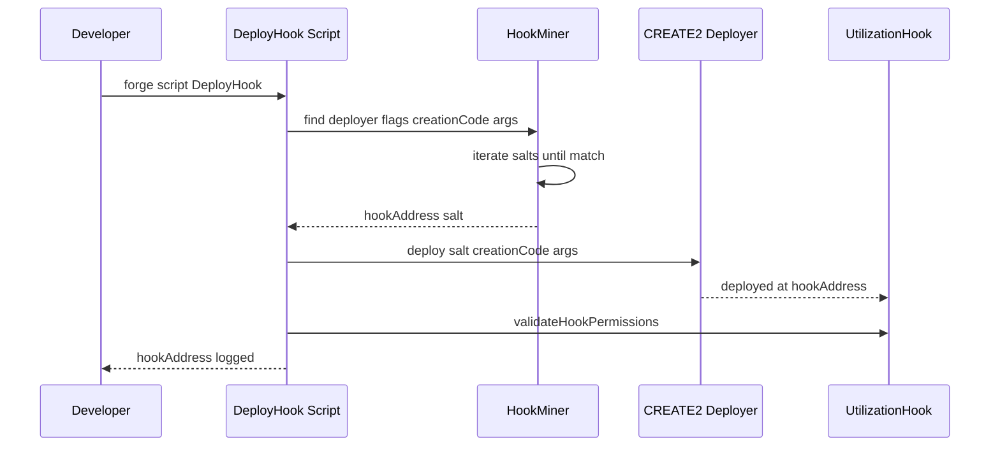

# Design Document: Uniswap v4 Integration

## Overview

**Purpose**: Uniswap v4 Integration は、CPT/USDC 市場を構築し、L2稼働率に応じて手数料を動的に制御する Hook を実装します。「空いているL2ほど計算が安くなる」市場ルールを実現し、Zombie L2 Clearinghouse の価格形成レイヤーを提供します。

**Users**:
- **トレーダー/ボット**: CPT/USDC の公的価格市場で計算リソースを取引
- **システム（自動実行）**: スワップ時に動的手数料を自動適用
- **開発者**: Hook デプロイと Pool 初期化を自動化

**Impact**:
Uniswap v4 の Hook 機能を活用し、L2稼働率に連動した動的価格市場を構築します。これにより、低稼働L2の計算リソースが安価に取引され、裁定機会を創出します。

### Goals

- Uniswap v4 Pool で CPT/USDC ペアの流動性市場を提供
- Utilization Hook による L2稼働率連動の動的手数料制御
- CREATE2 + HookMiner パターンによる適切なアドレスでの Hook デプロイ
- 各L2チェーン（Base Sepolia, 代替: Arbitrum Sepolia）への自動デプロイ
- 包括的なテストスイートによる品質保証

### Non-Goals

- CPT Token 発行・管理（core-token-system 仕様）
- Mock Oracle 実装（core-token-system 仕様）
- 価格監視・裁定ロジック（offchain-arbitrage-engine 仕様）
- Dashboard UI（dashboard-demo 仕様）
- Operator Vault への USDC 入金フロー（settlement-layer 仕様）

---

## Architecture

### Existing Architecture Analysis

本仕様は core-token-system が提供する CPT Token と Mock Oracle に依存する拡張機能です。

**現状**:
- Foundry 環境構築済み（forge-std 導入済み）
- core-token-system で OpenZeppelin 導入予定
- Mock Oracle インターフェース（`IMockOracle.getUtilization()`）が定義済み

**統合方針**:
- `contract/src/hooks/` に UtilizationHook.sol を配置
- `contract/src/lib/` に HookMiner.sol を配置
- `contract/script/` に Hook デプロイ・Pool 初期化スクリプトを配置
- v4-core, v4-periphery を Foundry 依存関係として追加

### Architecture Pattern & Boundary Map

**選択パターン**: Hook-Centric Architecture（フック中心アーキテクチャ）

Uniswap v4 の Hook システムを活用し、スワップ時のカスタムロジックを外部コントラクト（Utilization Hook）に委譲します。



**Domain/Feature Boundaries**:
- **Hook Domain**: Utilization Hook（動的手数料計算）
- **Pool Domain**: Uniswap v4 PoolManager（スワップ実行）
- **Oracle Domain**: Mock Oracle（稼働率供給、core-token-system）
- **Deployment Domain**: HookMiner, デプロイスクリプト

**Key Decisions**:
- **BaseHook 継承**: v4-periphery の標準パターンを採用し、セキュリティとメンテナンス性を確保
- **beforeSwap のみ実装**: 動的手数料に必要最小限のフック（ガス効率重視）
- **段階式手数料**: 稼働率閾値ベースの3段階手数料（予測可能性重視）

**Steering Compliance**:
- Foundry 使用（ステアリング `tech.md`）
- NatSpec コメント必須（ステアリング `tech.md`）
- ハッカソンスコープでの簡略化（段階式手数料、単一チェーン優先）

---

### Technology Stack

| Layer | Choice / Version | Role in Feature | Notes |
|-------|------------------|-----------------|-------|
| **Smart Contracts** | Solidity 0.8.26 | UtilizationHook, HookMiner | Transient storage 対応 |
| **Uniswap v4 Core** | v4-core (latest) | IPoolManager, Hooks, PoolKey | 公式リポジトリから導入 |
| **Uniswap v4 Periphery** | v4-periphery (latest) | BaseHook, StateLibrary | Hook 基底クラス |
| **Standard Library** | OpenZeppelin Contracts v5.x | (共有) | core-token-system と共通 |
| **Blockchain** | Base Sepolia (primary), Arbitrum Sepolia (fallback) | Pool + Hook デプロイ | Uniswap v4 デプロイ確認済み |
| **Deployment** | Foundry (forge, forge script) | CREATE2 デプロイ、Pool 初期化 | HookMiner 統合 |
| **Testing** | Foundry test | Hook 単体・統合テスト | fork テスト対応 |

**Technology Alignment**:
- **Solidity 0.8.26**: v4-core 要件（transient storage: EIP-1153）に対応
- **BaseHook**: 標準的な Hook 実装パターン、onlyPoolManager 等のセキュリティ実装済み
- **Foundry**: ステアリングで指定された標準ツール

**External Contract Addresses**:

| Contract | Base Sepolia | Arbitrum Sepolia |
|----------|--------------|------------------|
| PoolManager | `0x05E73354cFDd6745C338b50BcFDfA3Aa6fA03408` | `0xFB3e0C6F74eB1a21CC1Da29aeC80D2Dfe6C9a317` |
| CREATE2 Deployer | `0x4e59b44847b379578588920ca78fbf26c0b4956c` | 同左 |
| USDC | `0x036CbD53842c5426634e7929541eC2318f3dCF7E` | TBD |

---

## System Flows

### スワップ時の動的手数料適用フロー



**Key Decisions**:
- Oracle 呼び出しは1回/スワップに制限（ガス効率）
- 異常値（utilization > 100）の場合はデフォルト手数料（3000 = 0.3%）を適用
- `OVERRIDE_FEE_FLAG` を使用して Pool のベース手数料を上書き

### Hook デプロイフロー



**Key Decisions**:
- HookMiner で事前にソルト探索（オフチェーン計算推奨）
- `BEFORE_SWAP_FLAG` (bit 7) がセットされたアドレスを探索
- デプロイ後に `validateHookPermissions` で検証

---

## Requirements Traceability

| Requirement | Summary | Components | Interfaces | Flows |
|-------------|---------|------------|------------|-------|
| 1.1-1.5 | CPT/USDC Pool 提供 | PoolManager, InitializePool Script | PoolKey, initialize | Pool 初期化フロー |
| 2.1 | beforeSwap フック呼び出し | UtilizationHook | IHooks.beforeSwap | スワップフロー |
| 2.2 | L2稼働率取得 | UtilizationHook, MockOracle | IMockOracle.getUtilization | スワップフロー |
| 2.3-2.4 | 動的手数料制御 | UtilizationHook | calculateDynamicFee | スワップフロー |
| 2.5 | スプレッド調整ロジック | UtilizationHook | calculateDynamicFee | スワップフロー |
| 2.6 | 異常データフォールバック | UtilizationHook | calculateDynamicFee | スワップフロー |
| 2.7 | Hook実行ログ | UtilizationHook | FeeOverridden event | スワップフロー |
| 2.8 | v4 Hook インターフェース準拠 | UtilizationHook | IHooks, BaseHook | - |
| 2.9 | CREATE2 + HookMiner デプロイ | HookMiner, DeployHook Script | find, deploy | デプロイフロー |
| 3.1 | Hook デプロイ | DeployHook Script, HookMiner | CREATE2 | デプロイフロー |
| 3.2 | Pool 初期化 | InitializePool Script | PoolManager.initialize | Pool 初期化フロー |
| 3.3 | 初期流動性提供 | InitializePool Script | PositionManager.modifyLiquidity | Pool 初期化フロー |
| 3.4 | アドレス記録 | DeployHook Script | JSON output | デプロイフロー |
| 3.5 | ソルト探索拡大 | HookMiner | find | デプロイフロー |
| 3.6 | Foundry 使用 | All Scripts | forge script | - |
| 4.1-4.5 | テストスイート | Test Contracts | forge test | - |
| 5.1 | Hook 実行権限制限 | UtilizationHook | onlyPoolManager | - |
| 5.2 | 環境変数管理 | Scripts | .env | - |
| 5.3 | 異常値フォールバック | UtilizationHook | calculateDynamicFee | スワップフロー |

---

## Components and Interfaces

### Component Summary

| Component | Domain/Layer | Intent | Req Coverage | Key Dependencies (P0/P1) | Contracts |
|-----------|--------------|--------|--------------|--------------------------|-----------|
| UtilizationHook | Onchain/Hook | L2稼働率に応じた動的手数料制御 | 2.1-2.9, 5.1, 5.3 | BaseHook (P0), IMockOracle (P0), IPoolManager (P0) | Service, Event |
| HookMiner | Onchain/Lib | CREATE2 アドレスマイニング | 2.9, 3.1, 3.5 | - | Service |
| DeployHook Script | Deployment | Hook の CREATE2 デプロイ | 3.1, 3.4-3.6 | HookMiner (P0), UtilizationHook (P0) | Script |
| InitializePool Script | Deployment | Pool 初期化と流動性提供 | 3.2-3.4, 3.6 | PoolManager (P0), PositionManager (P1) | Script |
| UtilizationHook Test | Testing | Hook 単体テスト | 4.1, 4.3-4.5 | UtilizationHook (P0) | Test |
| PoolIntegration Test | Testing | Pool + Hook 統合テスト | 4.2, 4.4-4.5 | PoolManager (P0), UtilizationHook (P0) | Test |

---

### Hook Domain

#### UtilizationHook

| Field | Detail |
|-------|--------|
| Intent | L2稼働率に応じて動的にスワップ手数料を制御する |
| Requirements | 2.1-2.9, 5.1, 5.3 |

**Responsibilities & Constraints**
- Mock Oracle から稼働率を取得し、動的手数料を計算
- beforeSwap フックで手数料を PoolManager に返却
- 実行権限は PoolManager のみ（onlyPoolManager）
- 異常値検知時はデフォルト手数料を適用

**Dependencies**
- Inbound: PoolManager — beforeSwap コールバック (P0)
- Outbound: IMockOracle — 稼働率取得 (P0)
- External: v4-periphery BaseHook — 基底クラス (P0)

**Contracts**: Service [x], Event [x]

##### Service Interface

```solidity
// SPDX-License-Identifier: MIT
pragma solidity ^0.8.26;

import {BaseHook} from "v4-periphery/src/utils/BaseHook.sol";
import {IPoolManager} from "v4-core/interfaces/IPoolManager.sol";
import {Hooks} from "v4-core/libraries/Hooks.sol";
import {PoolKey} from "v4-core/types/PoolKey.sol";
import {PoolId, PoolIdLibrary} from "v4-core/types/PoolId.sol";
import {BeforeSwapDelta, BeforeSwapDeltaLibrary} from "v4-core/types/BeforeSwapDelta.sol";

/// @title IMockOracle
/// @notice Mock Oracle インターフェース（core-token-system 提供）
interface IMockOracle {
    function getUtilization() external view returns (uint256);
}

/// @title IUtilizationHook
/// @notice Utilization Hook インターフェース
interface IUtilizationHook {
    /// @notice 稼働率に応じた手数料を計算する
    /// @param utilization 稼働率（0-100）
    /// @return fee 手数料（bps）
    function calculateDynamicFee(uint256 utilization) external pure returns (uint24 fee);

    /// @notice Oracle アドレスを返す
    function oracle() external view returns (IMockOracle);

    /// @notice デフォルト手数料を返す
    function DEFAULT_FEE() external view returns (uint24);

    /// @notice 低稼働時の手数料を返す
    function LOW_FEE() external view returns (uint24);

    /// @notice 高稼働時の手数料を返す
    function HIGH_FEE() external view returns (uint24);
}

/// @title UtilizationHook
/// @notice L2稼働率に応じて動的に手数料を制御する Uniswap v4 Hook
/// @dev BaseHook を継承し、beforeSwap のみ実装
contract UtilizationHook is BaseHook, IUtilizationHook {
    using PoolIdLibrary for PoolKey;
    using BeforeSwapDeltaLibrary for BeforeSwapDelta;

    /// @notice Mock Oracle インスタンス
    IMockOracle public immutable oracle;

    /// @notice 手数料定数（bps: 100 = 0.01%）
    uint24 public constant LOW_FEE = 500;      // 0.05% - 低稼働時
    uint24 public constant DEFAULT_FEE = 3000; // 0.3%  - 標準
    uint24 public constant HIGH_FEE = 10000;   // 1.0%  - 高稼働時

    /// @notice 稼働率閾値
    uint256 public constant LOW_THRESHOLD = 30;
    uint256 public constant HIGH_THRESHOLD = 70;

    /// @notice 動的手数料が適用されたときに発行されるイベント
    event FeeOverridden(PoolId indexed poolId, uint256 utilization, uint24 fee);

    /// @notice コンストラクタ
    /// @param _poolManager PoolManager アドレス
    /// @param _oracle Mock Oracle アドレス
    constructor(IPoolManager _poolManager, IMockOracle _oracle) BaseHook(_poolManager) {
        oracle = _oracle;
    }

    /// @notice Hook の権限を定義
    function getHookPermissions() public pure override returns (Hooks.Permissions memory) {
        return Hooks.Permissions({
            beforeInitialize: false,
            afterInitialize: false,
            beforeAddLiquidity: false,
            afterAddLiquidity: false,
            beforeRemoveLiquidity: false,
            afterRemoveLiquidity: false,
            beforeSwap: true,
            afterSwap: false,
            beforeDonate: false,
            afterDonate: false,
            beforeSwapReturnDelta: false,
            afterSwapReturnDelta: false,
            afterAddLiquidityReturnDelta: false,
            afterRemoveLiquidityReturnDelta: false
        });
    }

    /// @notice スワップ前に呼び出される
    /// @dev 稼働率を取得し、動的手数料を計算して返す
    function beforeSwap(
        address,
        PoolKey calldata key,
        IPoolManager.SwapParams calldata,
        bytes calldata
    ) external override returns (bytes4, BeforeSwapDelta, uint24) {
        // 稼働率を取得
        uint256 utilization = oracle.getUtilization();

        // 動的手数料を計算
        uint24 fee = calculateDynamicFee(utilization);

        // イベント発行
        emit FeeOverridden(key.toId(), utilization, fee);

        // 手数料を OVERRIDE_FEE_FLAG と共に返す
        return (
            this.beforeSwap.selector,
            BeforeSwapDeltaLibrary.ZERO_DELTA,
            fee | uint24(Hooks.OVERRIDE_FEE_FLAG)
        );
    }

    /// @notice 稼働率に応じた手数料を計算
    /// @param utilization 稼働率（0-100）
    /// @return fee 手数料（bps）
    function calculateDynamicFee(uint256 utilization) public pure returns (uint24) {
        // 異常値の場合はデフォルト手数料
        if (utilization > 100) {
            return DEFAULT_FEE;
        }

        // 段階式手数料
        if (utilization < LOW_THRESHOLD) {
            return LOW_FEE;
        } else if (utilization >= HIGH_THRESHOLD) {
            return HIGH_FEE;
        } else {
            return DEFAULT_FEE;
        }
    }
}
```

- **Preconditions**:
  - msg.sender が PoolManager であること（BaseHook が検証）
  - Oracle が有効なアドレスであること
- **Postconditions**:
  - 動的手数料が計算され、OVERRIDE_FEE_FLAG と共に返される
  - FeeOverridden イベントが発行される
- **Invariants**:
  - 返される手数料は 0 < fee <= 1000000（100%）
  - utilization > 100 の場合は DEFAULT_FEE を返す

##### Event Contract

- **Published Events**:
  - `FeeOverridden(PoolId indexed poolId, uint256 utilization, uint24 fee)` — 動的手数料適用時

**Implementation Notes**
- **Integration**: BaseHook を継承、IMockOracle に依存
- **Validation**: utilization > 100 の場合は DEFAULT_FEE にフォールバック
- **Risks**: Oracle がゼロアドレスの場合は revert（コンストラクタで検証推奨）

---

### Library Domain

#### HookMiner

| Field | Detail |
|-------|--------|
| Intent | CREATE2 で目的のビットパターンを持つアドレスを探索する |
| Requirements | 2.9, 3.1, 3.5 |

**Responsibilities & Constraints**
- ソルト値を反復探索し、目的のフラグを持つアドレスを発見
- 探索範囲は設定可能（デフォルト 1,000,000 iterations）
- オフチェーンでの事前計算を推奨

**Dependencies**
- Outbound: なし（独立ユーティリティ）

**Contracts**: Service [x]

##### Service Interface

```solidity
// SPDX-License-Identifier: MIT
pragma solidity ^0.8.26;

/// @title HookMiner
/// @notice CREATE2 アドレスマイニングライブラリ
/// @dev v4-template の HookMiner を参考に実装
library HookMiner {
    /// @notice 目的のフラグを持つアドレスとソルトを探索
    /// @param deployer CREATE2 Deployer アドレス
    /// @param flags 必要な Hook フラグ（ビットマスク）
    /// @param creationCode コントラクトの creationCode
    /// @param constructorArgs コンストラクタ引数（エンコード済み）
    /// @return hookAddress 発見されたアドレス
    /// @return salt 使用するソルト
    function find(
        address deployer,
        uint160 flags,
        bytes memory creationCode,
        bytes memory constructorArgs
    ) internal pure returns (address hookAddress, bytes32 salt);

    /// @notice 探索範囲を指定してアドレスを探索
    /// @param deployer CREATE2 Deployer アドレス
    /// @param flags 必要な Hook フラグ
    /// @param creationCode コントラクトの creationCode
    /// @param constructorArgs コンストラクタ引数
    /// @param seed 開始シード値
    /// @param maxIterations 最大反復回数
    /// @return hookAddress 発見されたアドレス
    /// @return salt 使用するソルト
    function find(
        address deployer,
        uint160 flags,
        bytes memory creationCode,
        bytes memory constructorArgs,
        uint256 seed,
        uint256 maxIterations
    ) internal pure returns (address hookAddress, bytes32 salt);
}
```

- **Preconditions**: creationCode が有効、flags が正しいビットマスク
- **Postconditions**: 発見されたアドレスの下位ビットが flags と一致
- **Invariants**: 発見失敗時は revert

**Implementation Notes**
- **Integration**: デプロイスクリプトから呼び出し
- **Validation**: アドレスのビットパターンを検証
- **Risks**: 探索失敗時のフォールバック（maxIterations 拡大）

---

### Deployment Domain

#### DeployHook Script

| Field | Detail |
|-------|--------|
| Intent | CREATE2 + HookMiner で UtilizationHook をデプロイする |
| Requirements | 3.1, 3.4-3.6 |

**Responsibilities & Constraints**
- HookMiner でソルトを探索
- CREATE2 Deployer を使用して Hook をデプロイ
- デプロイ結果を JSON ファイルに記録

**Dependencies**
- Outbound: HookMiner — ソルト探索 (P0)
- Outbound: UtilizationHook — デプロイ対象 (P0)
- External: CREATE2 Deployer — デプロイ実行 (P0)

**Contracts**: Script [x]

##### Script Interface

```solidity
// SPDX-License-Identifier: MIT
pragma solidity ^0.8.26;

import {Script, console} from "forge-std/Script.sol";
import {Hooks} from "v4-core/libraries/Hooks.sol";
import {IPoolManager} from "v4-core/interfaces/IPoolManager.sol";
import {UtilizationHook} from "../src/hooks/UtilizationHook.sol";
import {HookMiner} from "../src/lib/HookMiner.sol";

/// @title DeployHook
/// @notice UtilizationHook の CREATE2 デプロイスクリプト
contract DeployHook is Script {
    // CREATE2 Deployer（全チェーン共通）
    address constant CREATE2_DEPLOYER = 0x4e59b44847b379578588920ca78fbf26c0b4956c;

    function run() external {
        // 環境変数読み込み
        uint256 deployerPrivateKey = vm.envUint("DEPLOYER_PRIVATE_KEY");
        address poolManager = vm.envAddress("POOL_MANAGER");
        address mockOracle = vm.envAddress("MOCK_ORACLE");

        // フラグ設定（beforeSwap のみ）
        uint160 flags = uint160(Hooks.BEFORE_SWAP_FLAG);

        // ソルト探索
        bytes memory creationCode = type(UtilizationHook).creationCode;
        bytes memory constructorArgs = abi.encode(poolManager, mockOracle);
        (address hookAddress, bytes32 salt) = HookMiner.find(
            CREATE2_DEPLOYER,
            flags,
            creationCode,
            constructorArgs
        );

        console.log("Hook address:", hookAddress);
        console.log("Salt:", vm.toString(salt));

        vm.startBroadcast(deployerPrivateKey);

        // CREATE2 デプロイ
        UtilizationHook hook = new UtilizationHook{salt: salt}(
            IPoolManager(poolManager),
            IMockOracle(mockOracle)
        );

        require(address(hook) == hookAddress, "Hook address mismatch");
        console.log("Hook deployed at:", address(hook));

        vm.stopBroadcast();
    }
}
```

**Implementation Notes**
- **Integration**: forge script で実行、環境変数でチェーン切り替え
- **Validation**: デプロイ後にアドレス一致を検証
- **Risks**: ソルト探索失敗時は範囲拡大または再試行

---

#### InitializePool Script

| Field | Detail |
|-------|--------|
| Intent | Uniswap v4 Pool を CPT/USDC ペアで初期化する |
| Requirements | 3.2-3.4, 3.6 |

**Responsibilities & Constraints**
- PoolKey を構築し、Pool を初期化
- 初期流動性を提供（テスト用）
- Hook アドレスを Pool に関連付け

**Dependencies**
- Outbound: PoolManager — Pool 初期化 (P0)
- Outbound: PositionManager — 流動性提供 (P1)
- External: CPT Token, USDC Token — Pool ペア (P0)

**Contracts**: Script [x]

##### Script Interface

```solidity
// SPDX-License-Identifier: MIT
pragma solidity ^0.8.26;

import {Script, console} from "forge-std/Script.sol";
import {IPoolManager} from "v4-core/interfaces/IPoolManager.sol";
import {PoolKey} from "v4-core/types/PoolKey.sol";
import {Currency} from "v4-core/types/Currency.sol";
import {IHooks} from "v4-core/interfaces/IHooks.sol";

/// @title InitializePool
/// @notice CPT/USDC Pool 初期化スクリプト
contract InitializePool is Script {
    function run() external {
        // 環境変数読み込み
        uint256 deployerPrivateKey = vm.envUint("DEPLOYER_PRIVATE_KEY");
        address poolManager = vm.envAddress("POOL_MANAGER");
        address cptToken = vm.envAddress("CPT_TOKEN");
        address usdcToken = vm.envAddress("USDC_TOKEN");
        address hook = vm.envAddress("UTILIZATION_HOOK");

        // PoolKey 構築
        // currency0 < currency1 の順序を保証
        (address token0, address token1) = cptToken < usdcToken
            ? (cptToken, usdcToken)
            : (usdcToken, cptToken);

        PoolKey memory key = PoolKey({
            currency0: Currency.wrap(token0),
            currency1: Currency.wrap(token1),
            fee: 0x800000, // DYNAMIC_FEE_FLAG
            tickSpacing: 60,
            hooks: IHooks(hook)
        });

        // 初期価格（1 CPT = 0.001 USDC 相当）
        uint160 sqrtPriceX96 = 79228162514264337593543950336; // sqrt 1 times 2^96

        vm.startBroadcast(deployerPrivateKey);

        IPoolManager(poolManager).initialize(key, sqrtPriceX96);
        console.log("Pool initialized");

        // TODO: 初期流動性提供（PositionManager 経由）

        vm.stopBroadcast();
    }
}
```

**Implementation Notes**
- **Integration**: forge script で実行
- **Validation**: token0 < token1 の順序を保証
- **Risks**: 初期価格設定の誤り（テスト環境で検証）

---

## Data Models

### Domain Model

**主要エンティティ**:

1. **PoolKey** (Value Object)
   - 属性: currency0, currency1, fee, tickSpacing, hooks
   - 制約: currency0 < currency1, hooks は有効なアドレス

2. **UtilizationHook** (Service)
   - 属性: oracle (IMockOracle), poolManager (IPoolManager)
   - 制約: oracle は有効なアドレス

**Domain Events**:
- `FeeOverridden(poolId, utilization, fee)` — 動的手数料適用時

**Invariants**:
- Hook アドレスのビット7が1（BEFORE_SWAP_FLAG）
- 手数料は 0 < fee <= 1000000

### Logical Data Model

**UtilizationHook State**:
- `oracle`: IMockOracle — immutable、Oracle コントラクトアドレス
- `poolManager`: IPoolManager — immutable、PoolManager アドレス（BaseHook 継承）

**Fee Calculation Logic**:
```
utilization < 30  → 500 bps (0.05%)
30 <= utilization < 70 → 3000 bps (0.3%)
utilization >= 70 → 10000 bps (1.0%)
utilization > 100 → 3000 bps (default)
```

---

## Error Handling

### Error Strategy

**Onchain Errors**:
- すべてのエラーは `revert` で処理
- カスタムエラーを使用してガスコスト削減

### Error Categories and Responses

| Error Type | Condition | Response | User Message |
|------------|-----------|----------|--------------|
| `InvalidCaller` | msg.sender != poolManager | revert | "Only PoolManager" |
| `InvalidHookAddress` | アドレスビットパターン不一致 | revert (deploy時) | "Invalid hook address" |
| `OracleCallFailed` | Oracle 呼び出し失敗 | revert | "Oracle call failed" |
| `SaltNotFound` | HookMiner 探索失敗 | revert | "Salt not found" |

**異常値フォールバック**:
- utilization > 100 の場合は DEFAULT_FEE を適用（revert しない）

---

## Testing Strategy

### Unit Tests

1. **UtilizationHook.t.sol**
   - `test_calculateDynamicFee_lowUtilization` — 低稼働時の手数料検証
   - `test_calculateDynamicFee_midUtilization` — 中稼働時の手数料検証
   - `test_calculateDynamicFee_highUtilization` — 高稼働時の手数料検証
   - `test_calculateDynamicFee_abnormalUtilization` — 異常値フォールバック検証
   - `test_getHookPermissions` — 権限設定検証

### Integration Tests

1. **PoolIntegration.t.sol**
   - `test_swapWithDynamicFee` — スワップ時の動的手数料適用
   - `test_hookCalledOnSwap` — beforeSwap コールバック呼び出し
   - `test_feeOverriddenEvent` — イベント発行検証

2. **HookMiner.t.sol**
   - `test_findValidSalt` — ソルト探索成功
   - `test_addressHasCorrectFlags` — アドレスビットパターン検証
   - `test_deployWithFoundSalt` — CREATE2 デプロイ検証

### Coverage Target

- **Minimum Coverage**: 80%
- **Critical Paths**: beforeSwap, calculateDynamicFee は 100% カバレッジ

---

## Security Considerations

### Authentication & Authorization

- **Hook 実行権限**: PoolManager のみが beforeSwap を呼び出し可能（BaseHook の `onlyPoolManager` modifier）
- **Oracle 依存**: Mock Oracle は信頼されたコントラクト前提（ハッカソンスコープ）

### Smart Contract Security

- **Reentrancy**: beforeSwap は state 変更なし（view 的動作）、リスク低
- **Input Validation**: utilization > 100 の場合はフォールバック
- **Access Control**: BaseHook の標準パターン使用

### Known Risks & Mitigations

| Risk | Mitigation |
|------|-----------|
| Oracle 操作 | Mock Oracle はデモ用、本番では Chainlink 等の信頼されたオラクル使用 |
| Hook アドレス衝突 | HookMiner で一意なソルト探索 |

---

## Performance & Scalability

### Target Metrics

- **Hook 実行**: 1ブロック内完了
- **ガスコスト**: beforeSwap < 50,000 gas（目標）
- **Oracle 呼び出し**: < 10,000 gas（単純 storage 読み取り）

### Optimization

- **単純計算**: 段階式手数料でガス効率化
- **Immutable**: oracle, poolManager は immutable で SLOAD 削減
- **最小フック**: beforeSwap のみ実装

---

## Deployment Strategy

### Phase 1: 依存関係導入

```bash
cd contract
forge install Uniswap/v4-core
forge install Uniswap/v4-periphery
```

**remappings.txt 更新**:
```
v4-core/=lib/v4-core/src/
v4-periphery/=lib/v4-periphery/src/
```

### Phase 2: Hook デプロイ（Base Sepolia）

```bash
POOL_MANAGER=0x05E73354cFDd6745C338b50BcFDfA3Aa6fA03408 \
MOCK_ORACLE=<deployed-oracle-address> \
forge script script/DeployHook.s.sol \
  --rpc-url $BASE_SEPOLIA_RPC_URL \
  --broadcast
```

### Phase 3: Pool 初期化

```bash
CPT_TOKEN=<deployed-cpt-address> \
USDC_TOKEN=0x036CbD53842c5426634e7929541eC2318f3dCF7E \
UTILIZATION_HOOK=<deployed-hook-address> \
forge script script/InitializePool.s.sol \
  --rpc-url $BASE_SEPOLIA_RPC_URL \
  --broadcast
```

### Phase 4: アドレス記録

デプロイ結果を `contract/deployed-addresses.json` に追加:
```json
{
  "base-sepolia": {
    "utilization-hook": "0x...",
    "pool-id": "0x..."
  }
}
```

**Rollback Triggers**:
- Hook デプロイ失敗 → ソルト探索範囲拡大
- Pool 初期化失敗 → トークン順序確認

---

## Dependencies on Other Specifications

- **core-token-system**: CPT Token と Mock Oracle が必須（先にデプロイ）
- **offchain-arbitrage-engine**: Pool 価格を監視
- **dashboard-demo**: Hook 状態（稼働率・手数料）を表示

---

## Success Criteria

本仕様が完了とみなされる条件：

1. ✅ Utilization Hook が CREATE2 + HookMiner パターンでデプロイされる
2. ✅ Uniswap v4 Pool が CPT/USDC ペアで初期化される
3. ✅ スワップ時に Hook が動的手数料を適用する
4. ✅ すべてのテストがパスする（単体テスト・統合テスト、カバレッジ >= 80%）
5. ✅ デプロイスクリプトが自動化され、コントラクトアドレスが記録される
