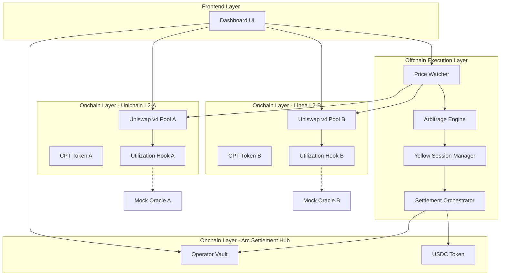
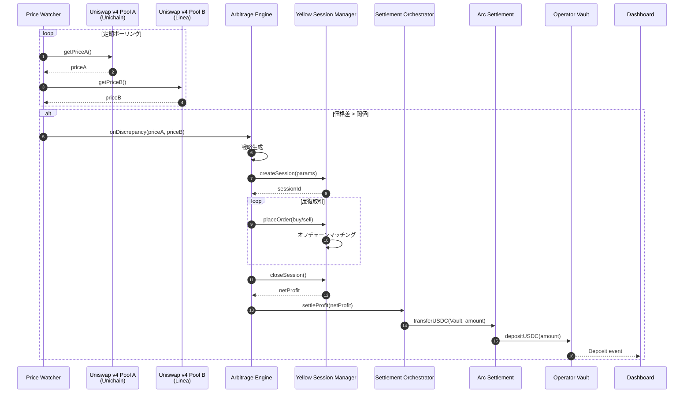
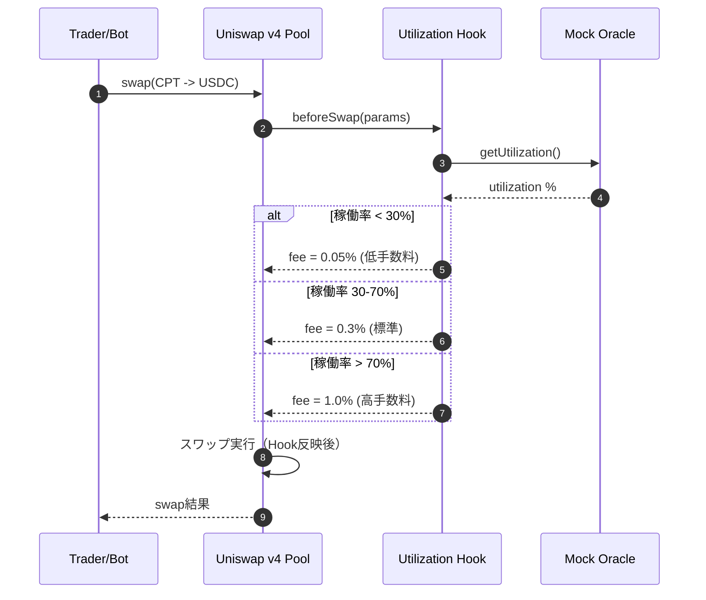

# Design Document: Zombie L2 Clearinghouse

## Overview

**Purpose**: Zombie L2 Clearinghouse は、低稼働なEthereum L2チェーンの計算リソースをトークン化し、Uniswap v4 Hook による動的市場制御、Yellow SDK によるガスレス裁定実行、Arc + Circle による USDC 決済を統合し、L2運営者に需要非依存の収益モデルを提供します。

**Users**:
- **L2運営者**: 固定インフラコストを補填する収益を得る
- **審査員（ETH Global HackMoney 2026）**: システムの動作とスポンサー技術統合を評価する
- **システム（自動実行）**: 価格差検知・裁定戦略生成・Yellow セッション実行・決済処理

**Impact**:
Ethereum L2エコシステムにおいて、「ユーザーがいなくても収益が発生する」新しい財務インフラを提供し、低稼働L2の持続可能性を向上させます。本プロジェクトはハッカソンプロジェクトとして、3つのスポンサー技術（Uniswap v4 / Yellow / Arc・Circle）の本質的な価値を実証します。

### Goals

- CPT（Compute Token）トークン化による計算リソースの資産化
- Uniswap v4 Hook でL2稼働率を価格メカニズムに反映する動的市場を構築
- Yellow SDK によるガスレス・高速な裁定実行エンジンの実装
- Arc + Circle による USDC 決済と Operator Vault への収益集約
- Dashboard によるリアルタイム可視化（価格差・Hook状態・セッションログ・Vault残高）
- ハッカソンデモ向けの自動実行スクリプトとモック環境の構築

### Non-Goals

- 実際のL2稼働率 Oracle 統合（モック実装で代替）
- 複数CPTペアの同時監視（2チェーン限定）
- 高度なリスク管理ロジック（最大ポジション制限等）
- 履歴データの永続化・長期チャート表示
- マルチチェーン対応の完全な自動化
- プロダクション環境向けのセキュリティ監査

---

## Architecture

### Architecture Pattern & Boundary Map

**選択パターン**: 3層アーキテクチャ（オンチェーン・オフチェーン・フロントエンド）

**Domain/Feature Boundaries**:
- **オンチェーン**: 価格形成・決済・状態管理のみ（CPT Token, Uniswap v4 Pool & Hook, Operator Vault）
- **オフチェーン**: 価格監視・戦略・実行ロジック（Price Watcher, Arbitrage Engine, Yellow Session Manager, Settlement Orchestrator）
- **フロントエンド**: 可視化のみ（Dashboard）

**Dependency Direction**:
- フロントエンド → オフチェーン（読み取り専用）
- オフチェーン → オンチェーン（コントラクト呼び出し）
- コントラクト間は最小限の依存（CPT Token ← Vault, Hook は Pool 参照のみ）



**Steering Compliance**:
- 機能ドメイン優先の組織化（ステアリング `structure.md`）
- TypeScript strict mode、Solidity 0.8.x以上（ステアリング `tech.md`）
- ハッカソンスコープでの簡略化（Mock Oracle、軽量Indexer）

---

### Technology Stack

| Layer | Choice / Version | Role in Feature | Notes |
|-------|------------------|-----------------|-------|
| **Smart Contracts** | Solidity 0.8.x | CPT Token, Utilization Hook, Operator Vault | ERC20標準、Uniswap v4 Hook インターフェース準拠 |
| **Blockchain** | Unichain (L2-A), Linea (L2-B), Arc (決済ハブ) | CPT発行・市場形成・USDC決済 | Testnet環境でデプロイ |
| **Uniswap v4** | v4 (latest) | CPT/USDC プール、Hook による動的制御 | スポンサープライズ要件 |
| **Yellow SDK** | Nitrolite (latest) | ステートチャネル・ガスレスセッション | スポンサープライズ要件 |
| **Circle** | Gateway / CCTP | USDC決済・クロスチェーン転送 | スポンサープライズ要件 |
| **Offchain Runtime** | Node.js 20+ / TypeScript | 価格監視・裁定エンジン・決済処理 | viem でコントラクト呼び出し |
| **Frontend** | Next.js 14+ / TypeScript | Dashboard（価格差・Hook・ログ・残高） | App Router、TailwindCSS、Shadcn/ui |
| **Wallet Integration** | wagmi / viem | ウォレット接続・Tx署名 | テスト用（MetaMask） |
| **Charts** | Recharts or Chart.js | 価格推移可視化 | ハッカソンデモ用 |
| **Deployment** | Foundry or Hardhat | コントラクトデプロイ・テスト | スクリプト自動化 |
| **Testing** | Foundry test / Vitest | コントラクト・TypeScriptロジックテスト | CI 統合 |

---

## System Flows

### Flow 1: 全体フロー（価格差検知 → 裁定実行 → USDC決済）



**Key Decisions**:
- Price Watcher は5秒間隔でポーリング（要件: 5秒以内に検知）
- Yellow セッションは反復的に売買を実行し、最終ネット結果のみオンチェーン反映
- Arc 決済は Circle Gateway/CCTP を使用してクロスチェーン USDC 転送

---

### Flow 2: Uniswap v4 Hook による動的手数料制御



**Key Decisions**:
- Hook は beforeSwap で稼働率を取得し、動的に手数料を調整
- モック Oracle はハッカソンデモ用に固定値または可変シミュレーションを返す
- Hook ロジックは「空いているL2ほどCPTが安くなる」市場ルールを実現

---

## Requirements Traceability

| Requirement | Summary | Components | Interfaces | Flows |
|-------------|---------|------------|------------|-------|
| 1.1-1.7 | CPT発行・管理 | CPT Token Contract, Operator Vault | ERC20, mint, transfer | - |
| 2.1-2.5 | Uniswap v4 基準市場 | Uniswap v4 Pool | swap, addLiquidity | Flow 1 |
| 3.1-3.8 | Hook 動的制御 | Utilization Hook, Mock Oracle | beforeSwap, getUtilization | Flow 2 |
| 4.1-4.7 | 価格差検知 | Price Watcher | watchPools, onDiscrepancy | Flow 1 |
| 5.1-5.6 | 裁定戦略生成 | Arbitrage Engine | analyzeDiscrepancy, generateStrategy | Flow 1 |
| 6.1-6.8 | Yellow セッション | Yellow Session Manager | createSession, placeOrder, closeSession | Flow 1 |
| 7.1-7.7 | Arc USDC 決済 | Settlement Orchestrator, Arc Settlement | settleProfit, transferUSDC | Flow 1 |
| 8.1-8.6 | Operator Vault | Operator Vault | depositUSDC, withdraw, balanceOf | Flow 1 |
| 9.1-9.10 | Dashboard | Dashboard UI | fetchPrices, fetchLogs, fetchBalance | - |
| 10.1-10.7 | デプロイ | Deployment Script | deployContracts, initializePools | - |
| 11.1-11.6 | エラーハンドリング | 全コンポーネント | try/catch, logger | - |
| 12.1-12.8 | テスト | Test Suite | unit, integration, e2e | - |
| 13.1-13.7 | セキュリティ | 全コントラクト | onlyOwner, ReentrancyGuard | - |
| 14.1-14.7 | ハッカソンデモ | Demo Script | simulateUtilization, runArbitrage | Flow 1, Flow 2 |

---

## Components and Interfaces

### Component Summary

| Component | Domain/Layer | Intent | Req Coverage | Key Dependencies (P0/P1) | Contracts |
|-----------|--------------|--------|--------------|--------------------------|-----------|
| CPT Token Contract | Onchain/Token | ERC20計算トークン発行・転送 | 1.1-1.7 | - | Service |
| Uniswap v4 Pool | Onchain/Market | CPT/USDC流動性・価格形成 | 2.1-2.5 | Uniswap v4 Core (P0) | API |
| Utilization Hook | Onchain/Hook | L2稼働率連動の動的手数料制御 | 3.1-3.8 | Uniswap v4 Hook (P0), Mock Oracle (P1) | Service |
| Mock Oracle | Onchain/Test | 稼働率シグナル供給 | 3.2, 14.5 | - | Service |
| Operator Vault | Onchain/Vault | USDC収益管理 | 8.1-8.6 | USDC Token (P0) | Service |
| Price Watcher | Offchain/Monitor | 価格差検知 | 4.1-4.7 | viem (P0) | Event |
| Arbitrage Engine | Offchain/Strategy | 裁定戦略生成・実行指示 | 5.1-5.6 | Yellow Session Manager (P0) | Service |
| Yellow Session Manager | Offchain/Execution | Yellow セッション管理 | 6.1-6.8 | Yellow SDK (P0) | Service, Event |
| Settlement Orchestrator | Offchain/Settlement | Arc USDC 決済処理 | 7.1-7.7 | Arc Settlement (P0), viem (P0) | Service |
| Dashboard UI | Frontend/UI | 価格差・Hook・ログ・残高可視化 | 9.1-9.10 | wagmi (P0), viem (P0), Recharts (P1) | API, State |
| Deployment Script | Offchain/Deploy | コントラクトデプロイ自動化 | 10.1-10.7 | Foundry/Hardhat (P0) | Batch |
| Demo Script | Offchain/Demo | デモシナリオ自動実行 | 14.1-14.7 | すべてのコンポーネント (P0) | Batch |

---

### Onchain Layer

#### CPT Token Contract

| Field | Detail |
|-------|--------|
| Intent | 計算リソースをERC20トークンとして発行・転送する |
| Requirements | 1.1-1.7 |

**Responsibilities & Constraints**
- ERC20標準インターフェースの完全実装
- 運営者アドレスのみが発行可能（mint権限）
- Unichain と Linea に独立してデプロイ

**Dependencies**
- Outbound: OpenZeppelin ERC20 — 標準実装 (P0)

**Contracts**: Service [x]

##### Service Interface

```solidity
// SPDX-License-Identifier: MIT
pragma solidity ^0.8.0;

import "@openzeppelin/contracts/token/ERC20/ERC20.sol";
import "@openzeppelin/contracts/access/Ownable.sol";

interface IComputeToken is IERC20 {
    /// @notice CPTを発行し、運営者アドレスに転送する
    /// @param amount 発行数量
    function mint(uint256 amount) external;

    /// @notice 発行権限を持つアドレスを返す
    function owner() external view returns (address);
}
```

- **Preconditions**: mint呼び出しはownerのみ
- **Postconditions**: 指定数量のCPTが発行され、ownerアドレスに転送される
- **Invariants**: totalSupply >= 0, owner権限は変更不可（ハッカソンスコープ）

**Implementation Notes**
- Integration: OpenZeppelin ERC20 + Ownable を継承
- Validation: onlyOwner modifier で mint 権限制御
- Risks: 発行上限なし（ハッカソンスコープでは問題なし）

---

#### Utilization Hook

| Field | Detail |
|-------|--------|
| Intent | L2稼働率に応じてUniswap v4 スワップ手数料を動的に制御する |
| Requirements | 3.1-3.8 |

**Responsibilities & Constraints**
- Uniswap v4 Hook インターフェース準拠
- beforeSwap で稼働率を取得し、手数料を調整
- Hook 実行権限は Uniswap v4 Pool のみ

**Dependencies**
- Inbound: Uniswap v4 Pool — beforeSwap 呼び出し (P0)
- Outbound: Mock Oracle — 稼働率シグナル取得 (P1)

**Contracts**: Service [x]

##### Service Interface

```solidity
// SPDX-License-Identifier: MIT
pragma solidity ^0.8.0;

interface IUtilizationHook {
    /// @notice スワップ前に呼び出され、稼働率に応じた手数料を返す
    /// @param params スワップパラメータ
    /// @return fee 動的手数料（basis points）
    function beforeSwap(
        address sender,
        PoolKey calldata key,
        IPoolManager.SwapParams calldata params,
        bytes calldata hookData
    ) external returns (bytes4, uint24 fee);

    /// @notice 現在の稼働率を返す
    /// @return utilization 稼働率（0-100%）
    function getUtilization() external view returns (uint256 utilization);
}
```

- **Preconditions**: Uniswap v4 Pool から呼び出される
- **Postconditions**: 稼働率に応じた動的手数料が返される（低稼働率 = 低手数料）
- **Invariants**: fee は 0.05% ~ 1.0% の範囲

**Implementation Notes**
- Integration: Uniswap v4 BaseHook を継承、Oracle から稼働率取得
- Validation: 稼働率が範囲外の場合はデフォルト手数料（0.3%）を適用
- Risks: Oracle 障害時のフォールバック必須

---

#### Operator Vault

| Field | Detail |
|-------|--------|
| Intent | 裁定収益（USDC）を受け取り、運営者が引き出し可能にする |
| Requirements | 8.1-8.6 |

**Responsibilities & Constraints**
- USDC 残高管理
- 運営者のみが引き出し可能
- Arc チェーンにデプロイ

**Dependencies**
- Inbound: Settlement Orchestrator — USDC 入金 (P0)
- Outbound: USDC Token — 残高確認・転送 (P0)

**Contracts**: Service [x], Event [x]

##### Service Interface

```solidity
// SPDX-License-Identifier: MIT
pragma solidity ^0.8.0;

interface IOperatorVault {
    /// @notice USDCを入金する
    /// @param amount 入金数量
    function depositUSDC(uint256 amount) external;

    /// @notice USDCを引き出す（運営者のみ）
    /// @param amount 引き出し数量
    function withdraw(uint256 amount) external;

    /// @notice USDC残高を返す
    function balanceOf() external view returns (uint256);

    event Deposit(uint256 amount, uint256 timestamp);
    event Withdraw(address indexed operator, uint256 amount, uint256 timestamp);
}
```

- **Preconditions**: withdraw は owner のみ、残高 >= amount
- **Postconditions**: USDC が owner アドレスに転送される
- **Invariants**: balanceOf >= 0

**Implementation Notes**
- Integration: OpenZeppelin Ownable, USDC ERC20 インターフェース
- Validation: 残高不足時は revert
- Risks: なし（シンプルな Vault）

---

### Offchain Layer

#### Price Watcher

| Field | Detail |
|-------|--------|
| Intent | 複数L2のCPT/USDC価格を監視し、裁定機会を検知する |
| Requirements | 4.1-4.7 |

**Responsibilities & Constraints**
- 5秒間隔で Unichain と Linea の価格を取得
- 価格差が閾値以上の場合、裁定機会イベントを発行
- エラー時のリトライロジック

**Dependencies**
- Outbound: Uniswap v4 Pool (Unichain, Linea) — 価格取得 (P0)
- Outbound: Arbitrage Engine — 裁定機会通知 (P0)

**Contracts**: Event [x]

##### Event Contract

- **Published events**: `DiscrepancyDetected(priceA, priceB, spread, timestamp)`
- **Subscribed events**: なし
- **Delivery guarantees**: イベント駆動（同期呼び出し）

**Implementation Notes**
- Integration: viem publicClient で getQuote() 呼び出し、5秒タイマー
- Validation: 価格取得エラー時は3回リトライ、失敗時はエラーログ
- Risks: RPC エンドポイント障害時の対処（フォールバックRPC設定推奨）

---

#### Arbitrage Engine

| Field | Detail |
|-------|--------|
| Intent | 価格差を分析し、裁定戦略を生成して Yellow セッション実行指示を出す |
| Requirements | 5.1-5.6 |

**Responsibilities & Constraints**
- 価格差・流動性・ガス推定を分析
- 利益が見込める場合、Yellow セッション開始指示を生成
- リスク管理ルールに違反する場合は中止

**Dependencies**
- Inbound: Price Watcher — 裁定機会通知 (P0)
- Outbound: Yellow Session Manager — セッション開始指示 (P0)

**Contracts**: Service [x]

##### Service Interface

```typescript
interface ArbitrageEngineService {
  /**
   * 裁定機会を分析し、実行判断を行う
   * @param discrepancy 価格差情報
   * @returns 実行すべきYellowセッションパラメータ、またはnull（実行しない）
   */
  analyzeDiscrepancy(discrepancy: PriceDiscrepancy): Promise<YellowSessionParams | null>;

  /**
   * 裁定戦略をログに記録する
   */
  logStrategy(strategy: ArbitrageStrategy): void;
}

type PriceDiscrepancy = {
  priceA: bigint;
  priceB: bigint;
  spread: number; // %
  timestamp: number;
};

type YellowSessionParams = {
  direction: 'A_TO_B' | 'B_TO_A';
  amount: bigint;
  minProfit: bigint;
};
```

- **Preconditions**: 価格差情報が有効
- **Postconditions**: Yellow セッションパラメータが生成される、またはnull（実行しない）
- **Invariants**: minProfit > 0（利益が見込めない場合は実行しない）

**Implementation Notes**
- Integration: 価格差分析ロジック、リスク管理ルール（最大取引額等）
- Validation: 流動性不足・ガスコスト高の場合は実行中止
- Risks: 価格変動による実行時の損失（Yellow セッション内で最終確認）

---

#### Yellow Session Manager

| Field | Detail |
|-------|--------|
| Intent | Yellow SDK を用いてガスレス・高速な裁定取引を実行する |
| Requirements | 6.1-6.8 |

**Responsibilities & Constraints**
- Yellow セッションの開始・売買指示・終了
- オフチェーンでマッチングを実行
- セッション終了時に最終ネット結果を返す

**Dependencies**
- Inbound: Arbitrage Engine — セッション開始指示 (P0)
- Outbound: Yellow SDK (Nitrolite) — セッション管理 (P0)
- Outbound: Settlement Orchestrator — ネット結果通知 (P0)

**Contracts**: Service [x], Event [x]

##### Service Interface

```typescript
interface YellowSessionManagerService {
  /**
   * Yellow セッションを開始する
   * @param params セッションパラメータ
   * @returns セッションID
   */
  createSession(params: YellowSessionParams): Promise<string>;

  /**
   * セッション内で売買指示を送信する
   * @param sessionId セッションID
   * @param order 売買注文
   */
  placeOrder(sessionId: string, order: Order): Promise<void>;

  /**
   * セッションを終了し、最終ネット結果を返す
   * @param sessionId セッションID
   * @returns 最終利益（USDC単位）
   */
  closeSession(sessionId: string): Promise<bigint>;
}

type Order = {
  type: 'BUY' | 'SELL';
  token: 'CPT_A' | 'CPT_B';
  amount: bigint;
};
```

- **Preconditions**: Yellow SDK が初期化済み
- **Postconditions**: セッション終了時に最終利益が確定
- **Invariants**: セッション内でのガス不要

##### Event Contract

- **Published events**: `SessionClosed(sessionId, netProfit, timestamp)`
- **Subscribed events**: なし
- **Delivery guarantees**: 非同期（Settlement Orchestrator に通知）

**Implementation Notes**
- Integration: Yellow SDK (Nitrolite) を使用、反復的に売買を実行
- Validation: セッション実行中のエラーはクローズしてログ記録
- Risks: Yellow Network 障害時の対処（タイムアウト設定）

---

#### Settlement Orchestrator

| Field | Detail |
|-------|--------|
| Intent | Yellow セッション終了後、Arc + Circle で USDC 決済を実行する |
| Requirements | 7.1-7.7 |

**Responsibilities & Constraints**
- Yellow セッションの最終利益を USDC で確定
- Arc 決済プロセスを開始し、Operator Vault に入金
- 決済失敗時のリトライロジック

**Dependencies**
- Inbound: Yellow Session Manager — ネット結果通知 (P0)
- Outbound: Arc Settlement (Circle Gateway/CCTP) — USDC 転送 (P0)
- Outbound: Operator Vault — 入金確認 (P0)

**Contracts**: Service [x]

##### Service Interface

```typescript
interface SettlementOrchestratorService {
  /**
   * 裁定利益を USDC で決済し、Vault に入金する
   * @param netProfit 最終利益（USDC単位）
   * @returns 決済トランザクションハッシュ
   */
  settleProfit(netProfit: bigint): Promise<string>;
}
```

- **Preconditions**: netProfit > 0
- **Postconditions**: USDC が Operator Vault に入金される
- **Invariants**: 決済トランザクションは冪等性を保証

**Implementation Notes**
- Integration: Circle Gateway/CCTP を使用してクロスチェーン USDC 転送
- Validation: 決済失敗時は3回リトライ、失敗時はエラーログ
- Risks: Arc ネットワーク障害時の対処（手動リトライ機能）

---

### Frontend Layer

#### Dashboard UI

| Field | Detail |
|-------|--------|
| Intent | CPT価格差・Hook状態・セッションログ・Vault残高をリアルタイムで可視化する |
| Requirements | 9.1-9.10 |

**Responsibilities & Constraints**
- Unichain と Linea の CPT/USDC 価格を表示
- 価格差を計算・表示
- Utilization Hook の現在の手数料設定を表示
- Yellow セッションログを表示
- Operator Vault の USDC 残高を表示
- データ更新時に自動リフレッシュ

**Dependencies**
- Outbound: Uniswap v4 Pool (Unichain, Linea) — 価格取得 (P0)
- Outbound: Utilization Hook — 手数料設定取得 (P0)
- Outbound: Yellow Session Manager — ログ取得 (P1)
- Outbound: Operator Vault — 残高取得 (P0)

**Contracts**: API [x], State [x]

##### API Contract

| Method | Endpoint | Request | Response | Errors |
|--------|----------|---------|----------|--------|
| GET | /api/prices | - | `{ priceA: string, priceB: string, spread: number }` | 500 |
| GET | /api/hook-status | - | `{ feeA: number, feeB: number, utilizationA: number, utilizationB: number }` | 500 |
| GET | /api/session-logs | - | `{ logs: SessionLog[] }` | 500 |
| GET | /api/vault-balance | - | `{ balance: string }` | 500 |

##### State Management

- State model: React hooks (useState, useEffect) + wagmi hooks
- Persistence: なし（リアルタイム表示のみ）
- Concurrency strategy: 各APIエンドポイントは独立して取得（並列実行）

**Implementation Notes**
- Integration: Next.js App Router、wagmi/viem でオンチェーンデータ取得、Recharts/Chart.js で価格推移チャート
- Validation: API エラー時はローディング状態表示、エラーメッセージ表示
- Risks: RPC エンドポイント遅延時の UX 低下（ローディングインジケーター必須）

---

## Data Models

### Domain Model

**主要エンティティ**:

1. **CPT Token** (Value Object)
   - 属性: symbol, decimals, totalSupply
   - 制約: ERC20標準準拠、運営者のみ発行可能

2. **Price** (Value Object)
   - 属性: token, price (USDC建て), timestamp
   - 制約: price > 0

3. **Arbitrage Opportunity** (Entity)
   - 属性: priceA, priceB, spread, timestamp
   - 制約: spread >= threshold

4. **Yellow Session** (Aggregate Root)
   - 属性: sessionId, orders[], netProfit, status
   - 制約: status = ACTIVE | CLOSED, netProfit は CLOSED 時のみ確定

5. **Operator Vault** (Entity)
   - 属性: balance (USDC), owner
   - 制約: balance >= 0, owner のみ引き出し可能

**Domain Events**:
- `CPTMinted(amount, owner)`
- `PriceDiscrepancyDetected(priceA, priceB, spread)`
- `SessionClosed(sessionId, netProfit)`
- `USDCDeposited(amount, vault)`

**Invariants**:
- CPT Token: totalSupply >= 0
- Price: price > 0
- Vault: balance >= 0

---

### Logical Data Model

**主要構造**:

1. **CPT Token (ERC20)**
   - balances: mapping(address => uint256)
   - allowances: mapping(address => mapping(address => uint256))
   - totalSupply: uint256

2. **Operator Vault**
   - usdcBalance: uint256
   - owner: address

3. **Yellow Session (Offchain)**
   - sessions: Map<sessionId, Session>
   - Session: { id, orders[], netProfit, status }

4. **Price Data (Offchain)**
   - prices: Map<chain, Price>
   - Price: { token, price, timestamp }

**Consistency Boundaries**:
- CPT Token: ERC20 標準により残高整合性を保証
- Operator Vault: 単一コントラクトで USDC 残高を管理
- Yellow Session: セッション内で整合性を保証、終了時にオンチェーン反映

---

### Physical Data Model

**Onchain (Ethereum L2)**:

1. **CPT Token Contract (Solidity)**
   - Storage: ERC20 標準の balances, allowances, totalSupply
   - Indexes: なし（ERC20標準で十分）

2. **Operator Vault Contract (Solidity)**
   - Storage: usdcBalance (uint256), owner (address)
   - Indexes: なし

**Offchain (Node.js / TypeScript)**:

1. **Price Cache (In-Memory)**
   - Structure: Map<chain, Price>
   - TTL: 5秒（定期ポーリング間隔）

2. **Session Logs (In-Memory)**
   - Structure: Array<SessionLog>
   - Retention: 直近100件のみ（ハッカソンスコープ）

---

## Error Handling

### Error Strategy

**エラーカテゴリ**:

1. **User Errors (4xx)**
   - 例: 残高不足、権限なし
   - 対応: revert with custom error、フロントエンドでエラーメッセージ表示

2. **System Errors (5xx)**
   - 例: RPC エンドポイント障害、Yellow Network 障害
   - 対応: リトライロジック（3回まで）、エラーログ記録、アラート発行

3. **Business Logic Errors (422)**
   - 例: 価格差が閾値未満、流動性不足
   - 対応: 裁定実行中止、ログ記録

### Error Categories and Responses

**Onchain Errors**:
- `InsufficientBalance`: 残高不足 → revert
- `Unauthorized`: 権限なし → revert
- `OracleFailure`: Oracle 障害 → デフォルト手数料適用

**Offchain Errors**:
- `RPCTimeout`: RPC タイムアウト → 3回リトライ、失敗時はエラーログ
- `YellowSessionFailed`: Yellow セッション失敗 → セッションクローズ、エラーログ
- `SettlementFailed`: 決済失敗 → 3回リトライ、失敗時はアラート

### Monitoring

- **ログレベル**: ERROR, WARN, INFO, DEBUG
- **構造化ログ**: JSON形式（timestamp, level, message, context）
- **アラート**: 致命的エラー時にコンソール出力（ハッカソンスコープ）

---

## Testing Strategy

### Unit Tests

1. **CPT Token Contract**: mint, transfer, balanceOf
2. **Utilization Hook**: beforeSwap（稼働率による手数料調整）
3. **Operator Vault**: depositUSDC, withdraw, balanceOf
4. **Price Watcher**: 価格取得、乖離検知
5. **Arbitrage Engine**: 戦略生成ロジック

### Integration Tests

1. **Uniswap v4 Pool + Hook**: スワップ時のHook呼び出し
2. **Price Watcher + Arbitrage Engine**: 価格差検知 → 戦略生成
3. **Arbitrage Engine + Yellow Session Manager**: セッション開始 → 実行
4. **Yellow Session Manager + Settlement Orchestrator**: セッション終了 → USDC 決済
5. **Settlement Orchestrator + Operator Vault**: USDC 入金確認

### E2E Tests (ハッカソンデモ)

1. **全体フロー**: 価格差検知 → 裁定実行 → USDC 決済 → Dashboard 表示
2. **Hook 動作確認**: 稼働率変化 → 手数料調整 → スワップ実行
3. **エラーハンドリング**: RPC 障害 → リトライ → エラーログ

### Performance Tests

- Price Watcher: 5秒以内に価格差検知
- Yellow Session: 500ms 以内に応答
- Dashboard: 3秒以内に初期ロード完了

---

## Security Considerations

### Authentication & Authorization

- **CPT Token**: mint 権限は owner のみ（Ownable）
- **Operator Vault**: withdraw 権限は owner のみ（Ownable）
- **Utilization Hook**: beforeSwap 実行権限は Uniswap v4 Pool のみ

### Data Protection

- **秘密鍵・APIキー**: 環境変数で管理（.env ファイル、gitignore）
- **ハードコード禁止**: コードに秘密情報を含まない

### Smart Contract Security

- **Reentrancy Guard**: OpenZeppelin ReentrancyGuard 使用
- **Input Validation**: すべてのパブリック関数で引数検証
- **Access Control**: onlyOwner modifier で権限制御

---

## Performance & Scalability

### Target Metrics

- **Price Watcher**: 5秒以内に価格差検知
- **Yellow Session**: Web2 並みの応答速度（< 500ms）
- **Dashboard**: 3秒以内に初期ロード完了

### Scaling Approach

- **ハッカソンスコープ**: 2チェーン（Unichain, Linea）のみ
- **将来拡張**: 追加L2への拡張が容易な設計（設定ファイルでチェーン追加）

### Caching Strategy

- **Price Cache**: 5秒間隔でポーリング、In-Memory キャッシュ
- **Dashboard**: クライアント側で5秒間隔で自動リフレッシュ

---

## Migration Strategy

**初回デプロイ（ハッカソンスコープ）**:

1. **Phase 1**: コントラクトデプロイ（CPT Token, Hook, Vault）
2. **Phase 2**: Uniswap v4 Pool 初期化（流動性提供）
3. **Phase 3**: オフチェーンシステム起動（Watcher, Engine, Settlement）
4. **Phase 4**: Dashboard デプロイ
5. **Phase 5**: デモスクリプト実行・動作確認

**Rollback Triggers**:
- コントラクトデプロイ失敗 → 再デプロイ
- Pool 初期化失敗 → 設定確認・再実行

**Validation Checkpoints**:
- 各フェーズ完了時にコントラクトアドレス確認
- Dashboard で価格・残高表示確認

---

## Supporting References

### TypeScript Type Definitions (詳細)

```typescript
// Price Data
type PriceData = {
  chain: 'Unichain' | 'Linea';
  token: 'CPT' | 'USDC';
  price: bigint; // wei 単位
  timestamp: number; // Unix timestamp
};

// Arbitrage Strategy
type ArbitrageStrategy = {
  direction: 'A_TO_B' | 'B_TO_A';
  amount: bigint; // CPT 数量
  minProfit: bigint; // 最小利益（USDC、wei 単位）
  gasEstimate: bigint; // ガス推定
  timestamp: number;
};

// Session Log
type SessionLog = {
  sessionId: string;
  orders: Order[];
  netProfit: bigint; // USDC、wei 単位
  status: 'ACTIVE' | 'CLOSED' | 'FAILED';
  timestamp: number;
};
```

### Uniswap v4 Hook Interface (参照)

```solidity
interface IHooks {
    function beforeSwap(
        address sender,
        PoolKey calldata key,
        IPoolManager.SwapParams calldata params,
        bytes calldata hookData
    ) external returns (bytes4);
}
```

---

**設計完了**: 全14要件をカバーする包括的な技術設計を完了しました。次フェーズ（タスク分解）に進む準備が整いました。
