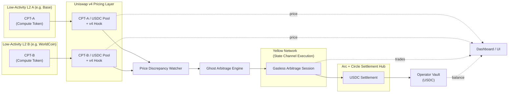
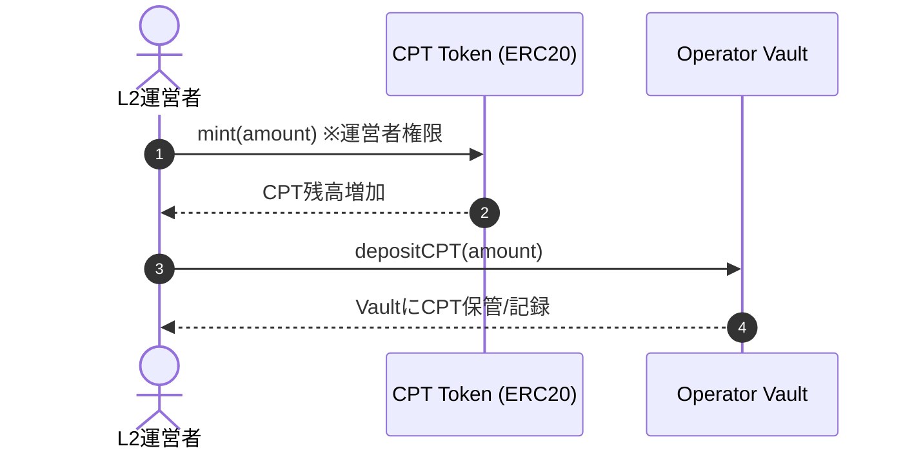
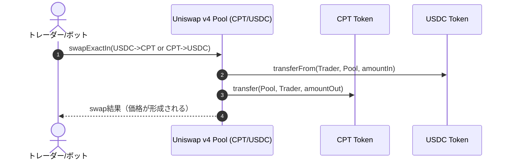
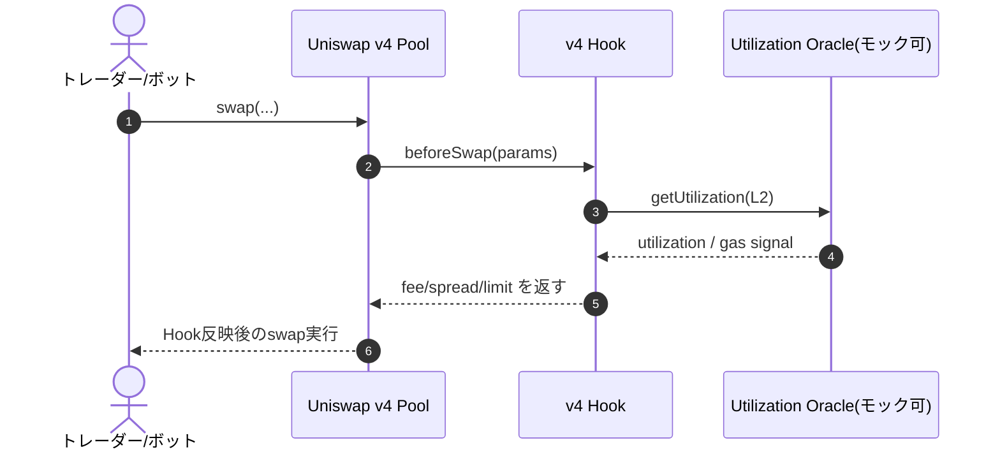
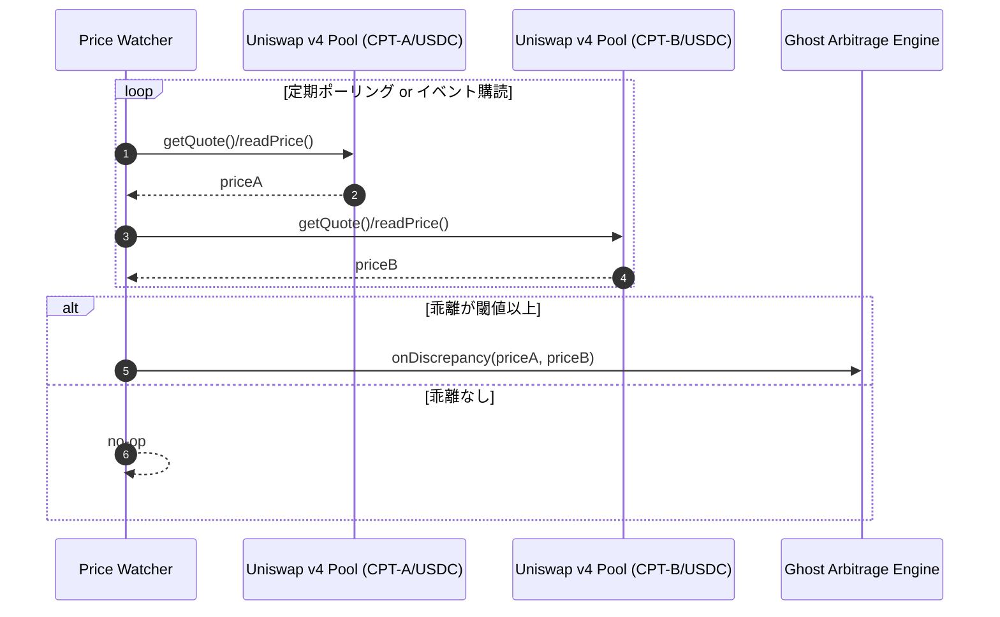
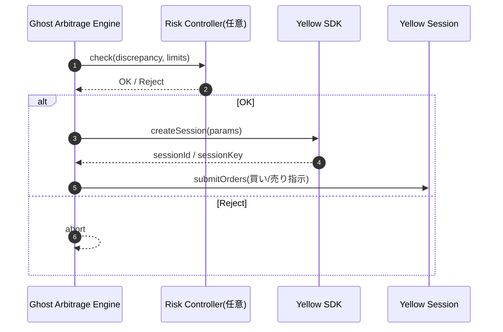
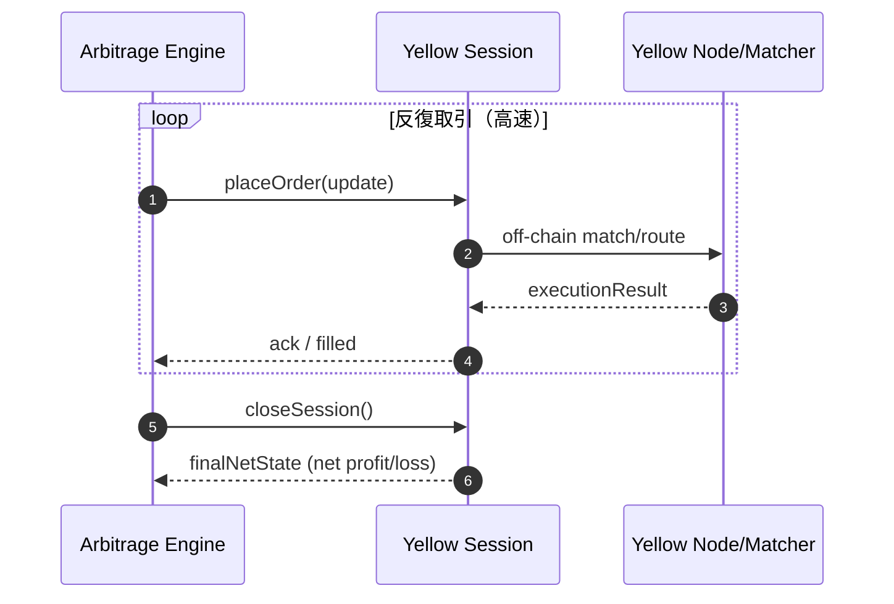
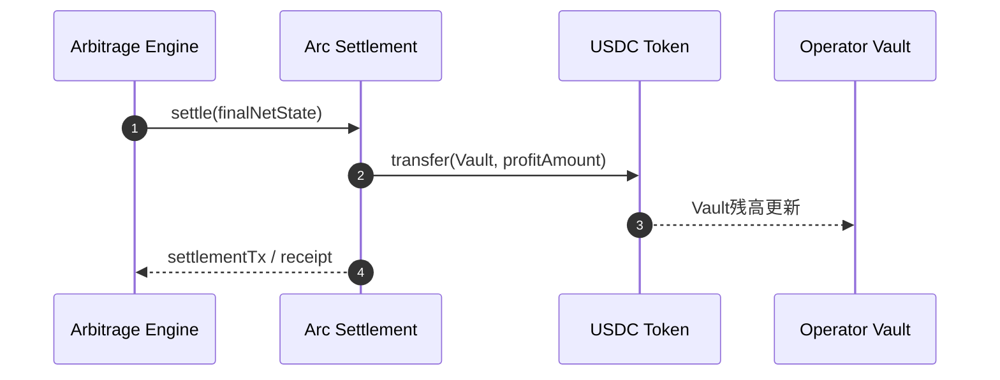
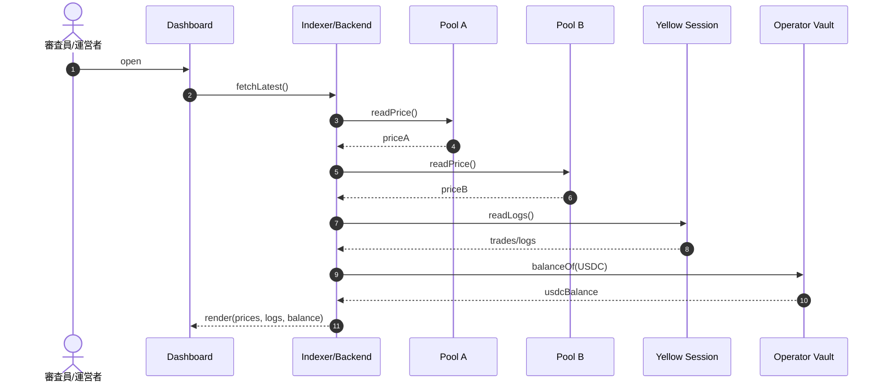

# hack-money-2026


## short description

Zombie L2 Clearinghouse は 低稼働なEthereum L2チェーンの計算リソースをトークン化し、ガスレス裁定によってL2運営者にUSDC収益を生み出す財務レイヤーです。

## Overview

EthereumのLayer 2エコシステムでは、多くのチェーンが「ユーザー不足 → 収益ゼロ → 固定費だけが残る」という構造的な問題を抱えています。

この結果、有望なL2であっても、キラーdAppが現れる前にチェーン停止や撤退に追い込まれてしまいます。

Zombie L2 Clearinghouse はこの問題を「ユーザーが来るまで耐える」のではなく「ユーザーがいなくても収益が回る」仕組みで解決します。

本プロダクトでは、各L2の計算コストを **Compute Token（CPT）** としてトークン化し、Uniswap v4 を用いて CPT / USDC の基準価格市場を構築します。

さらに v4 Hook により、L2の稼働率に応じて手数料やスプレッドを動的に制御し、「空いているL2ほど計算が安くなる」市場ルールを実装します。

生じたCPT価格差は、Yellow SDK のガス不要・高速なセッション取引によって裁定され、最終的な差益は Arc を介して USDC で決済されます。

このUSDCはL2運営者のVaultに集約され、ノード運用やシーケンサーなどの固定費を直接補填します。

Zombie L2 Clearinghouse は、死にかけたL2を復活させるプロジェクトではありません。

需要が戻るまでチェーンを生かし続けるための新しいL2財務インフラです。

> 先日ヴィタリックブテリンもL2には単なるスケーリング以外に付加価値が必要だと意見を表明していました。

今回のハッカソンで採用するL2ブロックチェーン

- Base Sepolia
- WorldCoin Sepolia

## このプロダクトで解決したい課題

EthereumのLayer 2エコシステムでは、多くのチェーンが**ユーザー数・取引量・流動性の不足**という共通課題を抱えています。

L2はユーザーが増えない限り、

* 手数料収益やSequencer収益が発生しない
* それにも関わらず、ノード運用・RPC・ブリッジ・監視などの
  **固定インフラコストは継続的に発生**する
* 一定期間赤字が続くと、**チェーン停止・撤退**を選ばざるを得ない

という構造的な問題に直面します。

この結果、

- 「キラーdAppが生まれる前にL2が消える」
- 「一部の大規模L2にトラフィックが集中する」

といった状況が生まれ、Ethereum全体の**分散性・耐障害性**が損なわれています。

👉 **問題の本質は「需要がないと何もできないL2運営モデル」そのものです。**

## About CPT

**CPT = ブロックスペースをコモディティ化したトークン**

CPTは、単なる「生ガス（Raw Gas）」のトークン化ではありません。L2の実行能力（Execution Capacity）とL1のデータ可用性（Data Availability）をパッケージ化し、**Gas Standard Unit (GSU)** という標準単位に統合したものです。

**1 CPT = 1,000,000 GSU**
GSUは、異なるL2間の実行コストとデータコストを正規化するための抽象的な単位です。

各CPTには **有効期限（Expiration Epoch）** が設定されています（例: `2026-Q3-Week12`）。
これは「ブロックスペースは時間が経つと消える」という性質を反映しており、将来の計算リソース予約を可能にします。

**CPTの消費用途:**
- **バッチ実行**（大量トランザクション、データ書き込み）
- **ステート占有**（オンチェーン状態の維持）
- **優先実行権**（混雑時の実行保証）

**供給サイドの裏付け:**
- CPTの発行は、シーケンサーのスループット、予約済みのDAスペース、RPCリソースなど、**未使用のL2インフラ容量**によって裏付けられています。
- L2の稼働状況が変化すると、Uniswap v4 Hookが動的にCPT価格を調整し、ブロックスペースの希少性が直接市場価格に反映される仕組みになっています。
- L2の稼働状況はL2Beatなどの状況をもとにする。

## Why Tokenize Compute?

### For Traders

Compute Token は、**ブロックチェーンの実行コストに対する投機やヘッジを可能にし、ガス代のボラティリティを取引可能な資産へと変えます。**

これによりトレーダーはインフラの混雑やチェーンの稼働状況を予測し、**計算コストそのものを市場で売買する**ことができます。

### For Developers

計算リソースをトークン化することで、開発者は**複数のL2にまたがる実行コストを事前に購入・予算化し、予測可能な価格で最適化**することができます。

これにより、ガス代の急騰によるUX低下や予算超過を防ぎ、**AWSやGoogle Cloudなどのパブリッククラウドに近い感覚でインフラコストを管理**できます。

### One-liner

> **計算コストをトークン化することで、実行コストは「不確実性」から「市場」へと変わります。**

## Concrete Use Cases

### 🖼 NFT / Launch Events

**課題**
NFTミントやエアドロ時には、一時的にトランザクションが集中し、
ガス代の高騰やUXの崩壊が起こりやすい。

**CPTを使うと**

* 事前に必要な計算量分のCPTを購入・確保
* ミント当日でも安定したコストで実行可能
* 需要が予想以上に高い場合は、CPTを高値で売却して実行を遅らせる判断も可能

👉 **一時的な負荷を「市場」で吸収できる**

### 🤖 Trading / Arbitrage Bots

**課題**
裁定ボットや高頻度トレードは、
ガス代の急騰によって突然赤字化するリスクを抱えている。

**CPTを使うと**

* 実行コストを事前にロック
* ガス代上昇時にはCPT価格が上昇し、自然なヘッジになる
* 「ガス代が上がるほど不利」な構造から脱却できる

👉 **実行コストが戦略変数になる**

### 🧠 AI / Batch Compute

**課題**
AI inference やバッチ処理は、
「いつ・どこで・どれくらい安く計算できるか」が重要。

**CPTを使うと**

* 低稼働なL2の計算リソースをまとめて購入
* 処理を最も安いL2に動的にルーティング
* 実行コストをUSDC建てで管理可能

👉 **L2が分散型クラウド計算基盤として機能**

### 🛠 Infrastructure / L2 Operators

**課題**
L2運営はユーザーがいない間も、
ノード・RPC・シーケンサーなどの固定費を払い続けなければならない。

**CPTを使うと**

* 余っている計算リソースをCPTとして市場に供給
* トレーダーや開発者による裁定でUSDC収益を獲得
* ユーザーが来る前にランウェイを確保できる

👉 **「使われないL2」が経済的に意味を持つ**

## Who Buys and Sells CPT?

### 参加者と役割

* **L2 Operators**

  * 計算リソースを提供
  * CPTを発行・供給する側
* **Developers**

  * 実行コストを安定させたい
  * CPTを購入・消費する側
* **Traders / Bots**

  * 価格差・稼働率の変化を収益化
  * CPTを売買する流動性提供者
* **Zombie L2 Clearinghouse**

  * 市場設計・裁定・USDC決済を担う財務レイヤー

## CPT Flow Diagram

```mermaid
flowchart LR
  %% Actors
  OP[L2 Operator]
  DEV[Developer / App]
  TR[Trader / Bot]
  CL[Zombie L2 Clearinghouse]
  UNI[Uniswap v4\nCPT / USDC Pool]
  YEL[Yellow Session]
  ARC[Arc + USDC]
  VAULT[Operator Vault]

  %% Supply
  OP -->|mint / supply CPT| UNI

  %% Demand
  DEV -->|buy CPT (predictable cost)| UNI
  TR -->|trade CPT (speculation / hedge)| UNI

  %% Arbitrage
  CL -->|price discrepancy detected| YEL
  YEL -->|gasless arbitrage| UNI

  %% Settlement
  YEL -->|net result| ARC
  ARC -->|USDC profit| VAULT
```

## Why L2s in 2026?

Ethereumは今、転換点にあります。

これまでL2は「Ethereumをスケールさせるための存在（Branded Shards）」として語られてきました。  

しかし2026年に向けて、その前提は大きく変わりつつあります。

* Ethereum L1自体が継続的にスケールしており、手数料は低下している
* ガスリミットの大幅な増加が予定されている
* 多くのL2は Stage 2 への移行が難しく、あるいは意図的に目指していない
* 規制、UX、事業要件により「完全にEthereumに従属しないL2」が増えている

この状況下で、L2を **「Ethereumをスケールさせるための存在」** として定義し続けることは、はや現実的ではありません。

### L2の役割は「スケーリング」から「付加価値」へ

2026年以降のL2に求められるのは、TPSを増やすことではなく、**EthereumやL1には存在しない価値を提供すること** です。

L2は今や、Ethereumとさまざまな距離感で接続された**独立したチェーンのスペクトラム**として存在しています。

* 超低レイテンシ
* 特定アプリケーションへの最適化
* 非EVM・特殊VM
* 非金融ユースケース
* 信頼前提だが高速で実用的な設計

これらはすべて、「Ethereumを直接スケールしない」からこそ実現できる価値です。

### Zombie L2 Clearinghouse が L2 を使う理由

Zombie L2 Clearinghouse は、L2をスケーリング手段として使っていません。

私たちが L2 を使う理由は明確です。

> ** 低稼働なL2のブロックスペースは、現実に存在する“安価で余っている計算資源”だからです。 **

多くのL2はユーザー不足により取引量が少なく、結果として計算コストが極端に安くなっています。
しかしその価値は、これまで経済的に活用されてきませんでした。

Zombie L2 Clearinghouse は、この「使われなさ」を欠点ではなく**未評価の資産**として扱います。

### Ethereumとの「適切な距離感」

本プロダクトは、Ethereumと以下のような関係を取ります。

* **価格形成・経済的信用**
  - Uniswap v4 を通じて Ethereum 経済圏に接続
* **最終的な価値確定**
  - USDC による安定したオンチェーン決済
* **高速・反復処理**
  - オフチェーン（Yellow セッション）で最適化

すべてをEthereumに委ねるのでもなく、
完全に切り離すのでもない。

**信用が必要な部分だけEthereumを使い、それ以外は自由に最適化する。**

これが、2026年以降のL2にとって最も現実的な設計です。

### L2は「生き残るためのインフラ」になる

Zombie L2 Clearinghouse は、L2を復活させるプロジェクトではありません。

L2がキラーアプリを見つけるまで、あるいは役割を再定義するまで**経済的に生き延びるための時間を提供する**プロジェクトです。

> L2は、ユーザーが来なかったから失敗なのではない。
> ユーザーが来るまで、稼げなかったことが問題だった。

2026年のL2に必要なのは、スケーリングではなく **持続可能性** です。

Zombie L2 Clearinghouse は、そのための財務レイヤーです。

## このプロダクトの解決アプローチ

Zombie L2 Clearinghouse は、**ユーザー需要に依存しない収益モデル**をL2運営に提供します。

### 1. 計算リソースを資産化する

各L2の計算コストを **Compute Token（CPT）** としてトークン化し、「空いている計算リソース」を取引可能な資産として定義します。

### 2. プログラム可能な価格市場を作る

Uniswap v4 を用いて **CPT / USDC** の基準市場を構築し、v4 Hook によって L2 の稼働率に応じて手数料やスプレッドを動的に調整します。

これにより、**「空いているL2ほどCPTが安くなり、買われやすい」** という市場ルールが自動的に成立します。

### 3. 価格差を高速・低コストで収益化する

複数の低稼働L2間に生じる CPT の価格差を、Yellow SDK のガス不要・高速なセッション取引によって裁定します。

反復取引はオフチェーンで行い、最終結果のみをオンチェーンで確定させることでコストと遅延を最小化します。

### 4. 収益をUSDCで確定し、運営に還元する

裁定によって得られた差益は、Arc を介して **USDCで決済・集約**され、L2運営者のVaultに直接入金されます。

これにより、裁定収益が **実際のインフラ運用費用を支払える資金**として機能します。

## このプロダクトが与えるインパクト

### L2運営にとってのインパクト

* **ユーザーがいなくても収益が発生**
* 固定インフラコストを部分的または継続的に補填
* チェーン停止までのランウェイを延長
* 「失敗したL2」という評価を回避し、将来の選択肢を維持

### Ethereumエコシステム全体へのインパクト

* トラフィックの一極集中リスクを緩和
* 小規模・新規L2が即死しない構造を提供
* 多様なL2が共存できる、より健全なエコシステムを促進

### 長期的な可能性

* L2を **分散型クラウド計算資産**として再定義
* 計算コストをベースとした新しいDeFi市場の創出
* 将来的にはWeb3以外の計算需要（AI・バッチ処理等）への拡張も可能

## System Architecture Diagram



## Functions

|  # | 機能名                            | 目的                     | 入力               | 出力/状態変化       | 主なコンポーネント                   |
| -: | ------------------------------ | ---------------------- | ---------------- | ------------- | --------------------------- |
|  1 | CPT（Compute Token）発行/管理        | 「計算コスト」を取引可能な資産にする     | 管理者操作            | CPT供給・残高      | CPT Token（ERC20）、Operator権限 |
|  2 | CPT/USDC 基準市場（Uniswap v4 Pool） | CPTの「公的価格」を形成          | 流動性提供、Swap       | Price/LP状態    | Uniswap v4 Pool             |
|  3 | Uniswap v4 Hook（市場ルール制御）       | L2稼働率に連動して手数料/スプレッドを変更 | 稼働率シグナル、Swap呼び出し | fee/spread/制限 | v4 Hook + Oracle(モック可)      |
|  4 | 価格乖離検知（Watcher）                | 裁定機会を特定                | 2チェーンのCPT/USDC価格 | 乖離イベント        | Watcher（bot/script）         |
|  5 | Ghost Arbitrage Engine（戦略生成）   | 裁定の実行方針決定              | 乖離イベント           | Session指示     | Strategy/Executor           |
|  6 | Yellow セッション（ガスレス高速執行）         | 反復取引をガス不要で回す           | Session開始、注文群    | オフチェーン約定ログ    | Yellow SDK / Session        |
|  7 | 最終決済（USDC）                     | 利益を確定して運営に戻す           | セッション結果（net）     | USDC移転        | Arc + Circle（決済）            |
|  8 | Operator Vault                 | 運営収益の受け皿               | USDC入金           | 残高増加          | Vault Contract              |
|  9 | Dashboard                      | 見せる・監視する               | 価格/ログ/残高         | 可視化           | Web UI / Indexer            |

## Sequence Diagram

### 2-1. CPT発行/管理（L2ごと）



### 2-2. CPT/USDC 基準市場（Uniswap v4 Pool）でのSwap



### 2-3. Uniswap v4 Hook（稼働率連動の手数料/スプレッド調整）



### 2-4. 価格乖離検知（Watcher）



### 2-5. Ghost Arbitrage Engine（戦略生成 → Yellowセッション開始）



### 2-6. Yellow セッション内（ガスレス高速執行 → 終了）



### 2-7. 最終決済（Arc + USDC）→ Operator Vault入金



### 2-8. Dashboard（可視化：価格・Hook状態・セッションログ・Vault残高）



## このプロダクトにおけるスポンサープライズの技術の「使い所」

### 🟦 Arc / USDC（Circle）

**役割：最終決済と財務集約レイヤー**

**なぜ使うか**

* 裁定で得た利益を **安定資産（USDC）で確定**させるため
* 複数L2に分散した収益を **1か所に集約**するため
* 「本当に稼げている」ことを**一目で示すため**

**具体的な使い所**

* Yellowセッション終了後の**最終ネット決済**
* CPT売買による差益を **USDCで確定**
* L2運営者の **Operator Vault にUSDCを入金**

**価値**

* L2運営にとって「固定費を払える現実のお金」になる
* 審査員に「これはデモではなく実収益」と伝わる

---

### 🟪 Uniswap v4

**役割：CPT（計算リソース）の価格形成と市場ルール制御**

**なぜ使うか**

* CPTを「ただのトークン」ではなく
  **プログラム可能な計算市場**にするため

**具体的な使い所**

* **CPT / USDC プール**を作成し、公的な基準価格を形成
* **v4 Hook**を用いて以下を動的に制御：

  * 手数料
  * スプレッド
  * スワップ制限
* L2の稼働率が低いほど、CPTが **安く・買われやすく**なる市場設計

**価値**

* 「L2が空いている＝計算が安い」という現実を価格に反映
* Yellowによる裁定の **基準価格（アンカー）** になる
* Uniswap v4 Prize に直結する設計

---

### 🟨 Yellow SDK

**役割：裁定取引の高速・ガスレス実行レイヤー**

**なぜ使うか**

* CPT価格差の裁定は **反復・高速処理が前提**
* オンチェーン取引では **ガス・遅延・MEV** に勝てない

**具体的な使い所**

* CPT間の裁定取引を **オフチェーンセッション**で実行
* ガス不要で何度も売買を回す
* セッション終了時のみオンチェーンに結果を反映

**価値**

* 「死んだL2間でも裁定が成立する」現実性
* UXとコストの両立（Web2並みの速度）
* Yellow Prize 要件を自然に満たす

---

## 3技術の関係を一言で

> **Uniswap v4 が価格を決め、Yellow が速く動かし、Arc + USDC が価値を確定する。**

## Tech Stacks

### ① ブロックチェーン / ネットワーク

| 区分   | 採用候補              | 用途                           |
| ---- | ----------------- | ---------------------------- |
| L2-A | Base Sepolia      | CPT発行、Uniswap v4 pool、価格形成   |
| L2-B | WorldCoin Sepolia | CPT発行、Uniswap v4 pool、価格形成   |
| 決済ハブ | Arc               | USDC最終決済、Operator Vault 収益集約 |

### ② スマートコントラクト（オンチェーン）

| コンポーネント         | 技術                 | 用途/責務                    |
| --------------- | ------------------ | ------------------------ |
| CPT Token       | Solidity（ERC20ベース） | 計算クレジットの発行・移転・残高管理       |
| Operator Vault  | Solidity           | USDC収益の受け皿、会計用イベント       |
| Uniswap v4 Pool | Uniswap v4         | CPT/USDCの価格市場（アンカー）      |
| Uniswap v4 Hook | Uniswap v4 Hooks   | L2稼働率に応じた手数料/スプレッド/制限の制御 |

### ③ オフチェーン実行（裁定・セッション）

| コンポーネント                 | 技術                            | 用途/責務                       |
| ----------------------- | ----------------------------- | --------------------------- |
| Ghost Arbitrage Engine  | Node.js / TypeScript          | 価格乖離検知→戦略生成→執行指示            |
| Price Watcher           | Node.js / TypeScript          | 各L2のCPT/USDC価格監視（Uniswap参照） |
| Gasless Execution       | Yellow SDK（Nitrolite/Session） | セッション内で裁定を反復実行（ガス不要・高速）     |
| Settlement Orchestrator | Node.js / TS                  | セッション終了→ArcでUSDC決済→Vault入金  |

### ④ USDC 決済・クロスチェーン

| コンポーネント | 技術                       | 用途/責務           |
| ------- | ------------------------ | --------------- |
| USDC決済  | Circle（Gateway / CCTP想定） | 利益のUSDC確定・移動    |
| 決済チェーン  | Arc                      | USDC集約・最終残高の可視化 |

### ⑤ フロントエンド（ダッシュボード）

| コンポーネント  | 技術                    | 用途/責務                          |
| -------- | --------------------- | ------------------------------ |
| Web UI   | Next.js + TailwindCSS + Shadcn/ui | 価格差、Hook状態、セッションログ、Vault残高の可視化 |
| Wallet接続 | wagmi / viem          | ウォレット接続、Tx署名（必要な場合のみ）          |
| チャート     | Recharts / Chart.js   | CPT価格と収益推移の可視化                 |

### ⑥ インデクサ / データ取得

| コンポーネント       | 技術            | 用途/責務                     |
| ------------- | ------------- | ------------------------- |
| Onchain Read  | viem          | Pool価格・Vault残高・イベント取得     |
| Logs Indexing | 自前Indexer（軽量） | デモ用に必要なイベントだけ保持（価格・決済・ログ） |

### ⑦ 開発・テスト・デプロイ

| 区分       | 技術                    | 用途                           |
| -------- | --------------------- | ---------------------------- |
| コントラクト開発 | Foundry or Hardhat    | コントラクトテスト、デプロイ               |
| テスト      | Foundry test / Vitest | Hook・CPT・Vault・botロジックの単体テスト |
| デプロイ     | スクリプト（TS）             | L2-A/B + Arc へデプロイ           |
| CI（任意）   | GitHub Actions        | lint/testの自動実行               |

### TL;DR

Zombie L2 Clearinghouse は、**使われていないL2を「失敗」ではなく「安価な計算資源」として再定義し、Uniswap v4・Yellow・USDC を組み合わせて、L2運営に現実的な収益をもたらす財務インフラ** です。

## 動かし方

### コントラクト

`contract`フォルダ配下で実行する

#### セットアップ

```bash
cp .env.example .env
```

#### ビルド

```bash
forge build
```

#### テスト

```bash
forge test

# PRCエンドポイントを指定してテストする場合
source .env
forge test --fork-url $SEPOLIA_RPC_URL
forge test --fork-url $UNICHAIN_SEPOLIA_RPC_URL
forge test --fork-url $BASE_SEPOLIA_RPC_URL
forge test --fork-url $WORLDCOIN_SEPOLIA_RPC_URL
forge test --fork-url $ARC_RPC_URL
```

#### デプロイ

Core Token System のデプロイスクリプトを実行する場合

```bash
source .env

# sepolia
CHAIN_NAME=sepolia \
forge script script/DeployCore.s.sol \
--rpc-url $SEPOLIA_RPC_URL \
--broadcast -vvv

# unichain sepolia
CHAIN_NAME=unichain-sepolia \
forge script script/DeployCore.s.sol \
--rpc-url $UNICHAIN_SEPOLIA_RPC_URL \
--broadcast -vvv

# base sepolia
CHAIN_NAME=base-sepolia \
forge script script/DeployCore.s.sol \
--rpc-url $BASE_SEPOLIA_RPC_URL \
--broadcast -vvv

# world sepolia
CHAIN_NAME=world-chain-sepolia \
forge script script/DeployCore.s.sol\
--rpc-url $WORLDCOIN_SEPOLIA_RPC_URL \
--broadcast -vvv

# Arc Testnet
CHAIN_NAME=arc \
forge script script/DeployCore.s.sol \
--rpc-url $ARC_RPC_URL \
--broadcast -vvv
```

Hooksコントラクトをデプロイする場合(UniswapV4のテストネットに対応しているチェーンである必要あり)

```bash
source .env

# sepolia
CHAIN_NAME=sepolia \
forge script script/DeployHook.s.sol:DeployHook \
--rpc-url $SEPOLIA_RPC_URL \
--broadcast -vvv

# base sepolia
CHAIN_NAME=base-sepolia \
forge script script/DeployHook.s.sol:DeployHook \
--rpc-url $BASE_SEPOLIA_RPC_URL \
--broadcast -vvv

# unichain sepolia
CHAIN_NAME=unichain-sepolia \
forge script script/DeployHook.s.sol:DeployHook \
--rpc-url $UNICHAIN_SEPOLIA_RPC_URL \
--broadcast -vvv
```

CPTをmintする場合（deployerがCPT ownerである必要あり）

```bash
source .env

# 必須
MINT_CPT_AMOUNT=1000000000000000000000

# 任意（未指定ならdeployerへmint）
# MINT_CPT_TO=0xYourRecipientAddress

# sepolia
CHAIN_NAME=sepolia \
forge script script/MintCpt.s.sol:MintCpt \
--rpc-url $SEPOLIA_RPC_URL \
--broadcast -vvv

# base sepolia
CHAIN_NAME=base-sepolia \
forge script script/MintCpt.s.sol:MintCpt \
--rpc-url $BASE_SEPOLIA_RPC_URL \
--broadcast -vvv

# unichain sepolia
CHAIN_NAME=unichain-sepolia \
forge script script/MintCpt.s.sol:MintCpt \
--rpc-url $UNICHAIN_SEPOLIA_RPC_URL \
--broadcast -vvv
```

Poolを初期化する場合（`INITIAL_PRICE_NUMERATOR / INITIAL_PRICE_DENOMINATOR` は「1 CPT あたり USDC 価格」）

```bash
# 例: 1 CPT = 1 USDC(以下の値は .envでもセットすればOK!)
INITIAL_PRICE_NUMERATOR=1
INITIAL_PRICE_DENOMINATOR=1

source .env

# sepolia
CHAIN_NAME=sepolia \
forge script script/InitializePool.s.sol:InitializePool \
--rpc-url $SEPOLIA_RPC_URL \
--broadcast -vvv

# base sepolia
CHAIN_NAME=base-sepolia \
forge script script/InitializePool.s.sol:InitializePool \
--rpc-url $BASE_SEPOLIA_RPC_URL \
--broadcast -vvv

# unichain sepolia
CHAIN_NAME=unichain-sepolia \
forge script script/InitializePool.s.sol:InitializePool \
--rpc-url $UNICHAIN_SEPOLIA_RPC_URL \
--broadcast -vvv
```

Poolへ流動性を追加する場合（Pool初期化後に実行）

```bash
source .env

# optional: default values are used if omitted
LIQUIDITY_DELTA=1000000000000000000
LIQ_TICK_LOWER=-120
LIQ_TICK_UPPER=120
LIQ_SALT=0

# optional: deployerがCPT ownerのときのみ利用（不足分をmint）
MINT_CPT_FOR_LP=0

# sepolia
CHAIN_NAME=sepolia \
forge script script/AddLiquidity.s.sol:AddLiquidity \
--rpc-url $SEPOLIA_RPC_URL \
--broadcast -vvv

# base sepolia
CHAIN_NAME=base-sepolia \
forge script script/AddLiquidity.s.sol:AddLiquidity \
--rpc-url $BASE_SEPOLIA_RPC_URL \
--broadcast -vvv

# unichain sepolia
CHAIN_NAME=unichain-sepolia \
forge script script/AddLiquidity.s.sol:AddLiquidity \
--rpc-url $UNICHAIN_SEPOLIA_RPC_URL \
--broadcast -vvv
```

Hook動作を検証する場合（Pool初期化・流動性追加後に実行）

```bash
source .env

# optional: default values are used if omitted
SWAP_INPUT_AMOUNT=1000000000000000
UTIL_LOW=10
UTIL_MID=50
UTIL_HIGH=90

# sepolia
CHAIN_NAME=sepolia \
forge script script/VerifyHookBehavior.s.sol:VerifyHookBehavior \
--rpc-url $SEPOLIA_RPC_URL \
--broadcast -vvv

# base sepolia
CHAIN_NAME=base-sepolia \
forge script script/VerifyHookBehavior.s.sol:VerifyHookBehavior \
--rpc-url $BASE_SEPOLIA_RPC_URL \
--broadcast -vvv

# unichain sepolia
CHAIN_NAME=unichain-sepolia \
forge script script/VerifyHookBehavior.s.sol:VerifyHookBehavior \
--rpc-url $UNICHAIN_SEPOLIA_RPC_URL \
--broadcast -vvv
```
