# Ghost Yield (hack-money-2026)


## Short Description

Ghost Yield is a financial layer that tokenizes computational resources of underutilized Ethereum L2 chains and generates USDC revenue for L2 operators through gasless arbitrage.

## Overview

In the Ethereum Layer 2 ecosystem, many chains face a structural problem: **"Lack of users → Zero revenue → Remaining fixed costs"**.

As a result, even promising L2s are forced to shut down or withdraw before a "killer dApp" appears.

Ghost Yield solves this problem not by "enduring until users come" but by creating a mechanism where **"revenue is generated even without users"**.

In this product, we tokenize the computational cost of each L2 as **Compute Token (CPT)** and build a standard price market for CPT / USDC using **Uniswap v4**.

Furthermore, utilizing **v4 Hooks**, we dynamically control fees and spreads according to the L2 utilization rate, implementing market rules where **"the emptier the L2, the cheaper the computation"**.

Generated CPT price discrepancies are arbitraged by **Yellow SDK**'s gasless and high-speed session trading, and the final profit is settled in **USDC** via **Arc**.

This USDC is aggregated in the L2 operator's Vault to directly cover fixed costs such as node operation and sequencers.

Ghost Yield is not a project to revive dead L2s.
It is a new L2 financial infrastructure to keep chains alive until demand returns.

> Recently, Vitalik Buterin also expressed the opinion that L2s need added value beyond mere scaling.

**L2 Blockchains adopted in this hackathon:**
- Base Sepolia
- WorldCoin Sepolia

## Problem Solved

In the Ethereum Layer 2 ecosystem, many chains face common challenges: **lack of users, transaction volume, and liquidity**.

Unless users increase, L2s face:
*   No fee revenue or Sequencer revenue.
*   However, **fixed infrastructure costs** such as node operation, RPC, bridges, and monitoring **continue to incur**.
*   If the deficit continues for a certain period, they have no choice but to **stop the chain or withdraw**.

This leads to structural problems where:
- "L2s disappear before a killer dApp is born"
- "Traffic concentrates on a few large L2s"

Resulting in damaged **decentralization and fault tolerance** of the entire Ethereum ecosystem.

👉 **The essence of the problem is the "L2 operation model that can do nothing without demand".**

## About CPT

**CPT = Tokenized Blockspace Commodity**

CPT is not just a tokenization of "Raw Gas". It packages L2 Execution Capacity and L1 Data Availability, integrating them into a standard unit called **Gas Standard Unit (GSU)**.

**1 CPT = 1,000,000 GSU**

GSU is an abstract unit for normalizing execution costs and data costs across different L2s.

Each CPT has an **Expiration Epoch** set (e.g., `2026-Q3-Week12`).
This reflects the nature that "blockspace disappears over time", enabling future reservation of computational resources.

**CPT Consumption Uses:**
- **Batch Execution** (Large transactions, data writing)
- **State Occupation** (Maintaining on-chain state)
- **Priority Execution Rights** (Execution guarantee during congestion)

**Supply Side Backing:**
- CPT issuance is backed by **unused L2 infrastructure capacity** such as sequencer throughput, reserved DA space, and RPC resources.
- When L2 utilization changes, the Uniswap v4 Hook dynamically adjusts the CPT price, creating a mechanism where blockspace scarcity is directly reflected in the market price.
- L2 utilization status is based on data sources like L2Beat (or oracle bots).

## Why Tokenize Compute?

### For Traders

Compute Tokens enable **speculation and hedging against blockchain execution costs, turning gas price volatility into a tradable asset.**

This allows traders to predict infrastructure congestion and chain utilization, **trading computational cost itself on the market**.

### For Developers

By tokenizing computational resources, developers can **pre-purchase and budget execution costs across multiple L2s, optimizing with predictable prices**.

This prevents UX degradation and budget overruns due to gas price spikes, allowing **management of infrastructure costs with a feeling similar to public clouds like AWS or Google Cloud**.

### One-liner

> **By tokenizing computational costs, execution costs change from "uncertainty" to a "market".**

## Concrete Use Cases

### 🖼 NFT / Launch Events

**Problem**
During NFT mints or airdrops, transactions concentrate temporarily, leading to gas price spikes and UX collapse.

**With CPT**
*   Purchase/secure necessary CPT amount in advance.
*   Execute at stable cost even on mint day.
*   If demand is unexpectedly high, one can decide to sell CPT at a high price and delay execution.

👉 **Absorb temporary load in the "market"**

### 🤖 Trading / Arbitrage Bots

**Problem**
Arbitrage bots and high-frequency traders face the risk of suddenly going into the red due to gas price spikes.

**With CPT**
*   Lock execution costs in advance.
*   CPT price rises when gas prices rise, serving as a natural hedge.
*   Escape the structure where "higher gas prices mean disadvantage".

👉 **Execution cost becomes a strategic variable**

### 🧠 AI / Batch Compute

**Problem**
For AI inference and batch processing, "when, where, and how cheaply calculation can be done" is important.

**With CPT**
*   Purchase computational resources of low-activity L2s in bulk.
*   Dynamically route processing to the cheapest L2.
*   Manage execution costs in USDC.

👉 **L2 functions as a decentralized cloud computing infrastructure**

### 🛠 Infrastructure / L2 Operators

**Problem**
L2 operators must continue to pay fixed costs such as nodes, RPCs, and sequencers even when there are no users.

**With CPT**
*   Supply excess computational resources to the market as CPT.
*   Earn USDC revenue through arbitrage by traders and developers.
*   Secure runway before users arrive.

👉 **"Unused L2s" gain economic meaning**

## Who Buys and Sells CPT?

### Participants and Roles

*   **L2 Operators**
    *   Provide computational resources.
    *   The side that mints/supplies CPT.
*   **Developers**
    *   Want to stabilize execution costs.
    *   The side that purchases/consumes CPT.
*   **Traders / Bots**
    *   Monetize price differences / utilized rate changes.
    *   Liquidity providers trading CPT.
*   **Ghost Yield**
    *   Financial layer handling market design, arbitrage, and USDC settlement.

## CPT Flow Diagram

```mermaid
flowchart LR
  %% Actors
  OP[L2 Operator]
  DEV[Developer / App]
  TR[Trader / Bot]
  CL[Ghost Yield]
  UNI[Uniswap v4\nCPT / USDC Pool]
  YEL[Yellow Session]
  ARC[Arc + USDC]
  VAULT[Operator Vault]

  %% Supply
  OP -->|mint / supply CPT| UNI

  %% Demand
  DEV -->|buy CPT (predictable cost)| UNI
  TR -->|trade CPT (speculation / hedge)| UNI

  %% Arbitrage
  CL -->|price discrepancy detected| YEL
  YEL -->|gasless arbitrage| UNI

  %% Settlement
  YEL -->|net result| ARC
  ARC -->|USDC profit| VAULT
```

## Why L2s in 2026?

Ethereum is at a turning point.

Until now, L2s have been talked about as "entities to scale Ethereum (Branded Shards)".
However, towards 2026, that premise is changing significantly.

*   Ethereum L1 itself is scaling continuously, and fees are dropping.
*   Significant increases in gas limits are planned.
*   Many L2s find it difficult to transition to Stage 2, or intentionally do not aim for it.
*   "L2s not completely subordinate to Ethereum" are increasing due to regulations, UX, and business requirements.

Under these circumstances, continually defining L2s as **"entities to scale Ethereum"** is no longer realistic.

### L2's Role: From "Scaling" to "Added Value"

What is required of L2s in 2026 and beyond is not to increase TPS, but **to provide value that does not exist on Ethereum or L1**.

L2s now exist as a **spectrum of independent chains** connected to Ethereum with various distances.

*   Ultra-low latency
*   Optimization for specific applications
*   Non-EVM / Special VMs
*   Non-financial use cases
*   Designs that are trust-based but fast and practical

All of these are values that can be realized precisely because they "do not scale Ethereum directly".

### Why Ghost Yield Uses L2

Ghost Yield does not use L2s as a scaling means.
Our reason for using L2s is clear.

> **Because blockspace of low-activity L2s is a "cheap and surplus computational resource" that actually exists.**

Many L2s have low transaction volumes due to a lack of users, resulting in extremely low computational costs.
However, that value has not been economically utilized until now.

Ghost Yield treats this "disuse" not as a defect but as an **undervalued asset**.

### "Appropriate Distance" from Ethereum

This product takes the following relationship with Ethereum:

*   **Price Formation & Economic Trust**
    *   Connect to the Ethereum economic zone via Uniswap v4.
*   **Final Value Confirmation**
    *   Stable on-chain settlement via USDC.
*   **High-Speed / Iterative Processing**
    *   Optimization via off-chain (Yellow Session).

Neither entrusting everything to Ethereum nor completely separating from it.

**Use Ethereum only where trust is necessary, and freely optimize the rest.**

This is the most realistic design for L2s in 2026 and beyond.

### L2 Becomes "Infrastructure for Survival"

Ghost Yield is not a project to revive L2s.
It is a project to **provide time to survive economically** until L2s find killer apps or redefine their roles.

> L2s did not fail because users didn't come.
> The problem was that they couldn't earn until users came.

What L2s need in 2026 is not scaling, but **sustainability**.
Ghost Yield is the financial layer for that.

## Solution Approach

Ghost Yield provides L2 operators with a **revenue model that does not depend on user demand**.

### 1. Assetize Computational Resources
Tokenize the computational cost of each L2 as **Compute Token (CPT)**, defining "vacant computational resources" as tradable assets.

### 2. Create a Programmable Price Market
Build a standard market for **CPT / USDC** using Uniswap v4, and dynamically adjust fees and spreads according to L2 utilization via v4 Hooks.
This automatically establishes a market rule where **"the emptier the L2, the cheaper and easier to buy CPT becomes"**.

### 3. Monetize Price Differences at High Speed & Low Cost
Arbitrage CPT price differences arising between multiple low-activity L2s using Yellow SDK's gasless and high-speed session trading.
Iterative trading is performed off-chain, and only the final result is confirmed on-chain, minimizing costs and latency.

### 4. Confirm Revenue in USDC and Return to Operators
Arbitration profits are **settled and aggregated in USDC** via Arc and directly deposited into the L2 operator's Vault.
This allows arbitrage revenue to function as **funds to pay actual infrastructure operation costs**.

## L2 Admin: The Compute Central Bank Model

In Ghost Yield, the **L2 Operator functions as a "Compute Central Bank"** — the issuer of CPT (the currency of computation), whose value is backed by real L2 infrastructure capacity.

Just as a central bank manages monetary policy through supply control, interest rates, and open market operations, the L2 Admin manages the CPT economy through **three interconnected levers**, all governed by a single input signal: **L2 Utilization Rate**.

```mermaid
flowchart TD
  subgraph Oracle["Oracle Layer (Single Signal)"]
    BOT["Bot (EMA every 1 min)"]
    CL["Chainlink Functions (verify every 15 min)"]
    ORACLE["L2 Utilization Oracle"]
    BOT -->|fast update| ORACLE
    CL -->|secure verify| ORACLE
  end

  subgraph Admin["L2 Admin — 3 Levers"]
    MINT["Lever 1: CPT Supply\n(capacity-backed mint)"]
    LIQ["Lever 2: Liquidity Depth\n(surplus-proportional)"]
    FEE["Lever 3: Dynamic Fee\n(utilization-scaled)"]
  end

  subgraph Market["Uniswap v4 CPT/USDC Pool"]
    POOL["Market Price Formation"]
  end

  ORACLE -->|utilization u| MINT
  ORACLE -->|utilization u| LIQ
  ORACLE -->|utilization u| FEE

  MINT -->|"supply = capacity × (1 − u)"| POOL
  LIQ -->|"depth = base × (1 − u)²"| POOL
  FEE -->|"fee = min + (max − min) × u²"| POOL
```



### Lever 1: CPT Supply — Capacity-Backed Minting

CPT issuance is not arbitrary. It is **bounded by the real computational capacity** of the L2 chain that the operator controls.

**Formula:**
```
MaxMintPerEpoch = (BlockGasLimit × BlocksPerEpoch) / GSU_PER_CPT

ActualMint = MaxMintPerEpoch × (1 − CurrentUtilization)
```

**Example (Base Sepolia):**
```
BlockGasLimit  = 30,000,000 gas
BlocksPerEpoch = 300 blocks (~1 hour)
GSU_PER_CPT    = 1,000,000

MaxMintPerEpoch = (30M × 300) / 1M = 9,000 CPT

At 10% utilization → Mint up to 8,100 CPT (90% idle capacity)
At 50% utilization → Mint up to 4,500 CPT (50% idle capacity)
At 90% utilization → Mint up to   900 CPT (10% idle capacity)
```

**Why this matters:** The operator can only mint CPT proportional to **actually idle** computational capacity. This prevents supply inflation and ensures every CPT is backed by real blockspace that exists and can be consumed.

### Lever 2: Liquidity Provisioning — Surplus-Proportional Depth

The L2 Operator provides liquidity to the Uniswap v4 CPT/USDC pool in proportion to idle capacity.

**Formula:**
```
TargetLiquidity = BaseLiquidity × (1 − Utilization)²
```

| Utilization | Multiplier | Market Effect |
|:-----------:|:----------:|:-------------|
| 10% | × 0.81 | Deep liquidity → low slippage → easy to buy CPT |
| 30% | × 0.49 | Moderate depth → normal trading |
| 50% | × 0.25 | Thinner liquidity → noticeable price impact |
| 70% | × 0.09 | Shallow → large trades move price significantly |
| 90% | × 0.01 | Minimal → CPT becomes scarce and expensive |

**Why quadratic (²)?** A linear function would remove liquidity too gradually. The squared term creates a **non-linear scarcity curve**: at low utilization, the pool offers abundant liquidity (inviting traders), while at high utilization, liquidity disappears rapidly (reflecting genuine resource scarcity). This mirrors how real commodity markets behave — surplus goods are cheap and plentiful; scarce goods have thin order books.

### Lever 3: Dynamic Fee — Continuous Utilization-Scaled Pricing

The Uniswap v4 Hook applies a **continuous fee function** that smoothly scales with utilization, rather than discrete tiers.

**Formula:**
```
Fee(u) = FeeMin + (FeeMax − FeeMin) × u²

where:
  u      = utilization (0.0 to 1.0)
  FeeMin = 0.05% (500 bps)  — minimum friction for idle chains
  FeeMax = 1.00% (10000 bps) — maximum friction for congested chains
```

| Utilization | Fee | Interpretation |
|:-----------:|:---:|:---------------|
| 10% | 0.06% | Nearly free — encourages trading on idle L2 |
| 30% | 0.14% | Low cost — attracts arbitrageurs |
| 50% | 0.29% | Moderate — balanced market |
| 70% | 0.52% | Elevated — discourages excessive consumption |
| 90% | 0.82% | High — protects scarce resources |

**Why quadratic (u²)?** This design is inspired by **TCP congestion control**:
- At low utilization, the fee is nearly flat → maximizes trading volume and arbitrage opportunity.
- At high utilization, the fee rises steeply → naturally throttles demand and protects the L2 from overcommitment.

### How the Three Levers Work Together

The three levers create a **self-reinforcing market mechanism**:

```
When L2 is idle (low utilization):
  → More CPT minted (abundant supply)
  → Deep liquidity (easy to trade)
  → Low fees (cheap to buy)
  → Result: CPT is cheap → attracts buyers → generates revenue for operator

When L2 is busy (high utilization):
  → Less CPT minted (restricted supply)
  → Thin liquidity (price impact)
  → High fees (expensive to trade)
  → Result: CPT is expensive → reflects real scarcity → operator earns more per unit
```

> **In both cases, the L2 operator earns revenue. The mechanism ensures that "idle compute is monetized" while "busy compute is priced at a premium." The market always functions.**

### One-Liner for Pitch

> **"The L2 Admin operates as a Compute Central Bank: from a single utilization signal, CPT supply, liquidity depth, and trading fees are jointly and automatically calibrated — making idle blockspace a revenue-generating asset."**

## Impact

### Impact for L2 Operators
*   **Revenue generated even without users.**
*   Partial or continuous compensation of fixed infrastructure costs.
*   Extension of runway until chain shutdown.
*   Avoid evaluation as a "failed L2" and maintain future options.

### Impact on the Entire Ethereum Ecosystem
*   Mitigate risk of traffic concentration.
*   Provide a structure where small/new L2s do not die immediately.
*   Promote a healthier ecosystem where diverse L2s can coexist.

### Long-term Possibilities
*   Redefine L2 as **Decentralized Cloud Computing Assets**.
*   Creation of a new DeFi market based on computational cost.
*   Future expansion to non-Web3 computational demand (AI, batch processing, etc.).

## System Architecture Diagram


## Functions

|  # | Function Name | Purpose | Input | Output / State Change | Main Components |
| -: | :--- | :--- | :--- | :--- | :--- |
|  1 | CPT Mint/Mgmt | Turn "Compute Cost" into asset | Admin Action | CPT Supply / Balance | CPT Token (ERC20), Operator Auth |
|  2 | CPT/USDC Standard Market | Form "Public Price" of CPT | Liquidity Provider, Swap | Price / LP State | Uniswap v4 Pool |
|  3 | Uniswap v4 Hook | Control fees/spread based on L2 utilization | Utilization Signal, Swap Call | Fee / Spread / Limit | v4 Hook + Oracle (Mockable) |
|  4 | Price Watcher | Identify arbitrage opportunities | CPT/USDC prices on 2 chains | Discrepancy Event | Watcher (bot/script) |
|  5 | Ghost Arbitrage Engine | Decide arbitrage strategy | Discrepancy Event | Session Instructions | Strategy / Executor |
|  6 | Yellow Session | Run iterative trading gasless | Session Start, Orders | Off-chain Trade Log | Yellow SDK / Session |
|  7 | Final Settlement (USDC) | Confirm profit and return to operator | Session Result (net) | USDC Transfer | Arc + Circle (Settlement) |
|  8 | Operator Vault | Receiver of operator revenue | USDC Deposit | Balance Increase | Vault Contract |
|  9 | Dashboard | Visualize / Monitor | Price / Log / Balance | Visualization | Web UI / Indexer |

## Sequence Diagrams

### 2-1. Oracle Architecture (Hybrid Update System)

Achieves both speed and reliability through a hybrid configuration of **Bot (Primary Path)** and **Chainlink Functions (Verification Path)**.


### 2-2. CPT Minting/Management (Per L2)


### 2-3. Swap in CPT/USDC Standard Market (Uniswap v4 Pool)


### 2-4. Uniswap v4 Hook (Fee/Spread Adjustment Linked to Utilization)


### 2-5. Price Discrepancy Detection (Watcher)


### 2-6. Ghost Arbitrage Engine (Strategy Gen → Start Yellow Session)


### 2-7. Inside Yellow Session (Gasless High-Speed Execution → End)


### 2-8. Final Settlement (Arc + USDC) → Operator Vault Deposit


### 2-9. Dashboard (Visualization: Price, Hook State, Session Log, Vault Balance)


## Usage of Sponsor Prize Technologies

### 🟦 Arc / USDC (Circle)

**Role: Final Settlement and Financial Aggregation Layer**

**Why we use it**
*   To **confirm arbitrage profits in stable assets (USDC)**.
*   To **aggregate revenue distributed across multiple L2s into one place**.
*   To **demonstrate at a glance that "it is really making money"**.

**Concrete Usage**
*   **Final net settlement** after Yellow session ends.
*   **Confirm profit** from CPT trading in USDC.
*   **Deposit USDC into L2 Operator's Vault**.

**Value**
*   Becomes "real money that can pay fixed costs" for L2 operators.
*   Conveys to judges that "this is real revenue, not a demo".

---

### 🟪 Uniswap v4

**Role: Price Formation and Market Rule Control for CPT**

**Why we use it**
*   To make CPT not just a token but a **programmable computation market**.

**Concrete Usage**
*   Create **CPT / USDC Pool** to form a public standard price.
*   Dynamically control the following using **v4 Hook**:
    *   Fees
    *   Spreads
    *   Swap limits
*   Market design where the lower the L2 utilization, the **cheaper / easier to buy** CPT becomes.

**Value**
*   Reflects the reality that "Empty L2 = Cheap Computation" in price.
*   Becomes **Anchor Price** for arbitrage by Yellow.
*   Design directly linked to Uniswap v4 Prize.

---

### 🟨 Yellow SDK

**Role: High-Speed / Gasless Execution Layer for Arbitrage**

**Why we use it**
*   Arbitrage of CPT price differences presupposes **iterative / high-speed processing**.
*   On-chain trading cannot win against **Gas, Latency, and MEV**.

**Concrete Usage**
*   Execute arbitrage trading between CPTs in **Off-chain Session**.
*   Rotate buying and selling many times without gas.
*   Reflect results on-chain only at session end.

**Value**
*   Reality that "arbitrage holds true even between dead L2s".
*   Compatibility of UX and Cost (Web2-level speed).
*   Naturally meets Yellow Prize requirements.

---

## Relationship of 3 Technologies in One Line
> **Uniswap v4 decides the price, Yellow moves it fast, and Arc + USDC confirms the value.**

## Tech Stacks

### ① Blockchain / Network

| Category | Candidate | Usage |
| :--- | :--- | :--- |
| L2-A | Base Sepolia | CPT Issuance, Uniswap v4 pool, Price Formation |
| L2-B | WorldCoin Sepolia | CPT Issuance, Uniswap v4 pool, Price Formation |
| Settlement Hub | Arc | USDC Final Settlement, Operator Vault Revenue Aggregation |

### ② Smart Contracts (On-chain)

| Component | Tech | Usage / Responsibility |
| :--- | :--- | :--- |
| CPT Token | Solidity (ERC20 based) | Compute Credit Issuance/Transfer/Balance Mgmt |
| Operator Vault | Solidity | USDC Revenue Receiver, Accounting Events |
| Uniswap v4 Pool | Uniswap v4 | CPT/USDC Price Market (Anchor) |
| Uniswap v4 Hook | Uniswap v4 Hooks | Control Fee/Spread/Limit based on L2 Utilization |
| Hybrid Oracle | Chainlink Functions | Dual verification of utilization rate by Bot(EMA) and Chainlink |

### ③ Off-chain Execution (Arbitrage / Session)

| Component | Tech | Usage / Responsibility |
| :--- | :--- | :--- |
| Ghost Arbitrage Engine | Node.js / TypeScript | Price Discrepancy Detection -> Strategy Gen -> Execution Instruction |
| Oracle Bot | Node.js / TypeScript | Periodically reflect L2 utilization (EMA) to Oracle |
| Price Watcher | Node.js / TypeScript | Monitor CPT/USDC Prices on each L2 (Ref Uniswap) |
| Gasless Execution | Yellow SDK (Nitrolite/Session) | Iterative Arbitrage Execution in Session (Gasless/Fast) |
| Settlement Orchestrator | Node.js / TS | Session End -> USDC Settlement via Arc -> Vault Deposit |

### ④ USDC Settlement / Cross-chain

| Component | Tech | Usage / Responsibility |
| :--- | :--- | :--- |
| USDC Settlement | Circle (Gateway / CCTP assumed) | USDC Confirmation / Transfer of Profits |
| Settlement Chain | Arc | USDC Aggregation / Visualization of Final Balance |

### ⑤ Frontend (Dashboard)

| Component | Tech | Usage / Responsibility |
| :--- | :--- | :--- |
| Web UI | Next.js + TailwindCSS + Shadcn/ui | Visualization of Price Gap, Hook State, Session Logs, Vault Balance |
| Wallet Connection | wagmi / viem | Wallet Connect, Tx Signing (Only if needed) |
| Charts | Recharts / Chart.js | Visualization of CPT Price and Revenue Trends |

### ⑥ Indexer / Data Fetching

| Component | Tech | Usage / Responsibility |
| :--- | :--- | :--- |
| Onchain Read | viem | Fetch Pool Price, Vault Balance, Events |
| Logs Indexing | Custom Indexer (Lightweight) | Keep only necessary events for demo (Price, Settlement, Log) |

### ⑦ Dev / Test / Deploy

| Category | Tech | Usage |
| :--- | :--- | :--- |
| Contract Dev | Foundry or Hardhat | Contract Test, Deploy |
| Test | Foundry test / Vitest | Unit Test for Hook, CPT, Vault, Bot Logic |
| Deploy | Scripts (TS) | Deploy to L2-A/B + Arc |
| CI (Optional) | GitHub Actions | Auto-run Lint/Test |

### TL;DR

Ghost Yield is **a financial infrastructure that redefines unused L2s not as "failures" but as "cheap computational resources", and brings realistic revenue to L2 operators by combining Uniswap v4, Yellow, and USDC**.

## How to Run

### Contract

Run in the `contract` folder.

#### Setup

```bash
cp .env.example .env
```

#### Build

```bash
forge build
```

#### Test

```bash
forge test

# When testing with RPC endpoint specification
source .env
forge test --fork-url $SEPOLIA_RPC_URL
forge test --fork-url $UNICHAIN_SEPOLIA_RPC_URL
forge test --fork-url $BASE_SEPOLIA_RPC_URL
forge test --fork-url $WORLDCOIN_SEPOLIA_RPC_URL
forge test --fork-url $ARC_RPC_URL
```

#### Deploy

When executing the deployment script for Core Token System:

```bash
source .env

# sepolia
CHAIN_NAME=sepolia \
forge script script/DeployCore.s.sol \
--rpc-url $SEPOLIA_RPC_URL \
--broadcast -vvv

# unichain sepolia
CHAIN_NAME=unichain-sepolia \
forge script script/DeployCore.s.sol \
--rpc-url $UNICHAIN_SEPOLIA_RPC_URL \
--broadcast -vvv

# base sepolia
CHAIN_NAME=base-sepolia \
forge script script/DeployCore.s.sol \
--rpc-url $BASE_SEPOLIA_RPC_URL \
--broadcast -vvv

# world sepolia
CHAIN_NAME=world-chain-sepolia \
forge script script/DeployCore.s.sol\
--rpc-url $WORLDCOIN_SEPOLIA_RPC_URL \
--broadcast -vvv

# Arc Testnet
CHAIN_NAME=arc \
forge script script/DeployCore.s.sol \
--rpc-url $ARC_RPC_URL \
--broadcast -vvv
```

When deploying Hooks contract (Chain needs to support Uniswap v4 testnet):

```bash
source .env

# sepolia
CHAIN_NAME=sepolia \
forge script script/DeployHook.s.sol:DeployHook \
--rpc-url $SEPOLIA_RPC_URL \
--broadcast -vvv

# base sepolia
CHAIN_NAME=base-sepolia \
forge script script/DeployHook.s.sol:DeployHook \
--rpc-url $BASE_SEPOLIA_RPC_URL \
--broadcast -vvv

# unichain sepolia
CHAIN_NAME=unichain-sepolia \
forge script script/DeployHook.s.sol:DeployHook \
--rpc-url $UNICHAIN_SEPOLIA_RPC_URL \
--broadcast -vvv
```

When deploying FunctionsReceiver:

Must issue subscription ID from [ChainlinkFunction](https://functions.chain.link/) dashboard in advance.

[Subscription created this time](https://functions.chain.link/base-sepolia/569)

```bash
source .env

CHAIN_NAME=base-sepolia \
forge script script/DeployFunctionsReceiver.s.sol:DeployFunctionsReceiver \
--rpc-url $BASE_SEPOLIA_RPC_URL \
--broadcast -vvv
```

#### Minting CPT (Requires deployer to be CPT owner)

```bash
source .env

# Required
MINT_CPT_AMOUNT=1000000000000000000000

# Optional (If omitted, mint to deployer)
# MINT_CPT_TO=0xYourRecipientAddress

# sepolia
CHAIN_NAME=sepolia \
forge script script/MintCpt.s.sol:MintCpt \
--rpc-url $SEPOLIA_RPC_URL \
--broadcast -vvv

# base sepolia
CHAIN_NAME=base-sepolia \
forge script script/MintCpt.s.sol:MintCpt \
--rpc-url $BASE_SEPOLIA_RPC_URL \
--broadcast -vvv

# unichain sepolia
CHAIN_NAME=unichain-sepolia \
forge script script/MintCpt.s.sol:MintCpt \
--rpc-url $UNICHAIN_SEPOLIA_RPC_URL \
--broadcast -vvv
```

#### Initializing Pool

`INITIAL_PRICE_NUMERATOR / INITIAL_PRICE_DENOMINATOR` is "USDC Price per 1 CPT".

```bash
# Example: 1 CPT = 1 USDC (You can set in .env too!)
INITIAL_PRICE_NUMERATOR=1
INITIAL_PRICE_DENOMINATOR=1

source .env

# sepolia
CHAIN_NAME=sepolia \
forge script script/InitializePool.s.sol:InitializePool \
--rpc-url $SEPOLIA_RPC_URL \
--broadcast -vvv

# base sepolia
CHAIN_NAME=base-sepolia \
forge script script/InitializePool.s.sol:InitializePool \
--rpc-url $BASE_SEPOLIA_RPC_URL \
--broadcast -vvv

# unichain sepolia
CHAIN_NAME=unichain-sepolia \
forge script script/InitializePool.s.sol:InitializePool \
--rpc-url $UNICHAIN_SEPOLIA_RPC_URL \
--broadcast -vvv
```

#### Adding Liquidity to Pool (Run after Pool Init)

```bash
source .env

# optional: default values are used if omitted
LIQUIDITY_DELTA=1000000000000000000
LIQ_TICK_LOWER=-120
LIQ_TICK_UPPER=120
LIQ_SALT=0

# optional: use only if deployer is CPT owner (mint shortage)
MINT_CPT_FOR_LP=0

# sepolia
CHAIN_NAME=sepolia \
forge script script/AddLiquidity.s.sol:AddLiquidity \
--rpc-url $SEPOLIA_RPC_URL \
--broadcast -vvv

# base sepolia
CHAIN_NAME=base-sepolia \
forge script script/AddLiquidity.s.sol:AddLiquidity \
--rpc-url $BASE_SEPOLIA_RPC_URL \
--broadcast -vvv

# unichain sepolia
CHAIN_NAME=unichain-sepolia \
forge script script/AddLiquidity.s.sol:AddLiquidity \
--rpc-url $UNICHAIN_SEPOLIA_RPC_URL \
--broadcast -vvv
```

#### Verifying Hook Behavior (Run after Pool Init & Liquidity Add)

```bash
source .env

# optional: default values are used if omitted
SWAP_INPUT_AMOUNT=1000000000000000
UTIL_LOW=10
UTIL_MID=50
UTIL_HIGH=90

# sepolia
CHAIN_NAME=sepolia \
forge script script/VerifyHookBehavior.s.sol:VerifyHookBehavior \
--rpc-url $SEPOLIA_RPC_URL \
--broadcast -vvv

# base sepolia
CHAIN_NAME=base-sepolia \
forge script script/VerifyHookBehavior.s.sol:VerifyHookBehavior \
--rpc-url $BASE_SEPOLIA_RPC_URL \
--broadcast -vvv

# unichain sepolia
CHAIN_NAME=unichain-sepolia \
forge script script/VerifyHookBehavior.s.sol:VerifyHookBehavior \
--rpc-url $UNICHAIN_SEPOLIA_RPC_URL \
--broadcast -vvv
```

#### Registering/Unregistering FunctionsReceiver in Oracle Allowlist

```bash
source .env

# base sepolia
CHAIN_NAME=base-sepolia \
forge script script/AuthorizeFunctionsReceiver.s.sol:AuthorizeFunctionsReceiver \
--rpc-url $BASE_SEPOLIA_RPC_URL \
--broadcast -vvv
```

#### L2 Utilization Oracle Ops Monitoring & Troubleshooting

Refer to `/Users/harukikondo/git/hack-money-2026/docs/l2-oracle-ops-runbook.md` (Note: internal link) for event monitoring queries, stale alert conditions, LINK balance monitoring, and troubleshooting runbook.

### Oracle Related

#### Update Oracle

```bash
pnpm oracle:updater
```

```bash
{"timestamp":"2026-02-08T02:22:16.356Z","level":"INFO","component":"OracleUpdater","message":"Oracle utilization updated from bot","context":{"chain":"base-sepolia","source":"bot","utilization":11,"txHash":"0xc61960a35ecd3184e895703f1ee1f03164112c6a48c197b170f266547305576d","usedFallback":false}}
{"timestamp":"2026-02-08T02:22:31.554Z","level":"INFO","component":"OracleUpdater","message":"Oracle utilization updated from bot","context":{"chain":"unichain-sepolia","source":"bot","utilization":1,"txHash":"0x904ee45171e7c61603f0375c6e153696087068139465b36e33b885603622af0b","usedFallback":false}}
{"timestamp":"2026-02-08T02:23:30.730Z","level":"INFO","component":"OracleUpdater","message":"Oracle utilization updated from bot","context":{"chain":"base-sepolia","source":"bot","utilization":11,"txHash":"0x1f1bcd84452c737de744853095c463fcc260646b313a52dfdfedfd95e8cee5dc","usedFallback":false}}
{"timestamp":"2026-02-08T02:23:46.586Z","level":"INFO","component":"OracleUpdater","message":"Oracle utilization updated from bot","context":{"chain":"unichain-sepolia","source":"bot","utilization":1,"txHash":"0x4792655bae106194ade942ddbbb6b7f8dba90b73b0f1021726869ea31497637c","usedFallback":false}}
```

#### Execute Arbitrage

```bash
# When mocking Yellow Protocol
USE_YELLOW_MOCK=true pnpm run arbitrage
# When NOT mocking Yellow Protocol
USE_YELLOW_MOCK=false pnpm run arbitrage
```

#### Run Demo Code in Batch

```bash
# When mocking Yellow Protocol
USE_YELLOW_MOCK=true pnpm run demo
# When NOT mocking Yellow Protocol
USE_YELLOW_MOCK=false pnpm run demo
```

#### How to Intentionally Cause Discrepancy for Arbitrage

Launch the following in Terminal 1:

```bash
USE_YELLOW_MOCK=true THRESHOLD_BPS=10 MIN_PROFIT_USDC=10000 pnpm run arbitrage
```

Execute the following in Terminal 2 (inside `contract` folder):

```bash
# Cause a swap (execute USDC swap here)
CHAIN_NAME=base-sepolia \
SWAP_INPUT_AMOUNT=5000000000000000000 \
forge script script/VerifyHookBehavior.s.sol:VerifyHookBehavior \
--rpc-url $CHAIN_A_RPC_URL \
--broadcast -vvv
```

### 2-8. Final Settlement (Arc + USDC → Operator Vault)

Flow to send arbitrage profit as USDC to Operator Vault via Arc.

#### Prerequisites

- The following are set in the root `.env`:

```
ARC_API_KEY=<your-api-key>
ARC_WALLET_ID_SOURCE=<source-wallet-id>
ARC_WALLET_ID_OPERATOR_VAULT=<vault-wallet-id>
ENTITY_SECRET_HEX=<entity-secret-hex>
```

- SOURCE wallet has USDC-TESTNET balance

#### Check Vault Balance

```bash
source .env
pnpm vault:balance
```

#### Execute Settlement (Send USDC to Vault)

```bash
source .env

# dry-run (does not actually send)
pnpm settle:vault -- --amount 5 --dry-run

# production execution
pnpm settle:vault -- --amount 5
```

#### Options

- `--amount <USDC>` : Amount to send (Required)
- `--vault-wallet <walletId>` : Vault Wallet ID (Default: `ARC_WALLET_ID_OPERATOR_VAULT`)
- `--token-symbol <symbol>` : Token Symbol (Default: `USDC-TESTNET`)
- `--idempotency-key <uuid>` : Idempotency Key (Auto-generated if omitted)
- `--dry-run` : Confirm only, no send

#### Auto Settlement Pipeline (Session → Vault)

Automatically runs Profit Check → Arc Transfer → Vault Balance Check after Yellow Session completion, just by specifying Session ID.

```bash
source .env

# dry-run
pnpm settle:auto -- --session <sessionId> --dry-run

# production execution
pnpm settle:auto -- --session <sessionId>
```

- `--session <id>` : Yellow Session ID (Required)
- `--vault-wallet <walletId>` : Vault Wallet ID (Default: `ARC_WALLET_ID_OPERATOR_VAULT`)
- `--token-symbol <symbol>` : Token Symbol (Default: `USDC`)
- `--dry-run` : Confirm only

Since the idempotency key is deterministically generated from the Session ID, double spending will not occur even if re-executed with the same Session ID.

### 2-9. Yellow SDK Integration (ClearNode Sandbox)

Connect to Yellow Protocol's ClearNode Sandbox and fetch off-chain settlement balance via State Channel.

#### Prerequisites

- The following are set in the root `.env`:

```
YELLOW_PRIVATE_KEY=0x...   # Main wallet private key
YELLOW_ASSET=ytest.usd     # Test asset for Sandbox
SEPOLIA_RPC_URL=https://rpc.sepolia.org  # Required only for channel opening
```

#### Faucet (Get Test Tokens)

```bash
curl -XPOST https://clearnet-sandbox.yellow.com/faucet/requestTokens \
  -H "Content-Type: application/json" \
  -d '{"userAddress":"<your-wallet-address>"}'
```

#### Connection Test

```bash
source .env
pnpm test:yellow
```

Verifies 3 steps: Authentication, Channel Retrieval, Balance Retrieval.

#### Channel Opening (Sepolia On-chain)

```bash
source .env
pnpm yellow:open-channel
```

Sepolia ETH (gas) is required.
Requests Channel creation to ClearNode, sends on-chain Tx, then deposits funds from Unified Balance.

#### Architecture

```
┌─────────────┐    WebSocket     ┌──────────────┐
│ YellowClient├──────────────────┤ ClearNode    │
│ (off-chain) │  EIP-712 Auth    │ Sandbox      │
└──────┬──────┘                  └──────┬───────┘
       │                                │
       │  get_ledger_balances           │
       │  → ytest.usd: 10000000        │
       │                                │
┌──────┴──────┐                  ┌──────┴───────┐
│SessionClient│                  │ Custody.sol  │
│ → netProfit │                  │ (Sepolia)    │
└──────┬──────┘                  └──────────────┘
       │
       ▼
┌─────────────┐    Arc API       ┌──────────────┐
│ auto-settle │──────────────────┤ Operator     │
│ pipeline    │  USDC transfer   │ Vault        │
└─────────────┘                  └──────────────┘
```
