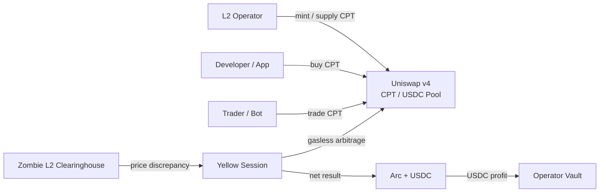
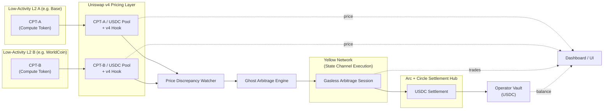

# Zombie L2 Clearinghouse
## 「ユーザーがいなくても収益が回る」L2財務インフラ

**Uniswap v4 × Yellow × Arc+USDC**  
ETH Global HackMoney 2026

---

## 1行で
**低稼働L2の“空き計算”をCPTとして資産化し、  
ガスレス裁定でUSDC収益を生む財務レイヤー。**

---

## 課題：L2運営は「需要依存」で詰む
- ユーザー不足 → 収益ゼロ
- それでも固定費（RPC/ノード/監視）は継続
- 黒字化前に撤退・停止

👉 **本質は「需要がないと何もできない運営モデル」**

---

## Why L2s in 2026?
### L2の役割は「スケーリング」から「付加価値」へ
- L1自体がスケールし、ガスリミット増加も進行
- L2は**独立した価値提供チェーンのスペクトラム**に
- 低レイテンシ/特化VM/非金融ユースケースなどが重要

---

## Zombie L2 Clearinghouseの立ち位置
**L2は“安価で余っている計算資源”**
- 低稼働L2のブロックスペースを資産化
- 需要が戻るまで**経済的に生き延びる時間**を提供
- 信用が必要な部分だけEthereumと接続

---

## Why Tokenize Compute?
### For Traders
- 実行コストのボラティリティを取引可能に
- 需要/混雑の予測を価格に反映

### For Developers
- 複数L2の実行コストを事前購入・予算化
- ガス高騰リスクを低減しUXを安定化

---

## Concrete Use Cases
- **NFT / Launch**: 需要集中でも安定コストで実行
- **Trading / Arbitrage Bots**: ガス高騰の自然ヘッジ
- **AI / Batch Compute**: 最安L2へ動的ルーティング
- **L2 Operators**: 余剰計算資源を収益化

---

## 参加者と役割
- **L2 Operators**: CPT発行・供給
- **Developers**: CPT購入・消費
- **Traders / Bots**: 流動性提供・裁定
- **Zombie L2 Clearinghouse**: 市場設計・裁定・USDC決済

---

## 解決アプローチ（4ステップ）
1. **CPTを発行**（計算リソースのERC20化）
2. **CPT/USDC基準市場**をUniswap v4で形成
3. **Yellowセッション**でガスレス裁定
4. **Arc + USDC**で利益確定 → Vaultへ還元

---

## 3技術の統合メッセージ
> **Uniswap v4 が価格を決め、  
> Yellow が速く動かし、  
> Arc + USDC が価値を確定する。**

---

## CPT Flow

---

## System Architecture Diagram

---

## デモシナリオ（審査員向け）
1. Base Sepolia 高稼働 → CPT-A 価格上昇
2. WorldCoin Sepolia 低稼働 → CPT-B 価格低下
3. **価格乖離検知 → Yellow裁定開始**
4. **USDC決済 → Vault残高増加**
5. Dashboardでリアルタイム表示

---

## 価値（インパクト）
### L2運営
- **ユーザーゼロでも収益発生**
- 固定費を継続補填
- ランウェイ延長

### Ethereumエコシステム
- **L2の即死を防ぐ**
- トラフィック集中を緩和
- 多様なL2共存を促進

---

## MVPスコープ（HackMoney 2026）
- L2: **Base Sepolia / WorldCoin Sepolia**
- 主要機能
  - CPT発行・Vault
  - v4 Hook（稼働率連動）
  - Yellowセッション裁定
  - Arc決済
  - Dashboard可視化

---

## 次の拡張
- 実稼働率Oracle連携
- 多L2対応
- リスク管理ルール
- 収益履歴の可視化

---

# Thank You
**Zombie L2 Clearinghouse**  
「ユーザーがいなくても収益が回る」L2財務インフラ
