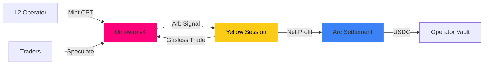

<!-- _class: lead -->

# Zombie L2 Clearinghouse
## Turning "Dead" Compute into Revenue

**ETH Global HackMoney 2026**
*Uniswap v4 × Yellow × Arc*

---

<!-- _class: split -->

### 💀 The Crisis
**"L2s are bleeding."**

*   **No Users** = Zero Revenue
*   **Fixed Costs** (Sequencers, Nodes) remain monthly
*   **Result**: Chains die before finding Product-Market Fit

### 💎 The Opportunity
**"Idle Compute is an Asset."**

*   Low activity chains offer **Record Low Fees**
*   We tokenize this capacity into **Compute Tokens (CPT)**
*   We arbitrage it for stable profit

---

# <!-- fit --> The Solution: **Financialize L2 Compute**

Zombie L2 Clearinghouse creates a market where:

1.  **L2s** mint idle capacity as **Compute Tokens (CPT)**.
2.  **Uniswap v4** prices CPT dynamically based on utilization.
3.  **Bots** arbitrage price gaps across chains via **Yellow**.
4.  **Profits** are settled in **USDC** via **Arc** to fund L2 ops.

> "Don't just scale Ethereum. **Survive.**"

---

<!-- _class: split-3 -->

### 1. Price
**Uniswap v4**
 
CPT / USDC Pools
  
Dynamic fees via Hooks adjust spread based on real-time chain utilization signaling.

### 2. Execute
**Yellow Network**
 
State Channels
  
Gasless, high-frequency arbitrage sessions between liquidity pools.

### 3. Settle
**Arc + Circle**
 
USDC Vaults
  
Real revenue settled in stablecoins to cover operational expenses.

---

## Token Flow Architecture

---

### Why Tokenize Compute?
**From "Cloud" to "Commodity"**

Just like oil or wheat, **blockspace** is a resource.   Standardizing it as **CPT (1M Gas Units)** enables:

*   **For Devs**: Pre-purchase budget (Hedging)
*   **For Traders**: Short/Long congestion
*   **For L2s**: Monetize empty blocks immediately

---

## The Tech Stack (HackMoney Stack)

| Component | Technology | Role |
| :--- | :--- | :--- |
| **Pricing** | **Uniswap v4 Hooks** | Adjusts spread/fees based on real-time chain utilization. |
| **Execution** | **Yellow SDK** | Off-chain "Sessions" for 1000x faster, gas-free arbitrage. |
| **Settlement** | **Arc + CCTP** | Cross-chain USDC finality to consolidate revenue. |
| **Targets** | **Base / WorldCoin** | Deploying CPT contracts on sepola testnets. |

---

<!-- _class: lead -->

## ⚡️ Demo Scenario

1.  **Base Sepolia** gets busy (High Usage) → **CPT ↑ Price Up**
2.  **WorldCoin** is empty (Low Usage) → **CPT ↓ Price Down**
3.  **Yellow Bot** detects gap & executes arb cycle
4.  **USDC Profit** lands in the Operator Vault

---

# Impact

### For L2 Operators
*   **Immediate Revenue** from idle hardware.
*   Extends runway during "Zombie" phases.
*   Turns fixed costs into variable assets.

### For Ethereum
*   Prevents L2 centralization/death.
*   Creates a decentralized compute market.
*   **Values Diversity** over raw throughput.

---

<!-- _class: lead -->
<!-- _footer: "ETH Global HackMoney 2026" -->

# Thank You
**Zombie L2 Clearinghouse**

*Code & Demo Available on Github*

