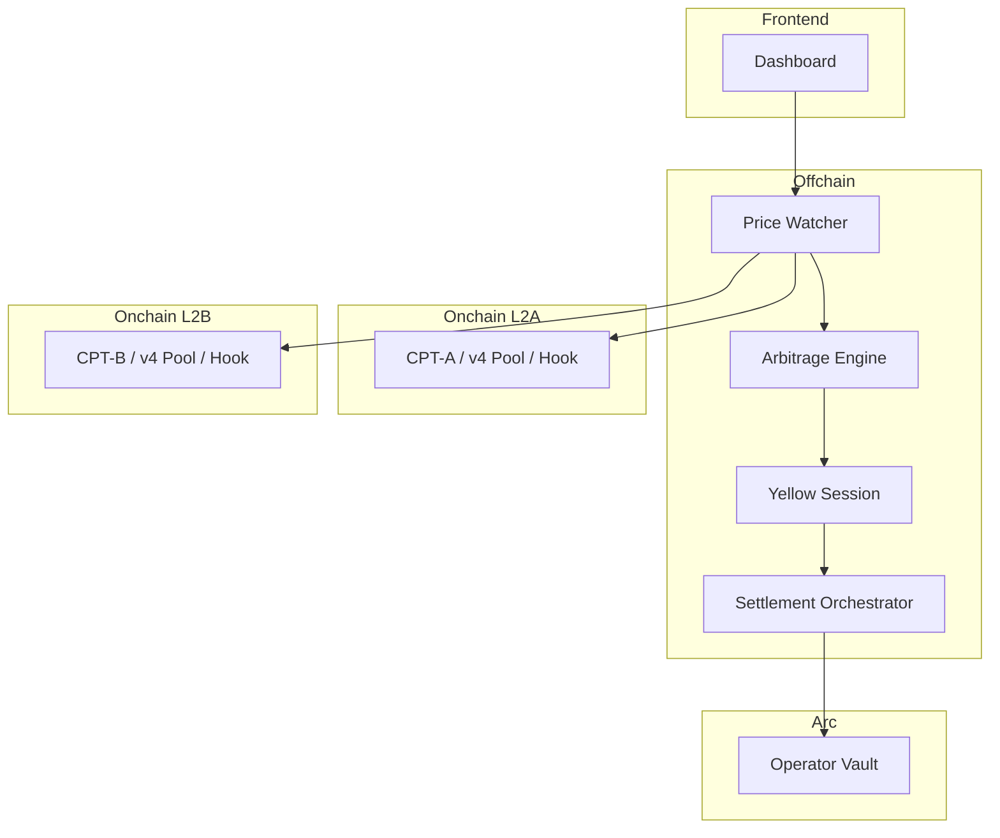

# Zombie L2 Clearinghouse
## 「ユーザーがいなくても収益が回る」L2財務インフラ

**Uniswap v4 × Yellow × Arc+USDC**  
ETH Global HackMoney 2026

---

## 1行で
**低稼働L2の“空き計算”をCPTとして資産化し、  
ガスレス裁定でUSDC収益を生む財務レイヤー。**

---

## 課題：L2運営は「需要依存」で詰む
- ユーザー不足 → 収益ゼロ
- それでも固定費（RPC/ノード/監視）は継続
- 黒字化前に撤退・停止

👉 **本質は「需要がないと何もできない運営モデル」**

---

## 解決：需要に依存しない収益モデル
### 3つの柱
1. **Compute Token (CPT)**  
   空き計算リソースをERC20化
2. **Uniswap v4 Hook**  
   稼働率連動で手数料/スプレッド制御
3. **Yellow + Arc/USDC**  
   ガスレス裁定 → USDC決済で収益確定

---

## 3技術の統合メッセージ
> **Uniswap v4 が価格を決め、  
> Yellow が速く動かし、  
> Arc + USDC が価値を確定する。**

---

## 仕組み（フロー）
1. L2ごとに **CPT/USDC 基準市場**を構築  
2. **v4 Hook** が稼働率に応じ手数料を調整  
3. 価格差を **Watcher** が検知  
4. **Yellowセッション**でガスレス裁定  
5. **Arc** でUSDC決済 → **Vault**に集約  

---

## アーキテクチャ（3層）

---

## デモシナリオ（審査員向け）
1. Unichain 高稼働 → CPT-A 価格上昇  
2. Linea 低稼働 → CPT-B 価格低下  
3. **価格乖離検知 → Yellow裁定開始**  
4. **USDC決済 → Vault残高増加**  
5. Dashboardでリアルタイム表示

---

## 価値（インパクト）
### L2運営
- **ユーザーゼロでも収益発生**
- 固定費を継続補填
- ランウェイ延長

### Ethereumエコシステム
- **L2の即死を防ぐ**
- トラフィック集中を緩和
- 多様なL2共存を促進

---

## MVPスコープ（HackMoney 2026）
- L2: **Unichain / Linea**
- 主要機能  
  - CPT発行・Vault  
  - v4 Hook（稼働率連動）  
  - Yellowセッション裁定  
  - Arc決済  
  - Dashboard可視化

---

## スポンサープライズ適合
- **Uniswap v4**: Hookで市場ルール制御（本質的価値）
- **Yellow**: ガスレス・高速裁定
- **Arc/Circle**: USDC収益確定・集約

---

## 次の拡張
- 実稼働率Oracle連携
- 多L2対応
- リスク管理ルール
- 収益履歴の可視化

---

# Thank You
**Zombie L2 Clearinghouse**  
「ユーザーがいなくても収益が回る」L2財務インフラ
